<!-- Dibuat oleh Bidang Sistem Informasi dan Statistik Dinas Komunikasi Informatika dan Persandian Kota Yogyakarta -->
# 🌌 BLUEPRINT — SIWASIN (Sistem Informasi Pengawasan Internal)
> **Single Source of Truth (SSOT)** Kebutuhan Teknis, Bisnis, Spesifikasi Sistem, dan Rencana Masing-Masing Modul untuk Vibe Coding & Agentic Coding di **Google Antigravity 2.0**.

---

## 1. Informasi Dokumen

| Field | Nilai |
|---|---|
| Judul Dokumen | Blueprint & Arsitektur Sistem Informasi Pengawasan Internal (SIWASIN) |
| Kode Dokumen | `BLUEPRINT-SIWASIN-V1.0` |
| Versi | `1.0.0` |
| Tanggal Penerbitan | 2026-09-15 |
| Status Dokumen | `DISETUJUI (APPROVED)` |
| Pemilik Produk | Inspektorat Kota Yogyakarta |
| Tim Pengembang | Dinas Komunikasi Informatika dan Persandian Kota Yogyakarta |
| Framework Acuan | BRD (BABOK v3) · SRS (ISO/IEC/IEEE 29148:2018) · NFR (ISO/IEC 25010) · Prioritas (MoSCoW) · Acceptance (Gherkin) · Visual (Mermaid.js) |
| System Mode | **Full-Stack Production Ready (Go Clean Arch + React/Vue Vite Apple HIG + PostgreSQL 16+ + MinIO + SSO Keycloak JSS)** |

### Riwayat Revisi

| Versi | Tanggal | Deskripsi Perubahan | Penulis | Approver |
|---|---|---|---|---|
| 0.1.0 | 2026-09-15 | Draf awal analisis 16 poin catatan bisnis pengawasan | Tim Developer Diskominfo | Sekretariat Inspektorat |
| 1.0.0 | 2026-09-15 | Finalisasi Blueprint Komprehensif (BRD, PRD, SRS, MOD-00 s.d MOD-05, UI Specs, & Traceability Matrix 0 broken links) | Pembuat Blueprint Profesional | Inspektur Kota Yogyakarta |

---

## 2. Ringkasan Eksekutif

**SIWASIN (Sistem Informasi Pengawasan Internal)** adalah aplikasi backoffice operasional dan executive dashboard utama Pemerintah Kota Yogyakarta yang dirancang khusus untuk mentransformasi seluruh siklus pengawasan internal Inspektorat terhadap Organisasi Perangkat Daerah (OPD). Sistem ini memfasilitasi alur kerja terpadu mulai dari:
- **Audit Universe Engine** — Master data multi-entitas seluruh objek audit: OPD/Dinas, UPTD, Kecamatan, Sekolah, hingga BUMD beserta struktur program kerja masing-masing.
- **Risk Scoring Engine** — Kalkulasi otomatis indeks risiko komposit tiap entitas berdasarkan 3 parameter berbobot: pagu anggaran (arsitektur siap integrasi API SIPD), riwayat temuan TLHP (input manual, siap integrasi API), dan nilai maturitas SPIP — dengan output kuadran risiko (High / Medium / Low).
- **Perencanaan PKPT & Tim** — Penyusunan PKPT Global & Tim, penugasan Auditor per jenjang jabatan (Madya, Muda, Pertama, Terampil), dengan validasi keras 16 HP dan **Clash Detection otomatis** (mencegah auditor ditugaskan di 2 tim pada tanggal yang sama).
- **Approval Berjenjang 3 Jenjang** — Pengendali Teknis (Daltek) → Pembantu Penanggung Jawab / Irban (PPJ) → Inspektur Daerah, dengan **Zero-Bypass Gate** pada setiap revisi.
- **Pelaksanaan & Pelaporan** — Fieldwork realisasi HP, upload LHP ke MinIO dengan akses RBAC ketat.
- **Evaluasi Matriks Realisasi Triwulanan** — Dashboard eksekutif perbandingan Rencana vs Aktual.

Built with Go (Golang 1.22+) Clean Architecture dan React/Vue Vite dengan desain visual Apple Human Interface Guidelines (HIG), SIWASIN menjamin efisiensi tinggi, isolasi role RBAC ketat (termasuk verifikasi SIMPEG Eselon IVB), serta perlindungan kerahasiaan berkas Laporan Pengawasan.

---

# BAGIAN A — BRD (Business Requirements Document)

## A.1. Latar Belakang & Konteks Bisnis

- **A.1.1. Kondisi Bisnis Saat Ini (As-Is)**:
  Proses pengawasan internal di Inspektorat Kota Yogyakarta masih menghadapi kendala fragmentasi data. Penilaian risiko OPD dilakukan secara manual via spreadsheet, pengusulan Hari Penugasan (HP) dan pembentukan tim audit sering tidak terpantau secara riil, serta revisi penugasan/surat tugas di tengah jalan berisiko luput dari verifikasi Inspektur. Matriks realisasi vs perencanaan PKPT baru dievaluasi secara reaktif di akhir tahun.
- **A.1.2. Pemicu Perubahan**:
  Kebutuhan tata kelola pemerintahan yang akuntabel (SPBE & MCP KPK), kewajiban transparansi audit berbasis risiko (Risk-Based Auditing), serta arahan Inspektur untuk memberlakukan kontrol persetujuan terpusat (*strict inspection approval gate*) terhadap setiap perubahan penugasan dan pelaporan pengawasan.
- **A.1.3. Kaitan dengan Strategi Organisasi**:
  Mendukung Peningkatan Kualitas Pengawasan Internal APIP (Aparat Pengawasan Intern Pemerintah) Kota Yogyakarta, Percepatan Reformasi Birokrasi (RB), dan Penguatan Sistem Pengendalian Intern Pemerintah (SPIP).

## A.2. Pernyataan Masalah & Peluang

- **A.2.1. Problem Statement**:
  *"Saat ini Sekretariat, Irban, dan Tim Auditor Inspektorat tidak dapat memantau realisasi penugasan PKPT secara presisi dan realtime karena proses pemetaan risiko OPD, pengusulan Surat Tugas, dan evaluasi realisasi HP masih terpisah-pisah, berdampak pada risiko ketidaksesuaian alokasi audit (melebihi batas 16 HP), keterlambatan laporan triwulanan, dan potensi perubahan jadwal penugasan tanpa persetujuan Inspektur."*
- **A.2.2. Peluang / Value Proposition**:
  Membangun sistem pengawasan internal terintegrasi berbasis web yang memetakan gradasi risiko OPD secara otomatis, membatasi alokasi maksimal 16 HP per kegiatan, mengunci alur approval revisi ke Inspektur, serta menyajikan matriks perbandingan realisasi vs perencanaan PKPT secara transparan dan akurat.
- **A.2.3. Dampak Bila Tidak Ditangani**:
  Risiko temuan berulang, alokasi Hari Penugasan auditor yang tumpang tindih/inefisien, serta melemahnya fungsi kontrol pimpinan terhadap pelaksanaan audit di lingkup Pemkot Yogyakarta.

## A.3. Tujuan Bisnis & KPI (SMART)

| ID | Tujuan Bisnis | Metrik (KPI) | Baseline | Target | Periode Ukur |
|---|---|---|---|---|---|
| `TUJ-01` | Meningkatkan akurasi pemetaan Obrik audit berbasis gradasi risiko OPD | Persentase OPD berisiko tinggi yang ter-cover PKPT | 65% | 100% | Semesteran |
| `TUJ-02` | Menjamin kontrol penuh Inspektur terhadap seluruh revisi penugasan | Persentase revisi Surat Tugas & Laporan yang terverifikasi Inspektur | 80% | 100% (Zero Bypass) | Realtime |
| `TUJ-03` | Mengoptimalkan alokasi Hari Penugasan (HP) Auditor | Kepatuhan alokasi HP (Maksimal 16 HP per penugasan) | 70% | 100% Validated | Triwulanan |
| `TUJ-04` | Meningkatkan akurasi evaluasi realisasi pengawasan | Ketepatan waktu penerbitan Matriks Realisasi Perencanaan vs Actual | H+14 Triwulan | H+2 Triwulan | 3 Bulanan |

## A.4. Ruang Lingkup Bisnis

- **A.4.1. In-Scope**:
  1. **Audit Universe Engine** — Master data multi-entitas objek audit: OPD/Dinas, UPTD, Kecamatan, Sekolah, dan BUMD, beserta struktur program kerja dan hierarki organisasi masing-masing entitas.
  2. **Risk Scoring Engine** — Kalkulasi otomatis indeks risiko komposit per entitas dengan 3 parameter berbobot: (a) Pagu anggaran — input manual Sekretariat, arsitektur siap integrasi API read-only SIPD/e-Keuangan Pemda; (b) Riwayat jumlah temuan TLHP — input manual, arsitektur siap integrasi API TLHP; (c) Nilai maturitas SPIP — input manual Sekretariat. Output: kuadran risiko **High / Medium / Low** dan daftar prioritas Obrik.
  3. Modul Penilaian Gradasi Risiko OPD (Sekretariat) untuk Audit Kinerja & Pengawasan (Semesteran & Tahunan).
  4. Modul Perencanaan PKPT (Perencanaan Global & Perencanaan Tim) dengan kategori Mandatori & Non-Mandatori.
  5. **Resource Allocation & Scheduling** — Master data SDM Auditor/P2UPD (kompetensi, jenjang jabatan, ketersediaan Hari Pengawasan), validasi keras maksimal 16 HP, dan **Clash Detection otomatis** (sistem mendeteksi & menolak jika satu auditor dijadwalkan di 2 tim pada tanggal yang sama).
  6. Modul Manajemen Surat Tugas & Pembentukan Tim Audit (Penerbitan ST Besar per Irban, penugasan Ketua Tim spesifik: Auditor Madya, Muda, Pertama, Terampil).
  7. Dynamic Hierarchical Master Data: Relasi `Master_Tujuan` $\rightarrow$ `Master_Sasaran` $\rightarrow$ `Master_Output` (Bukan sekadar text string mentah).
  8. **Approval Berjenjang 3 Jenjang** — Pengendali Teknis (Daltek) $\rightarrow$ Pembantu Penanggung Jawab / Irban (PPJ) $\rightarrow$ Inspektur Daerah. Setiap revisi sekecil apapun wajib melewati seluruh jenjang (Zero-Bypass Gate). Export otomatis ke format laporan resmi PDF/Word.
  9. Modul Pelaksanaan & Pelaporan Pengawasan (Parent Utama: Audit, Pengawasan, Monitoring, Reviu).
  10. Proteksi Hak Akses Laporan Pengawasan (Terbatas hanya untuk Inspektur, Sekretaris, Irban, dan Eselon IVB SIMPEG).
  11. Modul Matriks Pemantauan Realisasi vs Perencanaan (Status: Terealisasi, Belum Terealisasi, Tidak Terealisasi) & Evaluasi 3 Bulanan.
  12. 5 Modul Pengaturan Sistem Wajib (User Management JSS, Role Management, Permission Matrix, Drag-to-Reorder Sidebar Menu, Theme Manager 8 Themes, & User Activity Log Audit Trail).
  13. **Audit Trail ketat** — Log aktivitas setiap perubahan bobot parameter risiko, pergeseran jadwal penugasan, dan akses berkas LHP (hanya dapat diakses Superadmin & Pengawas).
- **A.4.2. Out-of-Scope**:
  1. Modul penganggaran belanja langsung OPD (di luar alokasi anggaran penugasan APIP).
  2. Integrasi penggajian / TPP pegawai SIMPEG (hanya membaca data master pegawai, jabatan, dan status Eselon IVB).
  3. Integrasi langsung (live sync) API SIPD & TLHP pada versi awal — disediakan sebagai **arsitektur integrasi future-ready** (endpoint siap, implementasi setelah koordinasi tim SIPD Pemda).
- **A.4.3. Batasan Lingkup**:
  Disesuaikan dengan Perwal Pengawasan Kota Yogyakarta, regulasi Jabatan Fungsional Auditor/P2UPD KemenPAN-RB, serta kebijakan SPBE Diskominfo Kota Yogyakarta.

## A.5. Stakeholder & RACI Matrix

| Stakeholder | Peran Organisasi | Kepentingan Utama | R | A | C | I |
|---|---|---|---|---|---|---|
| **Inspektur** | Pimpinan Inspektorat | Approval final ST, PKPT, LHP, & Monitoring Dashboard. Jenjang approval ke-3 (tertinggi) | | **A** | **C** | |
| **Pengendali Teknis (Daltek)** | Auditor Senior / Koordinator | Verifikasi teknis draft ST & PKPT sebelum naik ke PPJ. **Jenjang approval ke-1** | **R** | | **C** | |
| **Sekretaris / PPJ (Irban)** | Sekretariat / Pembantu Penanggung Jawab | Input parameter risiko OPD, PKPT Global, evaluasi triwulanan. **Jenjang approval ke-2** | **R** | | **C** | |
| **Irban (I s.d IV / Khusus)**| Inspektur Pembantu Wilayah | Perencanaan Tim, usulan Surat Tugas Besar, review NHP/LHP | **R** | | **C** | |
| **Auditor / P2UPD** | Ketua & Anggota Tim | Pelaksanaan fieldwork, input realisasi HP & dokumen pengawasan | **R** | | | **I** |
| **Eselon IVB (SIMPEG)** | Pejabat Terverifikasi | Verifikasi data struktural & akses laporan pengawasan terpilih | | | **C** | **I** |
| **Admin OPD (Obrik)** | Auditee Perangkat Daerah | Terima penugasan, upload bukti tanggapan & konfirmasi | **R** | | | **I** |
| **Superadmin Diskominfo** | Pengelola IT | Maintenance infrastruktur, RBAC, & Audit Log | **R** | **A** | | |

*Keterangan RACI: R = Responsible, A = Accountable, C = Consulted, I = Informed.*

## A.6. Kebutuhan Bisnis (Business Requirements)

| ID | Kebutuhan Bisnis | Prioritas | Sumber |
|---|---|---|---|
| `BR-01` | Sistem wajib menyediakan modul penilaian gradasi risiko OPD oleh Sekretariat sebagai dasar penentuan Obrik audit | **Must Have** | `[Jawaban: Catatan #1, #15]` |
| `BR-02` | Perencanaan risiko wajib mendukung periode analisis Semesteran dan Evaluasi Berkala per 3 Bulan (Triwulanan) | **Must Have** | `[Jawaban: Catatan #2, #12]` |
| `BR-03` | Sistem wajib mengelola Perencanaan PKPT (Global & Tim) dengan kategori Mandatori dan Non-Mandatori | **Must Have** | `[Jawaban: Catatan #2, #13]` |
| `BR-04` | Sistem wajib memberikan proteksi validasi maksimal 16 Hari Penugasan (HP) per kegiatan audit/pengawasan | **Must Have** | `[Jawaban: Catatan #16]` |
| `BR-05` | Sistem wajib mengintegrasikan pembentukan tim dengan kualifikasi Ketua Tim spesifik Jabatan Fungsional Auditor (Madya, Muda, Pertama, Terampil) | **Must Have** | `[Jawaban: Catatan #2]` |
| `BR-06` | Sistem wajib menyediakan 4 Parent Utama Pengawasan baku: Audit, Pengawasan, Monitoring, dan Reviu | **Must Have** | `[Jawaban: Catatan #4, #7]` |
| `BR-07` | Sistem wajib mengaitkan Tujuan dan Sasaran Pengawasan dengan struktur relasional parent Output (bukan teks mentah) | **Must Have** | `[Jawaban: Catatan #8]` |
| `BR-08` | Pembentukan Surat Tugas Besar wajib diprakarsai oleh Irban / Sekretariat sebelum penugasan tim berjalan | **Must Have** | `[Jawaban: Catatan #5]` |
| `BR-09` | Sistem wajib menerapkan **Strict Inspektur Approval**: revisi sekecil apa pun pada perencanaan/ST wajib diketahui & disetujui Inspektur | **Must Have** | `[Jawaban: Catatan #6]` |
| `BR-10` | Akses membaca Laporan Pengawasan wajib dibatasi eksklusif hanya untuk Inspektur, Sekretaris, Irban, dan Eselon IVB | **Must Have** | `[Jawaban: Catatan #9]` |
| `BR-11` | Sistem wajib menyajikan Matriks Pemantauan perbandingan Realisasi vs Perencanaan (Status: Terealisasi, Belum, Tidak Terealisasi) | **Must Have** | `[Jawaban: Catatan #10, #11]` |
| `BR-12` | Sistem wajib terintegrasi dengan SIMPEG Pemda untuk validasi NIP, Jabatan Pegawai, dan Eselon IVB | **Must Have** | `[Jawaban: Catatan #9]` |
| `BR-13` | Sistem wajib menyediakan 5 Modul Pengaturan Sistem (User Management, Role, Permission Matrix, Drag-to-Reorder Sidebar Menu, Theme Manager) | **Must Have** | `[Standar Diskominfo]` |
| `BR-14` | Sistem wajib mencatat Log Aktivitas Pengguna (Audit Trail) yang hanya dapat diakses oleh Superadmin dan Pengawas | **Must Have** | `[Standar Diskominfo]` |
| `BR-15` | Sistem wajib menyediakan Sandbox 4 Role Dummy User dengan 1-click quick login pada halaman login terpisah (`/login`) | **Must Have** | `[Standar Diskominfo]` |
| `BR-16` | **[Fase 7]** Penyimpanan berkas laporan akhir (LHP) wajib menggunakan MinIO Object Storage terenkripsi dengan Presigned URL | **Must Have** | `[Standar Diskominfo]` |
| `BR-17` | **[Fase 1A]** Sistem wajib menyediakan modul **Audit Universe** untuk registrasi Obrik Multi-Entitas (OPD/Kecamatan/BUMD) | **Must Have** | `[Diskusi Arsitektur 2026-09-15]` |
| `BR-18` | **[Fase 1B]** Sistem wajib menyediakan algoritma **Risk Scoring Engine** dengan kalkulasi 3 parameter (Pagu, TLHP, SPIP) | **Must Have** | `[Diskusi Arsitektur 2026-09-15]` |
| `BR-19` | **[Fase 3]** Sistem wajib memvalidasi jadwal ketersediaan Auditor melalui fitur **Clash Detection Otomatis** (Hard Block) | **Must Have** | `[Diskusi Arsitektur 2026-09-15]` |
| `BR-20` | **[Fase 4]** Sistem wajib menerapkan Alur **Approval Berjenjang 3 Lapis** (Daltek, PPJ, Inspektur) dengan sistem Zero-Bypass | **Must Have** | `[Diskusi Arsitektur 2026-09-15]` |
| `BR-21` | Sistem wajib menyiapkan **Arsitektur Integrasi API Future-Ready** untuk menyerap data SIPD dan sistem TLHP eksternal | **Should Have**| `[Standar Arsitektur]` |
| `BR-22` | **[Fase 6]** Sistem wajib memfasilitasi **Ruang Klarifikasi Interaktif Temuan** (Exit Meeting) antara Tim Auditor dan Admin OPD | **Must Have** | `[Diskusi Arsitektur 2026-09-15]` |
| `BR-23` | **[Fase 5]** Sistem wajib mengakomodir penyusunan Kertas Kerja Pemeriksaan (**KKP**) dan input realisasi HP aktual di lapangan | **Must Have** | `[Standar APIP]` |
| `BR-24` | **[Fase 7]** Sistem wajib mengakomodir pemantauan **Tindak Lanjut Hasil Pemeriksaan (TLHP)** selama maksimal 60 hari | **Must Have** | `[Standar APIP]` |

## A.7. Proses Bisnis As-Is (Kondisi Nyata Sebelum SIWASIN)

> **Kondisi Nyata**: Sistem yang ada hanya berfungsi sebagai **alat pencatatan** sederhana. Hasil analisis risiko OPD **tidak masuk** ke sistem, data tersebar & tidak terintegrasi (spreadsheet terpisah, catatan fisik, email), dan monitoring hanya bisa dilakukan oleh tim internal secara manual. Tidak ada alur audit dari hulu ke hilir yang terpadu.

```mermaid
flowchart TD
    subgraph LAMA["❌ Sistem Lama: Hanya Pencatatan Terpisah-Pisah"]
        A([Mulai Periode Pengawasan]) --> B["📊 Sekretariat Rekap Data OPD\ndi Excel\n(Tidak ada analisis risiko sistematis)"]
        B --> C["📝 Input Manual ke Database\n(Hanya sebagai catatan,\nbukan analisis)"]
        C --> D["👥 Irban Input Tim & HP Manual\n(Tidak ada validasi HP,\ndata tidak terpusat)"]
        D --> E["🖨️ Cetak Surat Tugas Fisik\n(Tanpa approval digital,\ntanpa versioning)"]
        E --> F["🔍 Auditor Laksanakan Audit\n(Tanpa monitoring realtime)"]
        F --> G{Perubahan\nHP/Tim?}
        G -- Ya --> H["✏️ Revisi Manual\n(Tidak terverifikasi Inspektur,\ntidak tercatat di sistem)"]
        G -- Tidak --> I["📋 Penyusunan Laporan Fisik\n(File terpisah,\ntidak terintegrasi)"]
        H --> I
        I --> J["📁 Laporan Diserahkan Fisik\nke Inspektur\n(Tidak ada akses digital terkontrol)"]
        J --> K["📊 Rekap Realisasi Manual\nAkhir Tahun\n(Data tidak akurat, molor waktu)"]
        K --> L([Selesai])
    end

    style LAMA fill:#fef2f2,stroke:#fca5a5,color:#1f2937
```

**❌ Gap Kritis Kondisi As-Is:**
- Data risiko OPD tidak dianalisis secara sistematis ke dalam sistem.
- Hasil analisis tidak terintegrasi — hanya catatan manual terpisah.
- Monitoring tim audit tidak bisa dilakukan secara realtime.
- Revisi penugasan tidak diketahui oleh Inspektur.
- Tidak ada kontrol akses berkas laporan pengawasan.

## A.8. Proses Bisnis To-Be SIWASIN (Hulu ke Hilir — End-to-End)

### 📍 Overview Alur 6 Fase (Hulu ke Hilir)

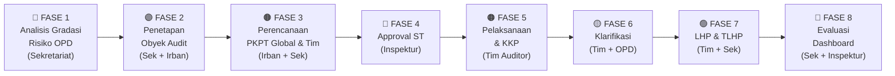

---

### 📖 Glosarium & Daftar Singkatan
*Berikut adalah istilah-istilah yang sering digunakan dalam alur SIWASIN di bawah ini:*

| Singkatan | Kepanjangan | Penjelasan Singkat |
|---|---|---|
| **APIP** | Aparat Pengawasan Intern Pemerintah | Instansi pengawas internal pemerintah (dalam hal ini Inspektorat Kota). |
| **OPD** | Organisasi Perangkat Daerah | Dinas/Badan/Kecamatan di pemerintah daerah (sebagai pihak yang diaudit). |
| **Obrik** | Obyek Pemeriksaan | Entitas/OPD spesifik yang menjadi target pengawasan. |
| **PKPT** | Program Kerja Pengawasan Tahunan | Dokumen perencanaan global kegiatan pengawasan selama satu tahun. |
| **ST** | Surat Tugas | Dokumen resmi penugasan tim untuk turun ke lapangan. |
| **HP** | Hari Pengawasan / Penugasan | Satuan ukur durasi & beban kerja (man-days) tim auditor di lapangan. |
| **Daltek** | Pengendali Teknis | Auditor senior yang mereviu substansi teknis pelaksanaan audit tim. |
| **PJ** | Penanggung Jawab | Peran otoritas tertinggi (biasanya Inspektur) yang bertanggung jawab atas penugasan audit secara keseluruhan. |
| **PPJ** | Pembantu Penanggung Jawab | Peran strategis (biasanya dijabat Irban/Sekretaris) yang membantu PJ dalam mengawasi penugasan. |
| **LHA / LHP** | Laporan Hasil Audit/Pengawasan | Dokumen output resmi (final) yang berisi temuan dan rekomendasi. |
| **TLHP** | Tindak Lanjut Hasil Pemeriksaan | Proses OPD merespons dan memperbaiki temuan setelah LHA/LHP terbit. |
| **KKP** | Kertas Kerja Pemeriksaan | Dokumen catatan/bukti lapangan yang disusun tim auditor selama proses pelaksanaan audit. |
| **SPIP** | Sistem Pengendalian Intern Pemerintah | Skor kematangan manajemen risiko internal dari sebuah OPD. |

---

### 🔵 FASE 1 — Analisis Gradasi Risiko OPD *(Aktor: Sekretariat)*

> **Fase ini terdiri dari 2 sub-sistem:** `1A — Audit Universe` (daftarkan siapa yang dinilai) → `1B — Risk Scoring Engine` (hitung seberapa berisiko).

#### 🗂️ Fase 1A — Audit Universe Engine *(Registrasi Multi-Entitas Objek Audit)*

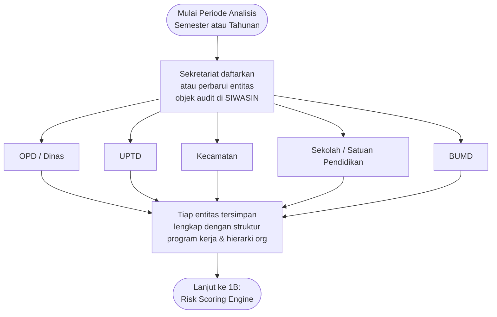

#### 🧮 Fase 1B — Risk Scoring Engine *(Kalkulasi Indeks Risiko Komposit per Entitas)*

> **Konfigurasi Master Risk Scoring (Dinamis):**
> Sistem dirancang fleksibel agar Superadmin/Sekretariat dapat mengatur parameter perhitungan mandiri tanpa *hardcoding*.
> 1. **Setup Range Mapping**: Konversi nilai mentah (Rupiah Pagu / Jumlah Temuan) ke skala baku (1—5).
> 2. **Setup Bobot (%)**: Menentukan persentase pengaruh tiap parameter terhadap Sumbu X dan Y (Total per sumbu wajib 100%).
> 3. **Setup Threshold**: Menentukan garis batas (*cut-off*) untuk menentukan zona Kuadran.

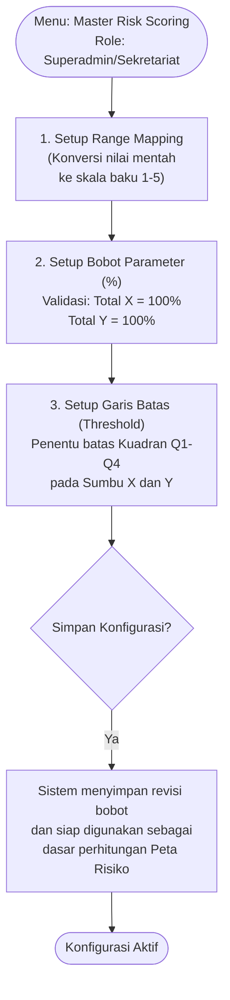

| Parameter | Sumber Data | Status Integrasi |
|---|---|---|
| **P1 — Pagu Anggaran** | Input manual Sekretariat | ⚙️ Arsitektur siap integrasi API SIPD / e-Keuangan Pemda |
| **P2 — Riwayat Temuan TLHP** | Input manual Irban | ⚙️ Arsitektur siap integrasi API sistem TLHP |
| **P3 — Nilai Maturitas SPIP** | Input manual Sekretariat (skala 1—5) | Manual permanen |

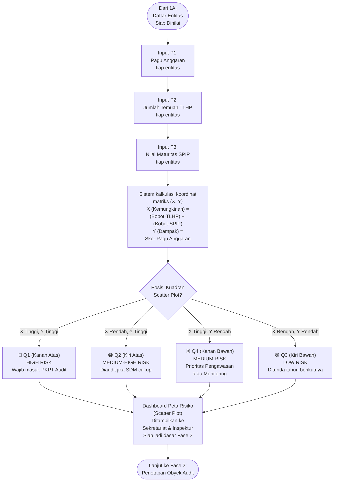

> **Skenario Perhitungan Lanjutan (Matriks X dan Y):**
> Untuk visualisasi *Scatter Plot* pada Dashboard Eksekutif, 3 parameter di atas dipetakan ke dalam 2 Sumbu (Matriks 2x2 atau 3x3) berdasarkan standar ISO 31000:
>
> 1. **Sumbu X (Kemungkinan Terjadi / Likelihood)**
>    Menilai seberapa besar kemungkinan OPD melakukan pelanggaran. Dihitung dari 2 parameter:
>    - **Riwayat Temuan TLHP** (makin banyak temuan masa lalu, makin berisiko mengulang)
>    - **Maturitas SPIP** (makin rendah nilainya, makin berisiko sistem internal bocor)
>
> 2. **Sumbu Y (Dampak / Signifikansi / Impact)**
>    Menilai seberapa besar kerugian/dampaknya jika terjadi penyelewengan. Dihitung dari:
>    - **Pagu Anggaran** (makin besar uang yang dikelola, makin destruktif dampaknya)
>
> **Pemetaan Status Kuadran Risiko (Scatter Plot):**
> | Sumbu Y (Dampak) | Sumbu X (Kemungkinan) | Posisi Kuadran | Status & Rekomendasi Tindakan |
> | :---: | :---: | :--- | :--- |
> | **TINGGI** | **TINGGI** | **Kanan Atas (Q1)** | 🔴 **HIGH RISK (Prioritas 1)** - Wajib masuk PKPT (Audit Kinerja). |
> | **TINGGI** | **RENDAH** | **Kiri Atas (Q2)** | 🟠 **MEDIUM-HIGH RISK (Prioritas 2)** - Wajib diaudit bila SDM mencukupi. |
> | **RENDAH** | **TINGGI** | **Kanan Bawah (Q4)**| 🟡 **MEDIUM RISK (Prioritas 3)** - Anggaran kecil tapi sering salah. Cocok untuk *Pengawasan/Monitoring*. |
> | **RENDAH** | **RENDAH** | **Kiri Bawah (Q3)** | 🟢 **LOW RISK** - Cukup pantauan jarak jauh. Bisa ditunda tahun berikutnya. |


---

### 🟣 FASE 2 — Penetapan Obyek Audit *(Aktor: Sekretariat + Irban)*

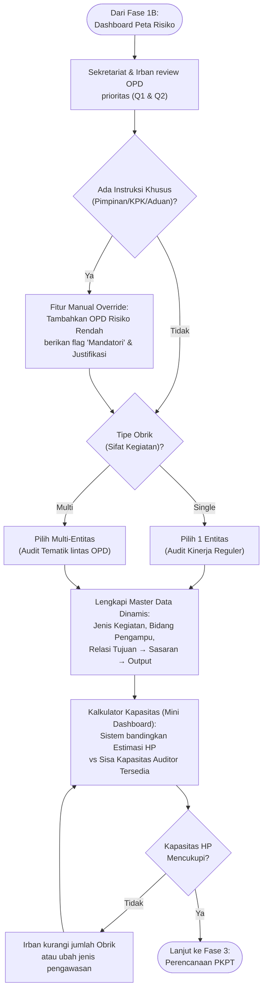

> **Fitur Dinamis Penetapan Obyek Audit:**
> Untuk mencegah proses yang kaku, Fase 2 dilengkapi 4 kapabilitas dinamis:
> 1. **Manual Override (Jalur Mandatori)**: Memungkinkan Sekretariat memasukkan OPD yang berisiko rendah (Kuadran Hijau) ke dalam PKPT jika ada instruksi mendadak dari Pimpinan/KPK/Aduan Masyarakat, dengan kewajiban mengisi kolom justifikasi.
> 2. **Audit Tematik (Multi-Obrik)**: Satu entri PKPT (1 set Tujuan & Sasaran) dapat memayungi lebih dari 1 OPD sekaligus, berguna untuk pengawasan isu lintas sektoral (contoh: *Audit Stunting*, *Pengentasan Kemiskinan*).
> 3. **Mini Dashboard Kapasitas HP**: Mencegah *overbooking*. Sistem akan otomatis menjumlahkan estimasi Hari Pengawasan (HP) yang dibutuhkan dari seluruh Obrik yang dipilih, lalu membandingkannya dengan ketersediaan SDM Auditor.
> 4. **Master Data Management Terpusat**: Hirarki `Tujuan → Sasaran → Output` dan `Jenis Kegiatan` bersifat dinamis (*tree-based*) yang dapat dikonfigurasi oleh Superadmin tanpa mengubah *source code*, untuk mengantisipasi perubahan RPJMD/Regulasi di masa depan.


---

### 🟤 FASE 3 — Perencanaan PKPT Global & Tim *(Aktor: Irban + Sekretariat)*

> **Setiap entri PKPT harus diklasifikasikan ke salah satu dari 4 Jenis Pengawasan.** Masing-masing jenis punya karakteristik tim, dokumen, dan batas HP yang berbeda.

#### Perbedaan 4 Jenis Pengawasan dalam PKPT

| Aspek | 🔍 Audit | 👁️ Pengawasan | 📊 Monitoring TLHP | 📋 Reviu |
|---|---|---|---|---|
| **Dokumen Penugasan** | ST Resmi (ST Besar) | ST Resmi (ST Besar) | Dapat digabung dalam ST Audit terkait | Nota Dinas |
| **Tim** | Ketua Tim + Anggota Wajib | Ketua Tim + Anggota | Minimal 1-2 orang | Sesuai kompetensi dokumen |
| **Batas HP** | Dikonfigurasi Admin | Dikonfigurasi Admin | Dikonfigurasi Admin | Dikonfigurasi Admin |
| **Output Laporan** | LHA (Laporan Hasil Audit) | LHP (Laporan Hasil Pengawasan) | Laporan Monitoring TLHP | Laporan Reviu |
| **Temuan → TLHP** | ✅ Ya | ✅ Ya | ❌ Tidak | ❌ Tidak |
| **Obrik Spesifik** | Wajib 1 entitas | Wajib 1 entitas | Bisa multi-OPD | Bisa multi-dokumen |

#### Diagram Perencanaan PKPT Global & Tim

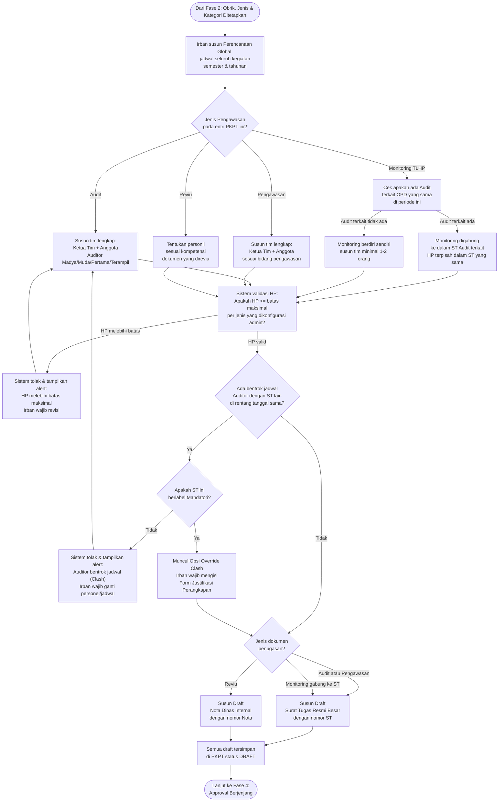

> **Komposisi 5 Peran Resmi Tim Audit (Penugasan ST Resmi):**
> Sesuai standar tata naskah dinas Inspektorat, setiap penyusunan Surat Tugas (ST) Resmi wajib mencakup 5 peran struktural yang akan tercetak di dokumen:
> 1. **Penanggung Jawab (PJ)**: Biasanya dijabat oleh Inspektur (wajib 1 orang). Tercatat di ST dan otomatis menjadi Approver Final (Jenjang 3).
> 2. **Pembantu Penanggung Jawab (PPJ)**: Biasanya dijabat oleh Sekretaris / Irban (wajib 1 orang). Tercatat di ST dan otomatis menjadi Approver Review (Jenjang 2).
> 3. **Pengendali Teknis (Daltek)**: Auditor Senior yang mereviu substansi teknis (wajib 1 orang). Tercatat di ST dan otomatis menjadi Approver Awal (Jenjang 1).
> 4. **Ketua Tim**: Auditor (Madya/Muda) yang memimpin pelaksanaan lapangan (wajib 1 orang).
> 5. **Anggota Tim**: Auditor pelaksana (0 atau lebih, sesuai kebutuhan dan batas HP).

> **Penanganan Penugasan Insidental & Bentrok Jadwal (Clash Detection):**
> 1. **Penugasan Non-PKPT**: Jika ada permintaan audit mendadak (Aduan, APH, KPK), Irban dapat melewati Fase 1 & 2 dengan menekan tombol **Buat Penugasan Insidental**. Penugasan ini otomatis mendapat *flag* **Mandatori**.
> 2. **Clash Detection**: Sistem SIWASIN memiliki algoritma deteksi bentrok (`BR-19`). Jika Auditor X didaftarkan di ST baru namun jadwalnya bertabrakan dengan ST lain yang sedang *In Progress* atau *Approved*, sistem otomatis menolak (*Hard Block*).
> 3. **Override Clash (Perangkapan Tugas)**: Pengecualian diberikan khusus untuk penugasan berlabel **Mandatori**. Sistem akan memunculkan opsi *Override*, mengizinkan auditor merangkap tugas dengan syarat Irban wajib mengisi justifikasi (misal: "Hanya diperbantukan sementara untuk tim KPK"). Ke depan, ini juga membantu pelacakan *Audit Trail*.

---

### ⚡ JALUR KHUSUS — Audit Non-PKPT (Penugasan Insidental)

> **Konteks:** Digunakan saat ada permintaan audit di tengah periode berjalan (injeksi jadwal) di luar kalender PKPT resmi (misal: Atensi Walikota, KPK, atau Aduan Masyarakat viral).

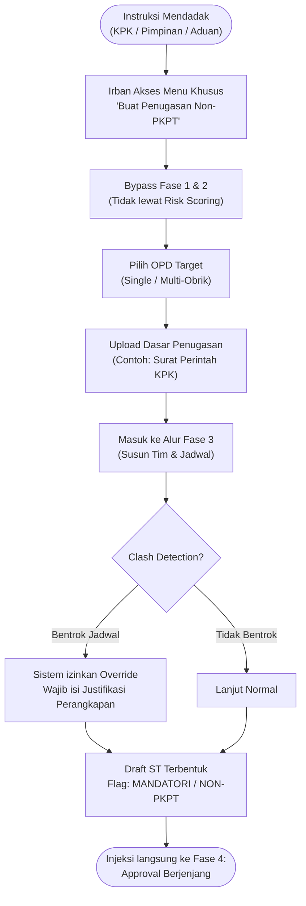

---

### 🔴 FASE 4 — Approval Berjenjang *(Aktor: Daltek, PPJ, Inspektur — Zero Bypass)*

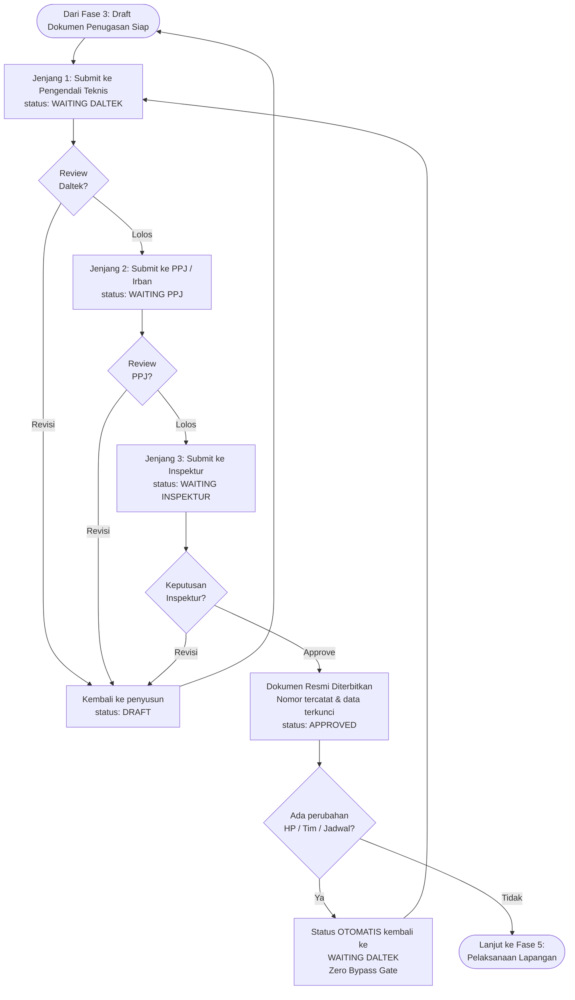

---

### 🟠 FASE 5 — Pelaksanaan Lapangan & KKP *(Aktor: Ketua Tim + Anggota Tim)*

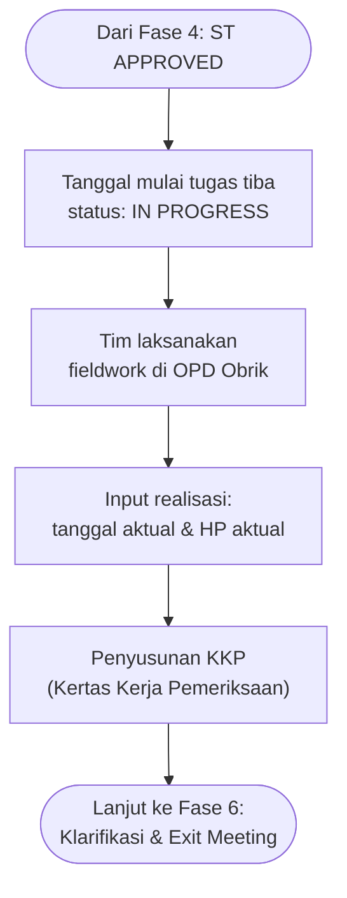

---

### 🟡 FASE 6 — Klarifikasi Temuan & Pembahasan Akhir / Exit Meeting *(Aktor: Ketua Tim + Admin OPD)*

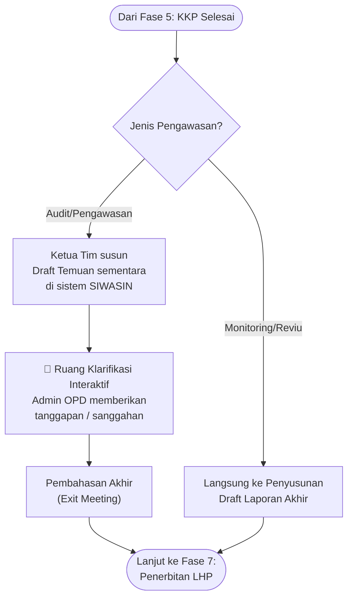

---

### 🟢 FASE 7 — Penerbitan LHP & Pemantauan TLHP *(Aktor: Ketua Tim + Sekretariat)*

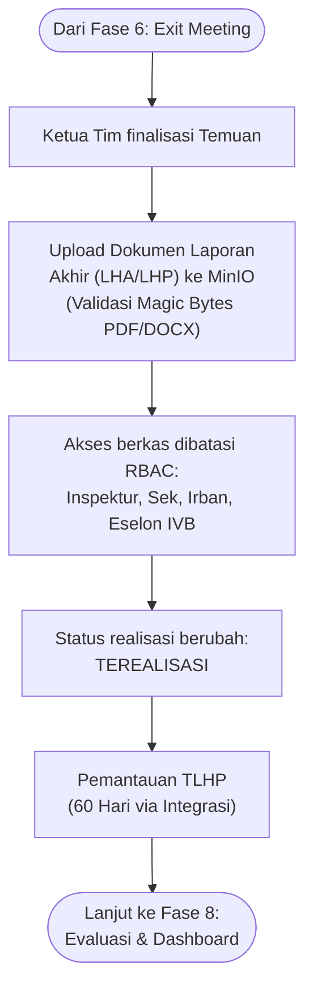

---

### 🔵 FASE 8 — Evaluasi & Dashboard Triwulan *(Aktor: Sekretariat + Inspektur)*

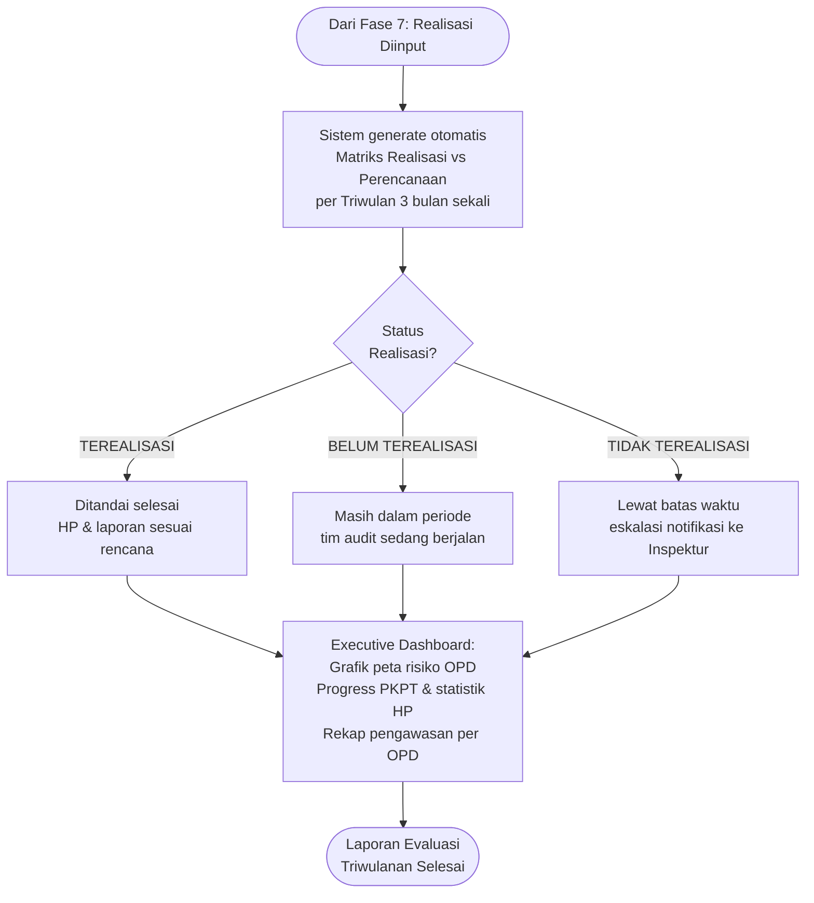

## A.9. Analisis Kesenjangan (Gap Analysis)

| Area Proses | Kondisi As-Is (Saat Ini) | Kondisi To-Be SIWASIN | Gap & Aksi Perbaikan |
|---|---|---|---|
| **Penilaian Risiko (Risk Scoring)** | Manual spreadsheet, hanya mengandalkan intuisi atau pembobotan sederhana 1 dimensi. | **Risk Scoring Engine** (Matriks X & Y): Kalkulasi otomatis 3 parameter (Pagu, TLHP, SPIP) menghasilkan pengelompokan kuadran (Q1-Q4) di Scatter Plot. | Membangun *Algoritma Kalkulasi Matriks Koordinat* & *Dashboard Scatter Plot* di MOD-02 |
| **Pendaftaran Obyek Audit** | 1 entri PKPT hanya bisa untuk 1 instansi, tidak mendukung isu lintas sektoral. | **Audit Tematik (Multi-Obrik)**: 1 entri Perencanaan (Tujuan & Sasaran) dapat menaungi banyak OPD sekaligus. | Mendesain skema relasi database *One-to-Many* antara PKPT dan Master Entitas di MOD-02 |
| **Kapasitas SDM (Budgeting)** | Penetapan target OPD tidak melihat ketersediaan jumlah Auditor & alokasi waktu. Sering *overbooking*. | **Mini Dashboard Kapasitas HP**: Sistem membandingkan Estimasi HP yang dibutuhkan vs Sisa Kapasitas Auditor sebelum penetapan Obrik final. | Membuat *Kalkulator Agregasi HP* secara *real-time* di UI Fase 2 (MOD-02) |
| **Penugasan Mendadak (KPK/Pimpinan)** | Audit insidental mengacak-acak kalender utama PKPT, sulit dilacak pemisahannya. | **Jalur Khusus (Fast-Track) Audit Non-PKPT**: Fitur *bypass* Fase 1 & 2, langsung masuk penjadwalan dengan *flag* khusus **Mandatori**. | Memisahkan form *entry point* UI untuk PKPT Reguler vs Audit Non-PKPT di MOD-03 |
| **Manajemen Jadwal Auditor** | Pengecekan jadwal masih manual, sering terjadi bentrok (1 auditor di 2 tim bersamaan). | **Clash Detection Otomatis**: Sistem menolak input auditor jika bentrok jadwal (*Hard Block*). | Membangun algoritma validasi irisan tanggal (*date range overlap*) di *Backend* MOD-03 |
| **Perangkapan Tugas Auditor** | Auditor nyambi di 2 tim tidak tercatat resmi, menyulitkan audit kinerja internal. | **Fitur Override Clash**: Sistem izinkan bentrok jadwal HANYA untuk penugasan Mandatori, dengan syarat Irban mengisi *Form Justifikasi*. | Menambahkan field `justifikasi_override` dan *bypass logic* khusus *flag* Mandatori di MOD-03 |
| **Validasi Kuota HP** | Sering melebihi 16 HP per orang karena dihitung pakai kalkulator manual. | **System-Enforced Validation (Hard Cap)**: Sistem memblokir form *submit* jika HP Ketua/Anggota melebihi batas (maks 16 HP). | Menambahkan *constraint backend* & UI *validator limit* HP di MOD-03 |
| **Approval Inspektur** | Revisi penugasan (ganti orang/tanggal) di lapangan jalan terus, Inspektur tidak tahu. | **Zero-Bypass Workflow**: Setiap ada klik edit pada tim/jadwal, status otomatis *reset* mundur ke `WAITING_DALTEK` / `INSPEKTUR`. | Membangun *State Machine Lifecycle Approval* yang ketat di MOD-03 |
| **Master Data Hierarki** | Sasaran dan Tujuan di-input berulang berupa *string/text* mentah. Rawan salah ketik. | **Master Data Management**: Relasi hirarki `Tujuan` $\rightarrow$ `Sasaran` $\rightarrow$ `Output` bersifat dinamis (*tree-based*) dan terpusat. | Membangun UI Manajemen Master Data Terstruktur & *Dynamic Select Box* di MOD-01 |
| **Klarifikasi Temuan (Auditee)** | Proses tanggapan temuan dilakukan via WhatsApp atau kirim berkas fisik, tidak terekam historinya. | **Ruang Klarifikasi Interaktif**: Fitur diskusi terenkripsi (seperti forum/thread) antara Auditor & OPD sebelum laporan final. | Mengembangkan *Chat/Thread Module* dengan lampiran bukti di dalam sistem LHA (MOD-05) |
| **Akses Laporan Rahasia** | Berkas fisik/PDF LHA sering beredar bebas atau rentan diakses pihak tak berwenang. | **Strict RBAC Enforcement**: Hanya Inspektur, Sekretaris, Irban, & Eselon IVB SIMPEG yang bisa buka/unduh *file* LHA final. | Mengaktifkan *Middleware Authorization Guard* terintegrasi SIMPEG di MOD-04 |

## A.10. Manajemen Risiko & Mitigasi Bisnis

| ID | Risiko Bisnis / Operasional | Probabilitas | Dampak | Strategi Mitigasi (Sistem SIWASIN) | Tanggung Jawab |
|---|---|---|---|---|---|
| `R-01` | **Manipulasi Jadwal (Bypass Ilegal)**: Auditor/Irban merevisi tim atau tanggal di lapangan tanpa sepengetahuan Inspektur. | Sedang | Tinggi | **State Machine Zero-Bypass**: Memutus *state* aktif dan otomatis mengembalikan status dokumen ke `WAITING_DALTEK` / `INSPEKTUR` tiap ada *edit*. | Sistem (MOD-03) |
| `R-02` | **Bentrok Jadwal (Double Jobbing)**: Auditor berada di 2 tempat bersamaan karena kelalaian ploting jadwal. | Tinggi | Sedang | **Clash Detection Algorithm**: Sistem memberikan *Hard Block* pada tanggal yang beririsan. Hanya bisa diterobos lewat jalur *Override* dengan Justifikasi. | Irban & Sistem |
| `R-03` | **Overbooking Anggaran/SDM**: OPD berisiko tinggi terlalu banyak dipilih, melebihi sisa kapasitas Hari Pengawasan (HP) APIP. | Sedang | Tinggi | **Mini Dashboard Kapasitas**: Kalkulasi *real-time* estimasi HP vs ketersediaan HP Auditor sebelum Obrik disahkan di Fase 2. | Sekretariat |
| `R-04` | **"Audit Siluman" (Unaccounted Mandatori)**: Audit dadakan disisipkan ke sistem tanpa dasar perintah yang jelas. | Rendah | Tinggi | **Jalur Non-PKPT Strict**: Wajib mengunggah (upload) dokumen PDF surat perintah dasar (Walikota/KPK) sebagai syarat *submit*. | Inspektur |
| `R-05` | **Kelelahan Auditor (Burnout)**: Penugasan seorang auditor melebihi batas wajar dalam satu Surat Tugas. | Tinggi | Sedang | **Hard-Cap Constraint 16 HP**: UI dan *Backend* memblokir *submit* form jika durasi penugasan > 16 HP. | Sistem (MOD-03) |
| `R-06` | **Keterlambatan Approval (Bottleneck)**: Proses terhenti berhari-hari karena Inspektur sedang dinas luar. | Sedang | Tinggi | Menyediakan *Mobile-responsive Quick Approval Panel* yang terhubung dengan notifikasi SSO. | Inspektur |
| `R-07` | **Kebocoran Dokumen LHA**: Pihak luar atau staf biasa berhasil mengunduh laporan hasil audit yang sifatnya sangat rahasia. | Rendah | Tinggi | **Strict RBAC Guard**: Middleware mengecek level jabatan SIMPEG (Hanya Eselon IVB/Irban/Inspektur). URL berkas menggunakan *MinIO Presigned URL* berbatas waktu. | Superadmin |
| `R-08` | **Injeksi Malware via Bukti Laporan**: Auditee mengunggah bukti sanggahan berisi *script* berbahaya (Ransomware). | Rendah | Tinggi | **Magic Bytes Validation**: Sistem *backend* mengecek *binary header* file (wajib PDF/DOCX murni), bukan sekadar mengecek ekstensi `.pdf`. | Diskominfo |

---

# BAGIAN B — PRD (Product Requirements Document)

## B.1. Visi Produk

Menjadi platform digital pengawasan internal Aparat Pengawasan Intern Pemerintah (APIP) terdepan yang mengintegrasikan seluruh siklus perencanaan berbasis risiko, penugasan audit, approval pimpinan, dan evaluasi realisasi secara akuntabel, efisien, dan aman.

## B.2. Persona Pengguna

| ID | Nama Persona | Peran / Jabatan | Tujuan Utama | Pain Points | Jobs-to-be-Done (JTBD) | Success Metrics | Konteks Pakai |
|---|---|---|---|---|---|---|---|
| `P-01` | **Drs. Bambang (Inspektur)** | Inspektur / Pimpinan | Kontrol 100% terhadap seluruh penugasan & laporan pengawasan | Kesulitan memantau revisi penugasan di lapangan secara realtime | *"Ketika ada revisi penugasan audit, saya ingin memverifikasi langsung di sistem, sehingga tidak ada surat tugas berjalan tanpa approval."* | Zero bypass revision, 100% ST approved | Desktop / Tablet, 2-5x sehari |
| `P-02` | **Siti Nurhaliza, M.Si (Sekretaris)** | Sekretaris Inspektorat | Kelancaran pemetaan risiko OPD & evaluasi realisasi triwulanan | Data risiko OPD berceceran & rekap realisasi memakan waktu minggu | *"Ketika awal periode tiba, saya ingin memetakan gradasi risiko OPD secara otomatis, sehingga PKPT berbasis risiko siap disusun."* | Rekap risiko instan, laporan evaluasi H+2 | Desktop, Harian |
| `P-03` | **Ahmad Hidayat, M.A (Irban I)** | Inspektur Pembantu Wilayah | Penyusunan PKPT Tim & Surat Tugas Besar wilayah pengawasan | Alokasi HP auditor sering bentrok atau melebihi 16 HP | *"Ketika menyusun tim pengawasan, saya ingin alokasi HP tervalidasi otomatis max 16, sehingga penugasan patuh regulasi."* | 100% ST patuh 16 HP | Desktop, Harian |
| `P-04` | **Eko Prasetyo, S.STP (Ketua Tim Audit)** | Auditor Muda / Ketua Tim | Pelaksanaan fieldwork audit & input realisasi laporan | Proses administrasi pelaporan rumit dan membutuhkan banyak cetak kertas | *"Ketika audit selesai, saya ingin mengunggah LHP dan mengisi realisasi HP, sehingga status penugasan berubah Terealisasi."* | Upload LHP < 2 menit, status real-time | Laptop/Tab Lapangan, Harian |
| `P-05` | **Rina Handayani (Admin OPD)** | Operator Auditee OPD | Mengetahui jadwal penugasan audit & menyampaikan tanggapan NHP | Informasi penugasan audit sering mendadak dan kurang transparan | *"Ketika ada penugasan audit ke OPD saya, saya ingin menerima notifikasi resmi, sehingga dokumen pendukung siap disajikan."* | Notifikasi ST realtime | Laptop OPD, Berkala |

## B.3. User Stories & Matriks Prioritas (MoSCoW)

| ID | User Story | Persona | Prioritas | Tautan BR |
|---|---|---|---|---|
| `US-01` | Sebagai Sekretaris, saya ingin menginput data penilaian risiko OPD agar sistem menghitung gradasi risiko otomatis | `P-02` | **Must Have** | `BR-01`, `BR-02` |
| `US-02` | Sebagai Irban, saya ingin menyusun PKPT Global & Tim (Mandatori/Non-Mandatori) dengan memilih Obrik berisiko tinggi | `P-03` | **Must Have** | `BR-03` |
| `US-03` | Sebagai Irban, saya ingin sistem memvalidasi maksimal 16 HP saat pembentukan Surat Tugas agar patuh aturan | `P-03` | **Must Have** | `BR-04` |
| `US-04` | Sebagai Irban, saya ingin menugaskan Ketua Tim dengan filter spesifik jenjang Auditor (Madya, Muda, Pertama, Terampil) | `P-03` | **Must Have** | `BR-05` |
| `US-05` | Sebagai Irban, saya ingin menghubungkan kegiatan PKPT dengan relasi hirarki Tujuan $\rightarrow$ Sasaran $\rightarrow$ Output | `P-03` | **Must Have** | `BR-07` |
| `US-06` | Sebagai Inspektur, saya ingin menerima notifikasi persetujuan & memverifikasi setiap revisi Surat Tugas/Laporan | `P-01` | **Must Have** | `BR-09` |
| `US-07` | Sebagai Ketua Tim, saya ingin menginput realisasi tanggal, HP, dan mengunggah LHP setelah audit selesai | `P-04` | **Must Have** | `BR-11` |
| `US-08` | Sebagai Inspektur/Sekretaris/Irban/Eselon IVB, saya ingin mengunduh & membaca berkas Laporan Pengawasan secara aman | `P-01`, `P-02`, `P-03` | **Must Have** | `BR-10`, `BR-12` |
| `US-09` | Sebagai Sekretaris, saya ingin melihat Matriks Realisasi vs Perencanaan PKPT dengan indikator status triwulanan | `P-02` | **Must Have** | `BR-11` |
| `US-10` | Sebagai Sekretariat, saya ingin melihat *Mini Dashboard Kalkulator Kapasitas HP* agar alokasi Obrik tidak melampaui ketersediaan SDM Auditor | `P-02` | **Must Have** | `BR-01` (Gap) |
| `US-11` | Sebagai Irban, saya ingin membuat *Audit Tematik* (Multi-Obrik) pada 1 penugasan untuk mengawasi isu strategis lintas sektoral | `P-03` | **Must Have** | `BR-17` |
| `US-12` | Sebagai Irban, saya ingin menginput penugasan Mandatori (*Audit Non-PKPT*) untuk mengakomodir perintah mendadak KPK tanpa melalui form Risk Scoring reguler | `P-03` | **Must Have** | `BR-03` |
| `US-13` | Sebagai Sistem, saya wajib memblokir input auditor yang bentrok jadwal (*Clash Detection*) pada rentang tanggal yang sama | Sistem | **Must Have** | `BR-19` |
| `US-14` | Sebagai Irban, saya ingin melakukan *Override Clash* pada ST Mandatori dengan mengisi Form Justifikasi agar auditor dapat merangkap tugas | `P-03` | **Must Have** | `BR-19` |
| `US-15` | Sebagai Ketua Tim & Admin OPD, saya ingin menggunakan Ruang Klarifikasi Interaktif (Thread/Chat) untuk membahas temuan sementara sebelum difinalisasi | `P-04`, `P-05` | **Must Have** | `BR-22` |

## B.4. Standar UI Apple HIG & Pola Navigasi

Aplikasi SIWASIN mengusung antarmuka **Apple Human Interface Guidelines (HIG)** dengan ketentuan visual:
1. **Typography**: Font utama `-apple-system, BlinkMacSystemFont, "SF Pro Display", "SF Pro Text", "Helvetica Neue", Inter, sans-serif` dengan kerning `tracking-tight` pada heading.
2. **Whitespace**: Grid Spacing 8pt (padding card `p-6` / `p-8`, gap `gap-6` / `gap-8`) untuk tampilan lega dan tidak padat.
3. **Squircle & Frosted Glass**: Border Radius membulat halus (`rounded-2xl` / 16px) dipadukan efek backdrop blur (`backdrop-filter: blur(20px) saturate(180%)`) pada Topbar & Sidebar Navigation.
4. **Branding Pemkot Yogyakarta**:
   - Pojok Kiri Atas Sidebar: Logo Vektor Pemkot Yogyakarta (`assets/logo-jogja.svg`, tinggi 40px) + Teks **SIWASIN Inspektorat**.
   - Footer Resmi: `© 2026 Pemerintah Kota Yogyakarta`.
5. **Pola Navigasi**: **Left Panel Menu (Sidebar Navigation)** collapsible untuk backoffice operasional.

## B.5. 5 Modul Wajib Pengaturan Sistem & Autentikasi

SIWASIN wajib menyediakan 5 Modul System Settings dan Autentikasi Sandbox:
0. **Autentikasi Terpisah (`UI-AUTH-01` / `/login`)**: Halaman login terpisah dari layout utama dengan panel **1-Click Quick Login Sandbox 4 Role Dummy User** (`Superadmin`, `Pengawas`, `Admin`, `Operator`).
1. **Manajemen Pengguna (`UI-SYS-01`)**: Form input JSS ID (auto-sync nama), Role selection, Edit status.
2. **Manajemen Role (`UI-SYS-02`)**: Proteksi hapus role aktif (*Protected Role Deletion*).
3. **Manajemen Hak Akses (`UI-SYS-03`)**: Permission Matrix 4 aksi (View, Create, Update, Delete) per modul.
4. **Manajemen Menu Sidebar (`UI-SYS-04`)**: Pengelompokan header & **pengurutan posisi menu WAJIB Drag-and-Drop (Drag-to-Reorder)**.
5. **Manajemen Tema UI (`UI-SYS-05`)**: 8 Tema Terstandarisasi (4 Light + 4 Dark Themes, WCAG AA/AAA Ratio ≥ 4.5:1).
6. **User Activity Log (`UI-SYS-06`) [Fitur Wajib Audit Trail]**: Log pencatatan aktivitas pengguna (Waktu, NIP/JSS, Role, Method, Endpoint, IP Address). **Akses Eksklusif hanya untuk Role `Superadmin` dan `Pengawas`** (Read-Only).

## B.6. Acceptance Criteria (Gherkin Scenarios)

### Feature 1: Validasi Maksimal 16 Hari Penugasan (HP)
```gherkin
Scenario: Irban menginput alokasi HP valid (<= 16 HP)
  Given Irban berada di form penyusunan Surat Tugas
  When Irban mengisi lama Hari Penugasan sejumlah 14 HP
  Then Sistem menerima input tersebut dan menampilkan indikator kuota HP "14 / 16 HP (Valid)"

Scenario: Irban menginput alokasi HP melebihi batas (> 16 HP)
  Given Irban berada di form penyusunan Surat Tugas
  When Irban mengisi lama Hari Penugasan sejumlah 18 HP
  Then Sistem menolak form submit dan menampilkan pesan error "Alokasi Hari Penugasan melebihi batas maksimal 16 HP!"
```

### Feature 2: Strict Workflow Approval Revisi oleh Inspektur
```gherkin
Scenario: Inspektur menyetujui usulan Surat Tugas / Revisi Penugasan
  Given Inspektur membuka daftar pengajuan di Pending Approval Panel
  When Inspektur memeriksa detail penugasan dan mengklik "Setujui Surat Tugas"
  Then Status Surat Tugas berubah menjadi "APPROVED", nomor ST resmi diterbitkan, dan notifikasi terkirim ke Tim Audit

Scenario: Perubahan data penugasan tanpa approval Inspektur
  Given Perencanaan penugasan berstatus "APPROVED"
  When Irban melakukan pengubahan anggota tim atau jadwal pelaksanaan
  Then Status Surat Tugas otomatis berbalik menjadi "WAITING_INSPEKTUR" dan mengunci cetak dokumen resmi hingga disetujui ulang
```

### Feature 3: Clash Detection & Justifikasi Override (Non-PKPT)
```gherkin
Scenario: Sistem menolak auditor yang bentrok jadwal (Audit Reguler)
  Given Auditor "Budi" sudah terdaftar di ST Reguler Dinas A pada tanggal 1-5 Oktober
  When Irban mencoba memasukkan "Budi" ke ST Reguler Kecamatan B pada rentang waktu yang beririsan
  Then Sistem memunculkan alert "Jadwal Budi bentrok" dan memblokir tombol Submit

Scenario: Sistem mengizinkan perangkapan tugas khusus ST Mandatori (Non-PKPT)
  Given Auditor "Budi" sudah terdaftar di ST Reguler pada tanggal 1-5 Oktober
  And Irban sedang menyusun ST Mandatori KPK (Audit Non-PKPT)
  When Irban memasukkan "Budi" ke ST Mandatori pada rentang waktu yang sama
  Then Sistem memunculkan opsi "Override Clash" yang mewajibkan Irban mengisi teks justifikasi
  And setelah justifikasi diisi, sistem mengizinkan Submit dan Budi resmi merangkap tugas
```

---

# BAGIAN C — SRS (Software Requirements Specification)

> **Acuan standar:** ISO/IEC/IEEE 29148:2018 · Seluruh kebutuhan fungsional di bawah diturunkan langsung dari analisis proses bisnis (Bagian A — BRD, `BR-01` s.d `BR-22`) dan fitur produk (Bagian B — PRD, `US-01` s.d `US-15`). Setiap `SRS-F-xx` memiliki traceability chain ke BR dan US terkait.

---

## C.1. Functional Requirements (`SRS-F-xx`)

### C.1.1. Modul Audit Universe & Master Data (`SRS-F-01` s.d `SRS-F-04`)

| ID | Nama Requirement | Deskripsi Detail | Trigger / Precondition | Input Data | Output / Behavior | Validasi & Constraint | Tautan BR | Tautan US |
|---|---|---|---|---|---|---|---|---|
| `SRS-F-01` | CRUD Multi-Entitas Audit Universe | Sistem wajib menyediakan fitur pengelolaan master data 5 jenis entitas objek audit: **OPD/Dinas, UPTD, Kecamatan, Sekolah, dan BUMD**. Setiap entitas menyimpan struktur program kerja, hierarki organisasi, alamat, dan kontak PIC. | Sekretariat membuka menu Master Data Audit Universe (`/master/audit-universe`) | `tipe_entitas` (ENUM: 'OPD', 'UPTD', 'KECAMATAN', 'SEKOLAH', 'BUMD'), `kode_entitas` (UK), `nama_entitas`, `nama_pimpinan`, `alamat`, `kontak_pic`, `parent_opd_id` (nullable FK untuk UPTD/Sekolah), `metadata_program_kerja` (JSONB) | Entitas tersimpan di tabel `ref_audit_entities`. Jika `tipe_entitas` = 'UPTD' atau 'SEKOLAH', wajib memiliki `parent_opd_id`. Sistem menampilkan hierarki tree-view. | `kode_entitas` wajib unik. `tipe_entitas` hanya menerima 5 nilai ENUM. Soft-delete (`is_active = false`) — entitas yang sudah punya relasi ke PKPT tidak boleh dihapus permanen. | `BR-17` | — |
| `SRS-F-02` | Master Data Dinamis Tujuan → Sasaran → Output | Sistem wajib menyediakan manajemen hierarki 3 tingkat: **Tujuan** (parent) → **Sasaran** (child) → **Output** (grandchild) sebagai referensi data terstruktur yang digunakan saat penyusunan PKPT. Data bersifat *tree-based* dan dapat dikonfigurasi tanpa mengubah *source code*. | Superadmin/Sekretariat membuka menu Master Data Hierarki (`/master/tujuan-sasaran-output`) | **Tujuan**: `kode_tujuan` (UK), `narasi_tujuan`. **Sasaran**: `tujuan_id` (FK), `kode_sasaran` (UK), `narasi_sasaran`. **Output**: `sasaran_id` (FK), `kode_output` (UK), `indikator_output`, `satuan_target`. | Tree-view yang menampilkan hierarki 3 level. Create/Update/Delete dengan validasi referensi cascade. Jika Tujuan dihapus → semua Sasaran & Output di bawahnya wajib soft-delete. | Kode unik per level. Tidak boleh menghapus node yang sudah diacu oleh `PKPT_GLOBALS` aktif (status ≠ ARCHIVED). | `BR-07` | `US-05` |
| `SRS-F-03` | Master Data SDM Auditor & Jenjang Fungsional | Sistem wajib menyimpan data master SDM Auditor/P2UPD yang mencakup: NIP, nama, jabatan fungsional (Madya/Muda/Pertama/Terampil/P2UPD), unit kerja (Irban I s.d IV / Khusus), kapasitas HP tersedia per tahun, dan status ketersediaan. Data ini terintegrasi dengan validasi SIMPEG. | Admin/Sekretariat membuka menu Master Auditor (`/master/auditor`) atau sistem auto-sync dari SIMPEG | `pegawai_nip` (UK), `nama_pegawai`, `jenjang_auditor` (ENUM: 'MADYA', 'MUDA', 'PERTAMA', 'TERAMPIL', 'P2UPD'), `unit_irban` (ENUM: 'IRBAN_I', 'IRBAN_II', 'IRBAN_III', 'IRBAN_IV', 'KHUSUS'), `kapasitas_hp_tahun` (Integer), `is_eselon_ivb` (Boolean), `status_ketersediaan` (ENUM: 'TERSEDIA', 'CUTI', 'DINAS_LUAR', 'NON_AKTIF') | Data auditor tersimpan dan tervalidasi. Sistem menampilkan *dashboard kapasitas HP* per auditor: total HP terpakai vs sisa kapasitas. | NIP wajib valid sesuai format SIMPEG (18 digit numerik). `kapasitas_hp_tahun` default 220 HP. `is_eselon_ivb` di-flag dari integrasi SIMPEG. | `BR-05`, `BR-12` | `US-04` |
| `SRS-F-04` | Master Data 4 Jenis Pengawasan | Sistem wajib menyediakan referensi 4 parent utama jenis pengawasan baku: **Audit, Pengawasan, Monitoring TLHP, dan Reviu** — masing-masing dengan konfigurasi atribut yang berbeda (tipe dokumen, batas HP, template laporan). | Pre-seeded saat deployment, dapat dikonfigurasi oleh Superadmin (`/master/jenis-pengawasan`) | `kode_jenis` (UK), `nama_jenis`, `tipe_dokumen_penugasan` (ENUM: 'ST_RESMI', 'NOTA_DINAS'), `batas_hp_max` (Integer, configurable), `template_laporan` (ENUM: 'LHA', 'LHP', 'LAP_MONITORING', 'LAP_REVIU'), `wajib_temuan_tlhp` (Boolean), `wajib_obrik_spesifik` (Boolean) | 4 record referensi tersimpan dengan konfigurasi masing-masing. Digunakan sebagai FK constraint pada `PKPT_GLOBALS`. | Minimal 4 jenis wajib ada. `batas_hp_max` default = 16 (configurable oleh Superadmin). | `BR-06` | — |

---

### C.1.2. Modul Risk Scoring Engine (`SRS-F-05` s.d `SRS-F-08`)

| ID | Nama Requirement | Deskripsi Detail | Trigger / Precondition | Input Data | Output / Behavior | Validasi & Constraint | Tautan BR | Tautan US |
|---|---|---|---|---|---|---|---|---|
| `SRS-F-05` | Input 3 Parameter Risiko per Entitas | Sekretariat menginput 3 parameter berbobot untuk setiap entitas audit: **(P1)** Pagu Anggaran, **(P2)** Jumlah Temuan TLHP, **(P3)** Nilai Maturitas SPIP. Setiap parameter memiliki bobot yang dapat dikonfigurasi oleh Superadmin. | Sekretariat membuka modul Risk Scoring (`/risk-mapping`) dan memilih entitas & periode | `entitas_id` (FK), `tahun`, `semester` (1 atau 2), `pagu_anggaran` (Decimal, Rupiah), `jumlah_temuan_tlhp` (Integer ≥ 0), `nilai_spip` (Decimal, skala 1.00 — 5.00), `bobot_pagu` (%), `bobot_tlhp` (%), `bobot_spip` (%) | Data parameter tersimpan di `risk_scoring_inputs`. Sistem otomatis trigger kalkulasi indeks risiko komposit (SRS-F-06). | `pagu_anggaran` ≥ 0. `jumlah_temuan_tlhp` ≥ 0. `nilai_spip` antara 1.00 — 5.00. Total bobot wajib = 100%. Duplikasi `(entitas_id, tahun, semester)` tidak diizinkan — harus update. | `BR-01`, `BR-18` | `US-01` |
| `SRS-F-06` | Kalkulasi Indeks Risiko Komposit (Matriks X-Y) | Sistem wajib mengkalkulasi koordinat matriks 2 sumbu secara otomatis setelah input parameter risiko disimpan: **Sumbu X (Kemungkinan/Likelihood)** = f(Bobot×TLHP, Bobot×SPIP_Inverse), **Sumbu Y (Dampak/Impact)** = f(Skor_Pagu_Anggaran). Hasilnya adalah pengelompokan kuadran risiko. | Triggered otomatis oleh SRS-F-05 (after INSERT/UPDATE pada `risk_scoring_inputs`) | Hasil kalkulasi dari `pagu_anggaran`, `jumlah_temuan_tlhp`, `nilai_spip`, dan bobot masing-masing | Sistem menyimpan: `skor_x` (Likelihood), `skor_y` (Impact), `kuadran_risiko` (ENUM: 'Q1_HIGH', 'Q2_MEDIUM_HIGH', 'Q3_LOW', 'Q4_MEDIUM'), `rekomendasi_tindakan` (text otomatis). Mapping kuadran: **Q1** (X Tinggi, Y Tinggi) = HIGH RISK — Wajib PKPT; **Q2** (X Rendah, Y Tinggi) = MEDIUM-HIGH — Audit jika SDM cukup; **Q4** (X Tinggi, Y Rendah) = MEDIUM — Pengawasan/Monitoring; **Q3** (X Rendah, Y Rendah) = LOW — Ditunda. | Kalkulasi harus deterministik: input yang sama selalu menghasilkan output yang sama. Skor X dan Y dinormalisasi ke skala 0—100. Threshold kuadran: X > 50 = Tinggi, Y > 50 = Tinggi (configurable). | `BR-01`, `BR-18` | `US-01` |
| `SRS-F-07` | Dashboard Peta Risiko Scatter Plot | Sistem wajib menampilkan visualisasi **Scatter Plot** interaktif dari seluruh entitas yang telah dinilai, dengan sumbu X (Kemungkinan) dan sumbu Y (Dampak). Setiap titik merepresentasikan 1 entitas audit. | User dengan role Inspektur/Sekretaris membuka Dashboard Risk Mapping (`/risk-mapping/dashboard`) | `tahun`, `semester` (sebagai filter) | Scatter Plot 4 kuadran berwarna: 🔴 Q1 (Kanan Atas), 🟠 Q2 (Kiri Atas), 🟡 Q4 (Kanan Bawah), 🟢 Q3 (Kiri Bawah). Hover tooltip menampilkan: nama entitas, skor X, skor Y, kuadran, rekomendasi. Klik titik navigasi ke detail entitas. Tabel ranking entitas berdasar skor komposit (descending). | Chart responsif, data di-cache 5 menit (invalidate on new scoring). Mendukung filter per tipe entitas. Export ke PNG/PDF. | `BR-01`, `BR-02` | `US-01` |
| `SRS-F-08` | Konfigurasi Bobot Parameter Risiko | Superadmin/Sekretariat dapat mengubah bobot relatif ketiga parameter risiko (P1, P2, P3) dan threshold kuadran. Setiap perubahan bobot otomatis di-log ke Audit Trail dan trigger rekalkulasi seluruh skor entitas pada periode yang dipilih. | Superadmin membuka menu Konfigurasi Bobot Risiko (`/risk-mapping/config`) | `bobot_pagu` (%), `bobot_tlhp` (%), `bobot_spip` (%), `threshold_x` (0—100), `threshold_y` (0—100), `tahun_berlaku`, `keterangan_perubahan` (text) | Konfigurasi baru tersimpan di `risk_config_history` (versioned). Semua skor entitas pada tahun tersebut di-rekalkulasi secara background job (async). Notifikasi ke Sekretariat bahwa rekalkulasi selesai. | Total 3 bobot wajib = 100%. Perubahan bobot wajib mengisi `keterangan_perubahan`. Setiap perubahan di-log ke `user_activity_logs`. Versi lama tidak dihapus (historical). | `BR-18` | — |

---

### C.1.3. Modul Penetapan Obyek Audit & PKPT (`SRS-F-09` s.d `SRS-F-14`)

| ID | Nama Requirement | Deskripsi Detail | Trigger / Precondition | Input Data | Output / Behavior | Validasi & Constraint | Tautan BR | Tautan US |
|---|---|---|---|---|---|---|---|---|
| `SRS-F-09` | Penetapan Obrik dari Hasil Scoring | Sekretariat/Irban memilih entitas dari hasil Risk Scoring untuk dijadikan Obrik audit. Entitas di kuadran Q1 (HIGH RISK) otomatis di-*recommend* oleh sistem, sedangkan Q2/Q4 bersifat opsional. | Sekretariat membuka daftar entitas yang sudah dinilai (`/risk-mapping/obrik-selection`) | `entitas_id[]` (array), `tahun_pkpt`, `jenis_pengawasan_id`, `kategori_pkpt` (ENUM: 'MANDATORI', 'NON_MANDATORI'), `is_tematik` (Boolean) | Obrik ter-register di staging tabel `pkpt_obrik_staging` sebelum difinalisasi ke `PKPT_GLOBALS`. Entitas Q1 yang tidak dipilih ditampilkan sebagai warning badge "Belum ter-cover". | Entitas Q1 yang tidak dipilih wajib ditampilkan sebagai peringatan (bukan blocker). Filter kuadran harus tersedia. Duplikasi obrik pada tahun & jenis yang sama ditolak. | `BR-01`, `BR-03` | `US-02` |
| `SRS-F-10` | Manual Override (Jalur Mandatori) | Sistem mengizinkan Sekretariat memasukkan entitas berisiko rendah (Q3/Q4) ke PKPT jika ada instruksi khusus, dengan kewajiban mengisi justifikasi dan mengunggah dokumen dasar perintah. | Sekretariat mengklik "Tambah Obrik Mandatori" di form Penetapan Obrik | `entitas_id`, `justifikasi_mandatori` (text, min 50 karakter), `dasar_perintah_file` (PDF upload ke MinIO), `sumber_instruksi` (ENUM: 'PIMPINAN', 'KPK', 'APH', 'ADUAN_MASYARAKAT', 'LAINNYA') | Obrik tersimpan dengan flag `kategori_pkpt = 'MANDATORI'` dan `is_override = true`. File dasar perintah tersimpan di MinIO bucket `mandatori-docs/`. Tampil badge khusus "🔴 Mandatori" pada daftar PKPT. | `justifikasi_mandatori` minimal 50 karakter. File dasar perintah wajib PDF (Magic Bytes validated). Entitas yang di-override di-log ke Audit Trail. | `BR-03` | `US-12` |
| `SRS-F-11` | Audit Tematik Multi-Obrik | Sistem mendukung 1 entri perencanaan PKPT (1 set Tujuan & Sasaran) menaungi **lebih dari 1 entitas** sekaligus untuk keperluan audit lintas sektoral (contoh: Audit Stunting, Pengentasan Kemiskinan). | Irban memilih mode "Audit Tematik" saat menyusun PKPT | `judul_tematik`, `deskripsi_tematik`, `entitas_ids[]` (array, min 2), `tujuan_id`, `sasaran_id`, `output_id`, `jenis_pengawasan_id` | 1 record `PKPT_GLOBALS` terbentuk dengan `is_tematik = true` dan tabel relasi many-to-many `pkpt_tematik_entitas` menyimpan mapping ke banyak entitas. | Minimal 2 entitas untuk mode tematik. Semua entitas wajib `is_active = true`. Total HP rencana dihitung dari seluruh entitas. | `BR-17` | `US-11` |
| `SRS-F-12` | Mini Dashboard Kalkulator Kapasitas HP | Sistem wajib menampilkan dashboard real-time yang membandingkan **total HP rencana** dari seluruh obrik yang dipilih vs **sisa kapasitas HP** seluruh auditor tersedia pada periode yang sama. Jika melebihi kapasitas, tampilkan warning. | Ditampilkan otomatis saat user berada di form Penetapan Obrik atau Penyusunan PKPT | `tahun_pkpt`, `semester` (filter) | Panel menampilkan: (1) Total HP Terpakai, (2) Total HP Kapasitas, (3) Sisa HP Tersedia, (4) Persentase Utilisasi, (5) Progress bar visual. Jika utilisasi > 90% → warning kuning. Jika > 100% → warning merah + blocker submit. | Data dikalkulasi dari `SUM(total_hp_rencana)` pada `PKPT_GLOBALS` vs `SUM(kapasitas_hp_tahun)` pada `ref_auditors`. Refresh setiap kali ada perubahan PKPT. | `BR-04` | `US-10` |
| `SRS-F-13` | Penyusunan PKPT Global & Tim | Sekretariat/Irban menyusun Perencanaan Global (jadwal seluruh kegiatan semester/tahunan) dan Perencanaan Tim (pembagian tim per kegiatan). Setiap entri PKPT wajib dikaitkan dengan Jenis Pengawasan, Obrik, dan hierarki Tujuan → Sasaran → Output. | Irban membuka menu PKPT (`/pkpt`) dan klik "Buat Draf PKPT" | `kode_pkpt` (auto-generate), `tahun`, `semester`, `kategori_pkpt` (MANDATORI/NON_MANDATORI), `jenis_pengawasan_id` (FK), `entitas_obrik_id` (FK), `tujuan_id` (FK), `sasaran_id` (FK), `output_id` (FK), `estimasi_hp` (Integer), `jadwal_mulai` (Date), `jadwal_selesai` (Date), `catatan` (text) | Draf PKPT tersimpan dengan `status_pkpt = 'DRAFT'`. `kode_pkpt` auto-generated format: `PKPT-{TAHUN}-{SEQ:4}` (contoh: `PKPT-2026-0001`). Sasaran harus child dari Tujuan, Output harus child dari Sasaran (validated). | `estimasi_hp` ≤ `batas_hp_max` dari jenis pengawasan terkait. Jadwal mulai < jadwal selesai. Tidak boleh duplikasi `(entitas_obrik_id, tahun, jenis_pengawasan_id)` kecuali tematik. | `BR-03`, `BR-07` | `US-02`, `US-05` |
| `SRS-F-14` | Penugasan Non-PKPT (Fast-Track Insidental) | Sistem menyediakan jalur khusus untuk penugasan audit insidental (di luar PKPT reguler) yang mem-bypass Fase 1 & 2 (Risk Scoring). Penugasan ini otomatis mendapat flag Mandatori dan wajib mengunggah dokumen dasar perintah. | Irban mengklik tombol "Buat Penugasan Non-PKPT" di menu utama | `judul_penugasan`, `entitas_ids[]`, `dasar_perintah_file` (PDF), `sumber_instruksi`, `justifikasi_mandatori`, `estimasi_hp`, `jadwal_mulai`, `jadwal_selesai` | PKPT entry terbentuk dengan `kategori_pkpt = 'MANDATORI'`, `is_non_pkpt = true`, `is_override = true`. Langsung masuk ke alur Fase 3 (Tim) → Fase 4 (Approval). Ditampilkan terpisah pada daftar PKPT dengan badge "⚡ Non-PKPT". | File dasar perintah wajib (PDF). Justifikasi minimal 50 karakter. Bypass risk scoring tapi tetap harus melewati approval berjenjang. | `BR-03` | `US-12` |

---

### C.1.4. Modul Surat Tugas, Validasi HP, & Clash Detection (`SRS-F-15` s.d `SRS-F-21`)

| ID | Nama Requirement | Deskripsi Detail | Trigger / Precondition | Input Data | Output / Behavior | Validasi & Constraint | Tautan BR | Tautan US |
|---|---|---|---|---|---|---|---|---|
| `SRS-F-15` | Penyusunan Draft Surat Tugas Besar | Irban/Sekretariat menyusun draft Surat Tugas resmi yang mengacu pada entri PKPT. ST berisi: nomor surat, daftar tim audit, jadwal pelaksanaan, dan alokasi HP. Untuk jenis Audit & Pengawasan → ST Resmi. Untuk Reviu → Nota Dinas. | Irban membuka menu Surat Tugas (`/surat-tugas`) dan klik "Buat ST Baru" dari entri PKPT yang berstatus DRAFT atau APPROVED | `pkpt_global_id` (FK), `nomor_st` (auto-generate / manual), `tgl_mulai`, `tgl_selesai`, `lama_hp` (Integer), `tipe_dokumen` (auto dari jenis pengawasan), `catatan_irban` (text) | Draft ST tersimpan dengan `status_approval = 'DRAFT'`. Nomor ST auto-generate format: `ST/{IRB}/{SEQ:3}/{BULAN}/{TAHUN}` (contoh: `ST/IRB-I/001/10/2026`). Data penugasan terkunci saat status `APPROVED`. | `lama_hp` ≤ batas max jenis pengawasan. `tgl_mulai` < `tgl_selesai`. Satu PKPT entry hanya boleh punya 1 ST aktif (status ≠ ARCHIVED). | `BR-04`, `BR-08` | `US-03` |
| `SRS-F-16` | Validasi Hard-Cap Enforce Batas HP | Sistem wajib memblokir form submit Surat Tugas jika nilai `lama_hp` melebihi batas maksimal yang dikonfigurasi per jenis pengawasan (default 16 HP). Validasi dilakukan di **Frontend (UI blocker)** DAN **Backend (HTTP 422)**. | Form ST di-submit (POST /api/v1/surat-tugas) | `lama_hp` (Integer) | **Frontend**: Input field HP menampilkan indikator real-time `"{value} / {max} HP"`. Jika melebihi: field berwarna merah, tombol Submit disabled, tooltip "Melebihi batas!". **Backend**: Jika `lama_hp > batas_hp_max`, return HTTP 422 dengan error code `ERR_HP_LIMIT_EXCEEDED`. | Double validation (FE + BE). Batas HP configurable per jenis pengawasan (SRS-F-04). Jika batas diubah, ST existing tidak terpengaruh (grandfathered). | `BR-04` | `US-03` |
| `SRS-F-17` | Penugasan Tim Audit 5 Peran Resmi (PJ, PPJ, Daltek, Ketua Tim, Anggota) | Irban menambahkan anggota tim ke Surat Tugas dengan **5 peran resmi** sesuai struktur dokumen ST Inspektorat: **(1) Penanggung Jawab (PJ)** — biasanya dijabat Inspektur, tercetak di kop ST sebagai penanggung jawab penugasan, sekaligus approver Jenjang 3; **(2) Pembantu Penanggung Jawab (PPJ)** — biasanya dijabat Irban/Sekretaris, tercetak di ST, sekaligus approver Jenjang 2; **(3) Pengendali Teknis (Daltek)** — auditor senior yang me-review teknis, tercetak di ST, sekaligus approver Jenjang 1; **(4) Ketua Tim** — auditor yang memimpin pelaksanaan fieldwork; **(5) Anggota Tim** — anggota pelaksana (0 atau lebih). Setiap penambahan PJ/PPJ/Daltek otomatis men-set mereka sebagai approver di jenjang terkait tanpa perlu konfigurasi terpisah. | Irban membuka tab "Tim Audit" pada form Surat Tugas | `surat_tugas_id` (FK), `pegawai_nip` (FK), `peran_tim` (ENUM: **'PENANGGUNG_JAWAB'**, **'PEMBANTU_PJ'**, 'DALTEK', 'KETUA_TIM', 'ANGGOTA'), `jenjang_auditor` (auto-fill dari master), `urutan_cetak` (Integer, untuk urutan nama di dokumen ST cetak) | Anggota tim tersimpan di `anggota_tim`. Autocomplete search by NIP/nama dengan filter jenjang. Validasi SIMPEG integration: NIP, nama, jabatan, status aktif. Badge peran & jenjang ditampilkan di samping nama. UI menampilkan 5 section terpisah: PJ (1 slot), PPJ (1 slot), Daltek (1 slot), Ketua Tim (1 slot), Anggota Tim (multi slot). Saat PJ/PPJ/Daltek di-assign → sistem **otomatis register mereka sebagai approver** di jenjang 3/2/1. | **PJ wajib tepat 1 per ST** (PENANGGUNG_JAWAB). **PPJ wajib tepat 1 per ST** (PEMBANTU_PJ). **Daltek wajib tepat 1 per ST**. **Ketua Tim wajib tepat 1 per ST**. Anggota Tim 0..N. NIP wajib valid & `status_ketersediaan = 'TERSEDIA'`. Peran 'KETUA_TIM' hanya boleh jenjang Madya/Muda. Peran 'PENANGGUNG_JAWAB' harus memiliki role Inspektur. Peran 'PEMBANTU_PJ' harus memiliki role Irban/Sekretaris. Tidak boleh duplikasi NIP dalam 1 ST. | `BR-05`, `BR-12` | `US-04` |
| `SRS-F-18` | Clash Detection Otomatis (Hard Block) | Sistem wajib mendeteksi dan **memblokir** jika seorang auditor dijadwalkan di 2 Surat Tugas yang berbeda pada rentang tanggal yang **beririsan/overlap**. Algoritma: `ST_A.tgl_mulai <= ST_B.tgl_selesai AND ST_A.tgl_selesai >= ST_B.tgl_mulai`. | Triggered saat menambahkan anggota tim ke ST (SRS-F-17) | `pegawai_nip`, `tgl_mulai` (dari ST saat ini), `tgl_selesai` (dari ST saat ini) | **Jika bentrok ditemukan**: Sistem menampilkan alert merah: "⚠️ Jadwal {nama_auditor} bentrok dengan ST {nomor_st_lain} ({tgl_mulai_lain} s.d {tgl_selesai_lain})". Tombol "Tambah Anggota" diblokir (*Hard Block*). **Jika tidak bentrok**: Auditor berhasil ditambahkan. | Pengecekan dilakukan terhadap semua ST dengan `status_approval` IN ('DRAFT', 'WAITING_DALTEK', 'WAITING_PPJ', 'WAITING_INSPEKTUR', 'APPROVED', 'IN_PROGRESS'). ST berstatus 'ARCHIVED' atau 'CANCELLED' diabaikan. | `BR-19` | `US-13` |
| `SRS-F-19` | Override Clash dengan Justifikasi (Khusus ST Mandatori) | Pengecualian dari Hard Block Clash Detection: jika ST yang sedang disusun berlabel **Mandatori** (PKPT Mandatori atau Non-PKPT), sistem memunculkan opsi **"Override Clash"** yang mengizinkan bentrok jadwal dengan syarat Irban wajib mengisi Form Justifikasi. | Clash terdeteksi (SRS-F-18) DAN `kategori_pkpt = 'MANDATORI'` pada ST saat ini | `pegawai_nip`, `surat_tugas_id`, `justifikasi_override` (text, min 30 karakter), `approved_by_irban_nip` | Auditor berhasil ditambahkan meskipun bentrok. Data override tersimpan di tabel `clash_overrides` dengan referensi ke kedua ST yang bentrok. Badge "🔴 Override Clash" ditampilkan pada daftar anggota tim. Seluruh override di-log ke Audit Trail. | Hanya berlaku untuk ST Mandatori. `justifikasi_override` minimal 30 karakter. Override tidak menghapus data clash — tetap tercatat untuk pelacakan. | `BR-19` | `US-14` |
| `SRS-F-20` | Validasi Integrasi SIMPEG untuk NIP & Jabatan | Setiap kali Irban menambahkan anggota tim ke ST, sistem wajib memvalidasi data pegawai terhadap SIMPEG Pemda: keabsahan NIP, status pegawai aktif, jabatan fungsional, dan flag Eselon IVB. | Triggered saat input NIP di form penugasan tim (SRS-F-17) | `pegawai_nip` | Sistem melakukan lookup ke master auditor (yang di-sync dari SIMPEG). Response: `nama_pegawai`, `jabatan`, `jenjang_auditor`, `is_eselon_ivb`, `status_aktif`. Jika NIP tidak ditemukan atau pegawai non-aktif → tolak. | NIP 18 digit numerik. Pegawai `status_ketersediaan = 'NON_AKTIF'` atau `'CUTI'` tidak bisa ditugaskan (kecuali di-override manual oleh Irban dengan justifikasi). | `BR-12` | `US-04` |
| `SRS-F-21` | Auto-Reset Status pada Revisi Data ST (Zero-Bypass Gate) | Setiap kali ada **perubahan data** pada Surat Tugas yang sudah berstatus `APPROVED` — baik perubahan anggota tim, jadwal, maupun alokasi HP — sistem wajib **otomatis mengembalikan** status ke `WAITING_DALTEK` (approval dimulai ulang dari Jenjang 1). Data penugasan tidak bisa dicetak/dieksekusi selama belum `APPROVED` kembali. | User (Irban) mengedit field: `anggota_tim`, `tgl_mulai`, `tgl_selesai`, `lama_hp` pada ST yang berstatus `APPROVED` | Field yang diubah + `alasan_revisi` (text, wajib diisi) | Status ST otomatis berubah ke `WAITING_DALTEK`. Entry baru di `approval_logs` dengan `action = 'AUTO_RESET'` dan `trigger_reason`. Notifikasi ke Daltek bahwa ada ST yang perlu di-review ulang. Tombol cetak/export ST dikunci. | Berlaku untuk SEMUA perubahan tanpa pengecualian (Zero-Bypass). `alasan_revisi` wajib diisi. Perubahan yang di-auto-reset di-log lengkap (field lama vs baru) di Audit Trail. | `BR-09`, `BR-20` | `US-06` |

---

### C.1.5. Modul Approval Berjenjang 3 Jenjang (`SRS-F-22` s.d `SRS-F-26`)

| ID | Nama Requirement | Deskripsi Detail | Trigger / Precondition | Input Data | Output / Behavior | Validasi & Constraint | Tautan BR | Tautan US |
|---|---|---|---|---|---|---|---|---|
| `SRS-F-22` | Submit ke Jenjang 1: Pengendali Teknis (Daltek) | Irban/penyusun men-submit draft ST ke Daltek untuk review teknis. Status berubah dari `DRAFT` → `WAITING_DALTEK`. Daltek yang di-notify adalah pegawai yang sudah di-assign sebagai `peran_tim = 'DALTEK'` pada SRS-F-17. | Irban klik "Submit untuk Review" pada ST berstatus `DRAFT` | `surat_tugas_id`, `catatan_submit` (opsional) | Status ST → `WAITING_DALTEK`. Entry di `approval_logs`: `jenjang = 1`, `approver_nip` = NIP Daltek dari `anggota_tim`, `action = 'SUBMITTED'`. Notifikasi push/email ke Daltek yang tertulis di ST. ST muncul di Pending Panel Daltek. | **ST wajib sudah memiliki 5 peran lengkap sebelum bisa submit**: PJ (1), PPJ (1), Daltek (1), Ketua Tim (1), Anggota (≥0). Semua validasi HP dan Clash harus lolos. | `BR-20` | `US-06` |
| `SRS-F-23` | Review & Keputusan Jenjang 1: Daltek | Daltek (pegawai dengan `peran_tim = 'DALTEK'` pada ST ini) me-review draft ST dan memberikan keputusan: **Lolos** (forward ke PPJ) atau **Revisi** (kembalikan ke penyusun). | Daltek membuka Pending Approval Panel (`/approval/daltek`) dan klik detail ST | `surat_tugas_id`, `action` (ENUM: 'APPROVE', 'REVISE'), `catatan_review` (text, wajib jika REVISE) | **APPROVE**: Status ST → `WAITING_PPJ`. Entry approval log jenjang 1 complete. Notifikasi ke pegawai yang ber-`peran_tim = 'PEMBANTU_PJ'` pada ST ini. **REVISE**: Status ST → `DRAFT`. Entry approval log dengan catatan revisi. Notifikasi ke penyusun. | `catatan_review` wajib jika action = 'REVISE' (min 20 karakter). Daltek hanya bisa review ST yang dia tercantum sebagai Daltek-nya (di `anggota_tim`). | `BR-20` | `US-06` |
| `SRS-F-24` | Review & Keputusan Jenjang 2: Pembantu Penanggung Jawab (PPJ) | Pembantu PJ (pegawai dengan `peran_tim = 'PEMBANTU_PJ'` pada ST ini) me-review ST yang sudah lolos Daltek dan memberikan keputusan: **Lolos** (forward ke Penanggung Jawab) atau **Revisi** (kembalikan ke penyusun). | PPJ membuka Pending Approval Panel (`/approval/ppj`) dan klik detail ST | `surat_tugas_id`, `action` (ENUM: 'APPROVE', 'REVISE'), `catatan_review` (text) | **APPROVE**: Status ST → `WAITING_PJ`. Entry approval log jenjang 2 complete. Notifikasi ke pegawai yang ber-`peran_tim = 'PENANGGUNG_JAWAB'` pada ST ini. **REVISE**: Status ST → `DRAFT` (kembali ke awal, bukan ke Daltek). Entry approval log. | Hanya ST berstatus `WAITING_PPJ` yang tampil. PPJ hanya bisa review ST yang dia tercantum sebagai PPJ-nya (di `anggota_tim`). | `BR-20` | `US-06` |
| `SRS-F-25` | Review & Keputusan Jenjang 3: Penanggung Jawab / PJ (Final Approval) | Penanggung Jawab (pegawai dengan `peran_tim = 'PENANGGUNG_JAWAB'` pada ST ini — biasanya Inspektur) sebagai pemegang otoritas tertinggi memberikan keputusan akhir: **Approve** (ST resmi diterbitkan) atau **Reject** (kembalikan ke penyusun). | PJ membuka Pending Approval Panel (`/approval/pj`) dan klik detail ST | `surat_tugas_id`, `action` (ENUM: 'APPROVE', 'REJECT'), `catatan_pj` (text, wajib jika REJECT) | **APPROVE**: Status ST → `APPROVED`. `approved_at = NOW()`. Nomor ST resmi diterbitkan & dikunci. Data penugasan terkunci (*immutable* kecuali melalui SRS-F-21). Tombol cetak/export aktif. Notifikasi ke seluruh anggota tim (5 peran). **REJECT**: Status ST → `REJECTED`. Catatan PJ terkirim ke penyusun. | Hanya ST berstatus `WAITING_PJ` yang tampil di panel PJ. PJ hanya bisa review ST yang dia tercantum sebagai PJ-nya (di `anggota_tim`). `catatan_pj` wajib jika REJECT. | `BR-09`, `BR-20` | `US-06` |
| `SRS-F-26` | Approval Log & Jejak Audit Berjenjang | Setiap aksi approval (submit, approve, revise, reject, auto-reset) tercatat di tabel `approval_logs` dengan metadata lengkap: siapa, kapan, jenjang ke berapa, catatan, dan snapshot data ST saat itu. | Otomatis ter-trigger oleh setiap aksi di SRS-F-22 s.d SRS-F-25 dan SRS-F-21 | `surat_tugas_id`, `jenjang` (1/2/3), `approver_nip`, `approver_role`, `action`, `catatan`, `snapshot_st_data` (JSONB), `ip_address` | Record tersimpan di `approval_logs`. Tidak dapat dihapus atau diedit (append-only). Ditampilkan sebagai timeline vertikal pada detail ST. Bisa di-export ke PDF untuk keperluan audit BPK. | Immutable table — hanya INSERT, tidak ada UPDATE/DELETE. `snapshot_st_data` menyimpan state ST lengkap saat aksi dilakukan (untuk audit trail forensik). | `BR-09`, `BR-14`, `BR-20` | `US-06` |

---

### C.1.6. Fase 5, 6, & 7 — Modul Pelaksanaan, Klarifikasi, & Pelaporan LHP (`SRS-F-27` s.d `SRS-F-32`)

| ID | Nama Requirement | Deskripsi Detail | Trigger / Precondition | Input Data | Output / Behavior | Validasi & Constraint | Tautan BR | Tautan US |
|---|---|---|---|---|---|---|---|---|
| `SRS-F-27` | Aktivasi Pelaksanaan Otomatis | Saat tanggal mulai tugas tiba dan ST berstatus `APPROVED`, sistem secara otomatis mengubah status menjadi `IN_PROGRESS`. Tim audit dapat mulai input data realisasi. | Scheduler harian (cron) atau manual trigger oleh Ketua Tim | `surat_tugas_id` (auto-detect dari tanggal) | Status ST → `IN_PROGRESS`. Dashboard menampilkan ST yang sedang berjalan. Countdown sisa HP ditampilkan. | Hanya ST `APPROVED` yang di-aktivasi. Jika `tgl_mulai` sudah lewat dan status masih `APPROVED` → sistem kirim notifikasi eskalasi ke Irban. | `BR-08` | `US-07` |
| `SRS-F-28` | Input Realisasi Pelaksanaan & HP Aktual | Ketua Tim menginput data realisasi pelaksanaan audit: tanggal aktual mulai dan selesai, jumlah HP aktual yang terpakai, dan catatan pelaksanaan. | Ketua Tim membuka menu Realisasi (`/realisasi`) pada ST yang `IN_PROGRESS` | `surat_tugas_id` (FK), `realisasi_tgl_mulai` (Date), `realisasi_tgl_selesai` (Date), `realisasi_hp` (Integer), `catatan_pelaksanaan` (text) | Data realisasi tersimpan di `realisasi_pengawasan`. Delta antara rencana vs aktual otomatis dihitung dan ditampilkan. Status realisasi: `SEDANG_BERJALAN` → `MENUNGGU_LAPORAN`. | `realisasi_hp` ≤ `lama_hp` dari ST (warning jika melebihi, bukan blocker). `realisasi_tgl_mulai` ≤ `realisasi_tgl_selesai`. | `BR-11` | `US-07` |
| `SRS-F-29` | Penyusunan Draft Temuan (LHA/LHP) | Untuk jenis Audit & Pengawasan, Ketua Tim menyusun draft temuan di dalam sistem. Setiap temuan mencakup: kondisi, kriteria, sebab, akibat, dan rekomendasi. Temuan ini belum final — masih bisa diklarifikasi oleh OPD. | Ketua Tim membuka tab "Temuan" pada ST yang `IN_PROGRESS` (khusus jenis Audit/Pengawasan) | `surat_tugas_id`, `judul_temuan`, `kondisi` (text), `kriteria` (text), `sebab` (text), `akibat` (text), `rekomendasi` (text), `nilai_temuan` (Decimal, opsional — jika ada kerugian keuangan) | Draft temuan tersimpan di tabel `temuan_pengawasan` dengan `status_temuan = 'DRAFT'`. Bisa ada multiple temuan per ST. Setiap temuan memiliki nomor urut otomatis. | Minimal field `kondisi`, `kriteria`, `sebab`, `akibat`, `rekomendasi` wajib diisi. `nilai_temuan` ≥ 0 jika diisi. Hanya berlaku untuk jenis Audit & Pengawasan (yang `wajib_temuan_tlhp = true`). | `BR-06` | `US-07` |
| `SRS-F-30` | Ruang Klarifikasi Interaktif Temuan | Sistem menyediakan fitur diskusi interaktif (seperti forum/thread) antara Ketua Tim Audit dan Admin OPD (Auditee) untuk membahas setiap temuan. OPD dapat memberikan tanggapan, sanggahan, atau melampirkan bukti pendukung sebelum temuan difinalisasi. | Temuan berstatus `DRAFT` dan OPD sudah di-assign sebagai peserta klarifikasi | `temuan_id` (FK), `pengirim_nip`, `pengirim_role` (ENUM: 'AUDITOR', 'AUDITEE'), `isi_pesan` (text), `lampiran_file` (PDF/gambar, opsional, upload ke MinIO) | Pesan tersimpan di tabel `klarifikasi_threads` secara kronologis. Notifikasi real-time ke pihak lawan. File lampiran ter-upload ke MinIO bucket `klarifikasi-docs/`. Timeline diskusi ditampilkan mirip UI chat/forum. Status temuan dapat diubah: `DRAFT` → `DITERIMA_OPD` / `DITOLAK_OPD` / `FINAL`. | Hanya Ketua Tim dan Admin OPD yang bisa berpartisipasi. Pesan tidak bisa dihapus (immutable log). Lampiran wajib PDF/PNG/JPG (Magic Bytes validated, max 10MB per file). Thread otomatis di-close saat temuan di-finalisasi. | `BR-22` | `US-15` |
| `SRS-F-31` | Upload Dokumen Laporan Akhir ke MinIO | Ketua Tim mengunggah dokumen laporan akhir (LHA/LHP/Laporan Monitoring/Laporan Reviu) ke MinIO Object Storage. Sistem memvalidasi format file menggunakan **Magic Bytes** (binary header), bukan hanya ekstensi file. | Ketua Tim klik "Upload Laporan Final" pada ST yang `IN_PROGRESS` atau `MENUNGGU_LAPORAN` | `surat_tugas_id`, `file_laporan` (Binary — hanya PDF atau DOCX), `judul_laporan`, `tanggal_laporan` | File tersimpan di MinIO bucket `laporan-pengawasan/` dengan object key: `{tahun}/{irban}/{nomor_st}/{filename}`. Metadata tersimpan di `realisasi_pengawasan.minio_lhp_object_key`. Status realisasi → `MENUNGGU_VERIFIKASI`. | Magic Bytes validation: PDF header `%PDF-`, DOCX header `PK` (ZIP). Max file size: 50MB. Hanya 1 laporan final per ST (replace jika upload ulang). File lama di-archive, tidak dihapus. | `BR-10`, `BR-16` | `US-07` |
| `SRS-F-32` | Restricted File Download Laporan (RBAC Guard) | Akses membaca/mengunduh berkas laporan pengawasan dibatasi **eksklusif** hanya untuk: Inspektur, Sekretaris, Irban, dan Eselon IVB (terverifikasi SIMPEG). Akses menggunakan **MinIO Presigned URL** berbatas waktu. | User meminta download LHP (`GET /api/v1/laporan/{id}/download`) | `laporan_id`, JWT Token (dari session user) | Auth middleware mengecek: (1) JWT valid, (2) Role user IN ('INSPEKTUR', 'SEKRETARIS', 'IRBAN') ATAU `is_eselon_ivb = true`, (3) Jika lolos → generate MinIO Presigned URL (expiry 15 menit) dan redirect. (4) Jika ditolak → HTTP 403 Forbidden. | Presigned URL expiry = 15 menit. Setiap download di-log ke `user_activity_logs` (siapa, kapan, file apa, IP). Rate limit: max 10 download/menit per user. `is_eselon_ivb` divalidasi dari data SIMPEG (bukan self-claim). | `BR-10`, `BR-16` | `US-08` |

---

### C.1.7. Fase 8 — Modul Evaluasi, Dashboard, & Matriks Realisasi (`SRS-F-33` s.d `SRS-F-35`)

| ID | Nama Requirement | Deskripsi Detail | Trigger / Precondition | Input Data | Output / Behavior | Validasi & Constraint | Tautan BR | Tautan US |
|---|---|---|---|---|---|---|---|---|
| `SRS-F-33` | Matriks Pemantauan Realisasi vs Perencanaan | Sistem wajib men-generate matriks perbandingan **Plan vs Actual** secara otomatis per Triwulan (3 bulan sekali). Matriks mencakup: jumlah Obrik rencana vs terealisasi, total HP rencana vs aktual, jumlah ST rencana vs terbit, persentase ketepatan jadwal. | User membuka Dashboard Evaluasi (`/dashboard-evaluasi`) | `tahun_periode`, `triwulan` (ENUM: 'TW1', 'TW2', 'TW3', 'TW4') | Tabel matriks interaktif dengan kolom: Kode PKPT, Obrik, Jenis Pengawasan, HP Rencana, HP Aktual, Delta HP, Status Realisasi (badge warna), Ketepatan Jadwal (%). Summary row: total, rata-rata, persentase keseluruhan. Export ke Excel/PDF. | Status Realisasi: `TEREALISASI` (hijau — selesai sesuai/mendekati rencana), `BELUM_TEREALISASI` (kuning — masih berjalan/dalam periode), `TIDAK_TEREALISASI` (merah — melewati batas waktu tanpa realisasi). | `BR-11` | `US-09` |
| `SRS-F-34` | Executive Dashboard Inspektur | Dashboard eksekutif all-in-one untuk Inspektur yang menampilkan: (1) Peta Risiko OPD (Scatter Plot dari SRS-F-07), (2) Progress PKPT keseluruhan (donut chart), (3) Statistik HP utilisasi (bar chart), (4) Rekap pengawasan per Irban (stacked bar), (5) Daftar ST pending approval (quick action), (6) Alert eskalasi (ST tidak terealisasi). | Inspektur login dan membuka halaman utama Dashboard (`/dashboard`) | Filter: `tahun`, `semester`, `irban_id` (opsional) | Dashboard responsif dengan 6 widget/kartu. Setiap widget interaktif (klik drill-down ke detail). Auto-refresh setiap 5 menit. Animasi smooth pada transisi data. Compatible dengan tablet (responsive). | Data di-cache 5 menit di Redis/memory. Seluruh chart menggunakan library chart yang sama (konsistensi visual). Accessibility: kontras warna WCAG AA. | `BR-11` | `US-09` |
| `SRS-F-35` | Eskalasi Notifikasi Otomatis (Tidak Terealisasi) | Jika suatu Surat Tugas melewati `tgl_selesai` yang direncanakan namun `status_realisasi` belum `TEREALISASI`, sistem otomatis mengirim notifikasi eskalasi ke Inspektur dan Irban terkait. Eskalasi bertingkat: H+3 (warning), H+7 (urgent), H+14 (critical). | Scheduler harian (cron job) mengecek ST yang overdue | `surat_tugas_id` yang `tgl_selesai < TODAY()` AND `status_realisasi` NOT IN ('TEREALISASI', 'CANCELLED') | Notifikasi terkirim ke Inspektur & Irban. Level eskalasi: **Warning** (H+3, badge kuning), **Urgent** (H+7, badge oranye), **Critical** (H+14, badge merah + highlight di dashboard). Entry di `eskalasi_logs`. | Tidak mengirim duplikasi notifikasi pada level yang sama. Eskalasi berhenti jika status berubah ke `TEREALISASI` atau `CANCELLED`. | `BR-11` | `US-09` |

---

### C.1.8. Modul Sistem, Keamanan, & Audit Trail (`SRS-F-36` s.d `SRS-F-42`)

| ID | Nama Requirement | Deskripsi Detail | Trigger / Precondition | Input Data | Output / Behavior | Validasi & Constraint | Tautan BR | Tautan US |
|---|---|---|---|---|---|---|---|---|
| `SRS-F-36` | Autentikasi SSO & Sandbox Login | Halaman login terpisah (`/login`) dengan integrasi SSO Keycloak (OIDC). Menyediakan panel **1-Click Quick Login Sandbox** dengan 4 role dummy user: Superadmin, Pengawas, Admin, Operator — untuk keperluan demo dan testing. | User mengakses `/login` | `username/jss_id`, `password` (untuk SSO) atau klik tombol role sandbox | SSO: Redirect ke Keycloak → callback → JWT issued → redirect ke dashboard. Sandbox: 1-click langsung generate JWT untuk role yang dipilih → redirect ke dashboard. Session expiry: 8 jam (configurable). | JWT menggunakan RS256 signing. Refresh token rotation. Sandbox mode hanya aktif di environment `development` dan `staging` (non-production). CSRF protection pada form login. | `BR-15` | — |
| `SRS-F-37` | Manajemen Pengguna (User Management) | CRUD data pengguna: JSS ID (auto-sync nama dari JSS/SIMPEG), assignment Role, edit status aktif/non-aktif. Mendukung pencarian, filter, dan pagination. | Admin/Superadmin membuka menu User Management (`/settings/users`) | `jss_id` (UK), `nama_user` (auto-sync), `role_id` (FK), `email`, `no_hp`, `is_active` | Daftar user dengan tabel interaktif: search, filter by role, sort, pagination (25/page). Form create/edit user. Toggle aktif/non-aktif. | `jss_id` wajib unik. Tidak boleh menghapus user yang memiliki history approval log atau realisasi. Superadmin tidak bisa menonaktifkan dirinya sendiri. | `BR-13` | — |
| `SRS-F-38` | Manajemen Role & Protected Deletion | CRUD data role. Setiap role memiliki kode unik, nama, dan deskripsi. Proteksi: role yang masih memiliki user aktif yang di-assign **tidak bisa dihapus**. | Admin/Superadmin membuka menu Role Management (`/settings/roles`) | `kode_role` (UK), `nama_role`, `deskripsi`, `is_system_role` (Boolean — role bawaan tidak bisa dihapus) | Daftar role dengan jumlah user per role. Form create/edit. Tombol hapus disabled jika `user_count > 0` atau `is_system_role = true`. | 4 System Roles bawaan (Superadmin, Pengawas, Admin, Operator) tidak bisa dihapus. Role baru bisa ditambah. | `BR-13` | — |
| `SRS-F-39` | Permission Matrix (Hak Akses per Modul) | Matriks hak akses 4 aksi (**View, Create, Update, Delete**) per modul untuk setiap role. Superadmin memiliki full access. Ditampilkan sebagai tabel checkbox interaktif. | Superadmin membuka menu Permission Matrix (`/settings/permissions`) | `role_id`, `module_code`, `can_view` (Boolean), `can_create` (Boolean), `can_update` (Boolean), `can_delete` (Boolean) | Tabel matriks: baris = modul, kolom = 4 aksi × setiap role. Checkbox interaktif dengan auto-save. Highlight perubahan. Tombol "Reset ke Default". | Permission di-enforce di Backend middleware (bukan hanya UI). Superadmin role selalu full access (hardcoded, tidak bisa diubah). Perubahan permission di-log ke Audit Trail. | `BR-13` | — |
| `SRS-F-40` | Manajemen Menu Sidebar (Drag-to-Reorder) | Pengelolaan menu sidebar navigasi: pengelompokan header, **pengurutan posisi menu wajib menggunakan Drag-and-Drop** (bukan input angka urut). Mendukung nested menu (parent → child). | Superadmin membuka menu Sidebar Management (`/settings/menus`) | `menu_id`, `label`, `icon`, `route_path`, `parent_id` (nullable), `header_group`, `sort_order` (auto-updated by drag), `is_visible` (Boolean), `required_permission` | UI Drag-and-Drop list yang responsif. Preview sidebar real-time. Perubahan urutan di-auto-save. Mendukung toggle visibility (show/hide menu tanpa delete). | Drag-and-Drop wajib menggunakan library yang mendukung touch (tablet-friendly). Minimal 1 menu harus visible. Menu sistem (Settings) tidak bisa dihapus/disembunyikan oleh non-Superadmin. | `BR-13` | — |
| `SRS-F-41` | Theme Manager (8 Tema Terstandarisasi) | Sistem menyediakan 8 tema UI terstandarisasi: 4 Light Themes + 4 Dark Themes. Setiap tema memenuhi standar kontras WCAG AA/AAA (ratio ≥ 4.5:1). User dapat memilih tema preferensi yang tersimpan di profile. | User membuka menu Theme (`/settings/themes`) atau toggle di topbar | `theme_id` (UK), `theme_name`, `is_dark` (Boolean), `primary_color`, `secondary_color`, `background_color`, `text_color`, `contrast_ratio` | Galeri tema visual dengan preview card. Klik untuk apply. Tema tersimpan per user di `user_preferences`. Transisi smooth (300ms ease). CSS custom properties untuk dynamic theming. | Semua 8 tema wajib memenuhi WCAG AA (4.5:1). Minimal 1 tema light dan 1 tema dark wajib tersedia. Default theme: Light tema pertama. | `BR-13` | — |
| `SRS-F-42` | User Activity Log (Audit Trail) | Pencatatan otomatis setiap aktivitas pengguna: Waktu (timestamp), NIP/JSS ID, Role, HTTP Method, Endpoint Path, IP Address, Status Code, Request Body (sanitized — tanpa password/token), dan Response Time. Log hanya bisa diakses oleh role **Superadmin** dan **Pengawas** (Read-Only). | Otomatis ter-trigger oleh setiap HTTP request yang merupakan mutasi data (POST/PUT/PATCH/DELETE) atau akses file laporan | HTTP Request Context (auto-captured oleh middleware) | Record tersimpan **asinkron** (non-blocking) di tabel `user_activity_logs` via message queue atau goroutine. UI: Tabel log dengan filter tanggal, user, method, endpoint. Pagination 50/page. Export CSV/Excel. | Pencatatan asinkron agar tidak menambah latency API. Log immutable (append-only, tidak bisa edit/hapus). Retention: 365 hari (configurable). Sensitive field (password, token) wajib di-redact sebelum logging. | `BR-14` | — |

---

### C.1.9. Modul Integrasi API Future-Ready (`SRS-F-43`)

| ID | Nama Requirement | Deskripsi Detail | Trigger / Precondition | Input Data | Output / Behavior | Validasi & Constraint | Tautan BR | Tautan US |
|---|---|---|---|---|---|---|---|---|
| `SRS-F-43` | Arsitektur Integrasi API Read-Only (Future-Ready) | Sistem wajib menyiapkan arsitektur endpoint API yang siap terhubung ke sistem eksternal: **(1)** API SIPD/e-Keuangan Pemda untuk data pagu anggaran OPD, **(2)** API sistem TLHP untuk riwayat temuan. Pada V1, data ini diinput manual. Arsitektur berupa **adapter pattern** — saat API eksternal siap, cukup mengaktifkan adapter tanpa mengubah business logic. | Superadmin mengaktifkan toggle integrasi di konfigurasi sistem | `integration_type` (ENUM: 'SIPD', 'TLHP'), `base_url`, `api_key`, `is_active` (Boolean) | Konfigurasi tersimpan di `integration_configs`. Jika `is_active = false`: sistem menggunakan input manual (default V1). Jika `is_active = true`: sistem memanggil API eksternal via adapter. Health check endpoint tersedia (`/api/v1/integrations/{type}/health`). | Timeout API eksternal: 10 detik. Fallback ke data manual jika API gagal. Retry mechanism: 3x dengan exponential backoff. API key di-encrypt di database. | `BR-21` | — |

---

## C.2. Rangkuman Traceability Functional Requirements

> Tabel berikut memastikan **setiap Business Requirement (BR)** dan **User Story (US)** telah ter-cover oleh minimal 1 Functional Requirement (SRS-F):

| BR-xx | Deskripsi Singkat BR | SRS-F yang Meng-cover |
|---|---|---|
| `BR-01` | Modul penilaian gradasi risiko OPD | `SRS-F-05`, `SRS-F-06`, `SRS-F-07`, `SRS-F-09` |
| `BR-02` | Periode analisis semesteran & triwulanan | `SRS-F-05`, `SRS-F-07`, `SRS-F-33` |
| `BR-03` | Perencanaan PKPT Mandatori & Non-Mandatori | `SRS-F-10`, `SRS-F-13`, `SRS-F-14` |
| `BR-04` | Validasi maksimal 16 HP | `SRS-F-12`, `SRS-F-16` |
| `BR-05` | Kualifikasi Ketua Tim Jenjang Fungsional | `SRS-F-03`, `SRS-F-17` |
| `BR-06` | 4 Parent Utama Pengawasan | `SRS-F-04`, `SRS-F-29` |
| `BR-07` | Relasi hirarki Tujuan → Sasaran → Output | `SRS-F-02`, `SRS-F-13` |
| `BR-08` | Surat Tugas Besar oleh Irban | `SRS-F-15`, `SRS-F-27` |
| `BR-09` | Strict Inspektur Approval (Zero-Bypass) | `SRS-F-21`, `SRS-F-25`, `SRS-F-26` |
| `BR-10` | Akses laporan eksklusif RBAC | `SRS-F-31`, `SRS-F-32` |
| `BR-11` | Matriks Realisasi vs Perencanaan | `SRS-F-28`, `SRS-F-33`, `SRS-F-34`, `SRS-F-35` |
| `BR-12` | Integrasi SIMPEG validasi NIP/Jabatan | `SRS-F-03`, `SRS-F-20` |
| `BR-13` | 5 Modul Pengaturan Sistem | `SRS-F-37`, `SRS-F-38`, `SRS-F-39`, `SRS-F-40`, `SRS-F-41` |
| `BR-14` | Audit Trail Log Aktivitas | `SRS-F-26`, `SRS-F-42` |
| `BR-15` | Sandbox 4 Role Dummy Login | `SRS-F-36` |
| `BR-16` | MinIO Object Storage Presigned URL | `SRS-F-31`, `SRS-F-32` |
| `BR-17` | Audit Universe Multi-Entitas | `SRS-F-01`, `SRS-F-11` |
| `BR-18` | Risk Scoring Engine 3 Parameter | `SRS-F-05`, `SRS-F-06`, `SRS-F-08` |
| `BR-19` | Clash Detection Otomatis | `SRS-F-18`, `SRS-F-19` |
| `BR-20` | Approval Berjenjang 3 Jenjang (Zero-Bypass) | `SRS-F-21`, `SRS-F-22`, `SRS-F-23`, `SRS-F-24`, `SRS-F-25`, `SRS-F-26` |
| `BR-21` | Arsitektur Integrasi Future-Ready | `SRS-F-43` |
| `BR-22` | Ruang Klarifikasi Interaktif Temuan | `SRS-F-30` |

| US-xx | Deskripsi Singkat US | SRS-F yang Meng-cover |
|---|---|---|
| `US-01` | Input data penilaian risiko OPD | `SRS-F-05`, `SRS-F-06`, `SRS-F-07` |
| `US-02` | Penyusunan PKPT Global & Tim | `SRS-F-09`, `SRS-F-13` |
| `US-03` | Validasi maksimal 16 HP | `SRS-F-15`, `SRS-F-16` |
| `US-04` | Filter jenjang Auditor pada penugasan | `SRS-F-03`, `SRS-F-17`, `SRS-F-20` |
| `US-05` | Relasi Tujuan → Sasaran → Output | `SRS-F-02`, `SRS-F-13` |
| `US-06` | Approval & verifikasi revisi ST | `SRS-F-21`, `SRS-F-22`, `SRS-F-23`, `SRS-F-24`, `SRS-F-25`, `SRS-F-26` |
| `US-07` | Input realisasi & upload LHP | `SRS-F-27`, `SRS-F-28`, `SRS-F-29`, `SRS-F-31` |
| `US-08` | Download berkas laporan (RBAC) | `SRS-F-32` |
| `US-09` | Matriks Realisasi vs Perencanaan | `SRS-F-33`, `SRS-F-34`, `SRS-F-35` |
| `US-10` | Mini Dashboard Kapasitas HP | `SRS-F-12` |
| `US-11` | Audit Tematik Multi-Obrik | `SRS-F-11` |
| `US-12` | Penugasan Non-PKPT (Fast-Track) | `SRS-F-10`, `SRS-F-14` |
| `US-13` | Clash Detection (Hard Block) | `SRS-F-18` |
| `US-14` | Override Clash + Justifikasi | `SRS-F-19` |
| `US-15` | Ruang Klarifikasi Interaktif | `SRS-F-30` |

---

## C.3. Sequence Diagrams (Mermaid)

### Sequence 1: Alur Risk Scoring Engine (Fase 1B)

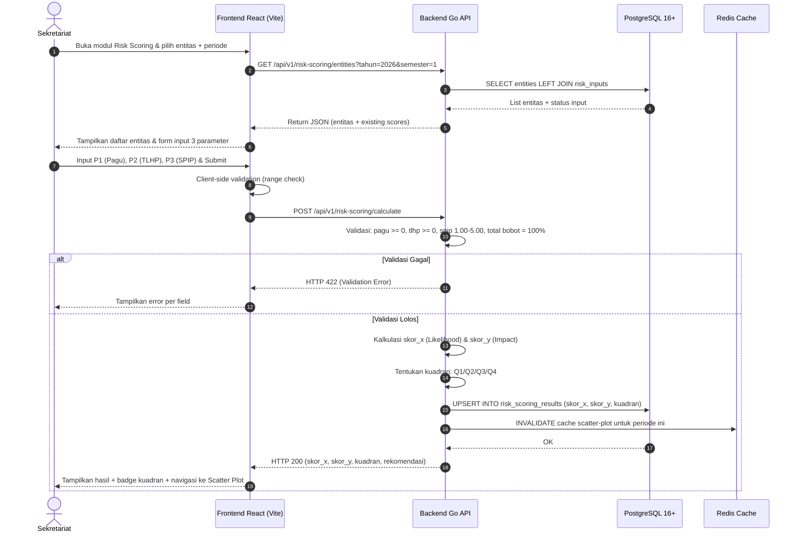

### Sequence 2: Alur Approval Berjenjang 3 Jenjang (Daltek → PPJ → Inspektur)

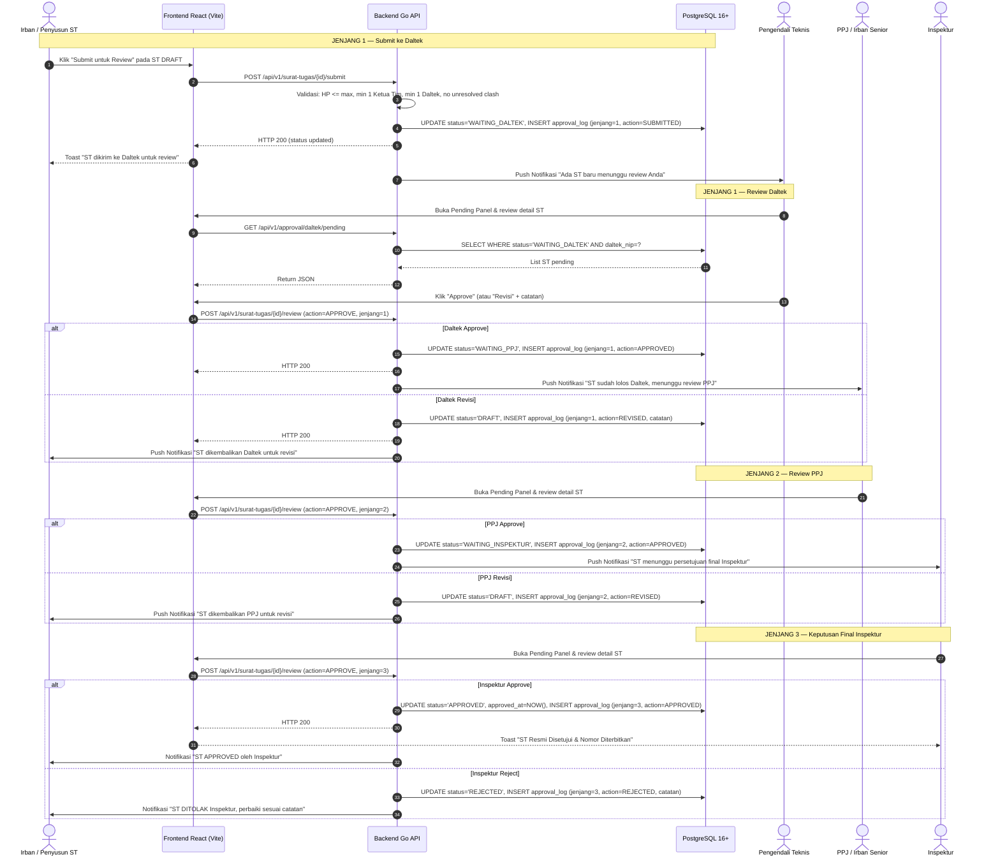

### Sequence 3: Clash Detection & Override Clash (Non-PKPT)

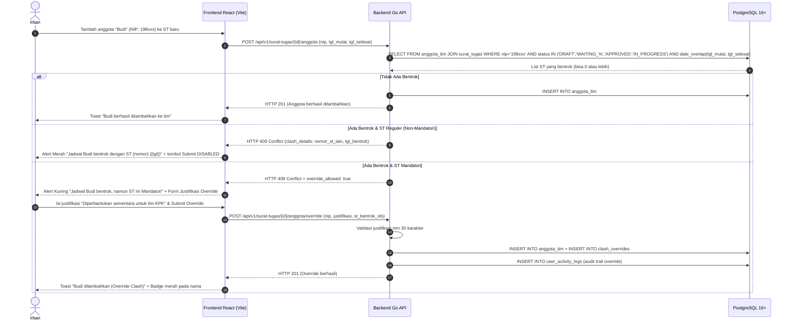

### Sequence 4: Upload Laporan & Restricted Download (MinIO + RBAC)

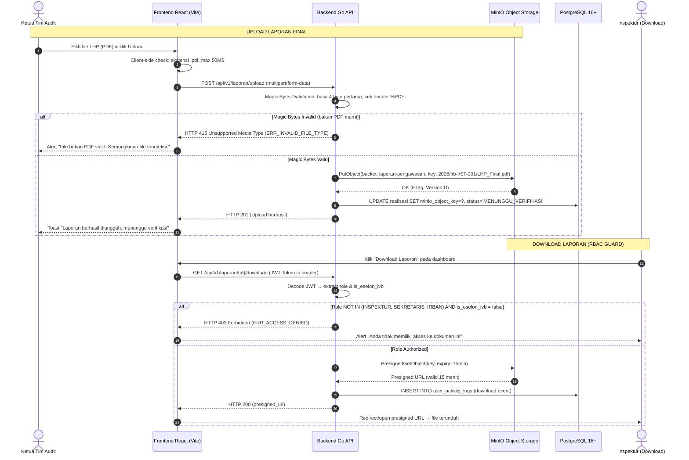

### Sequence 5: Klarifikasi Interaktif Temuan (Thread Auditor ↔ OPD)

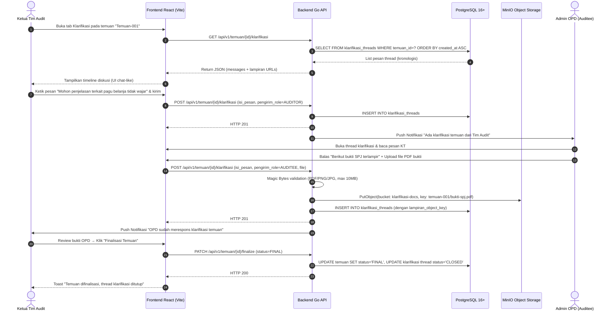

### Sequence 6: Auto-Reset Status (Zero-Bypass Gate) pada Revisi ST Approved

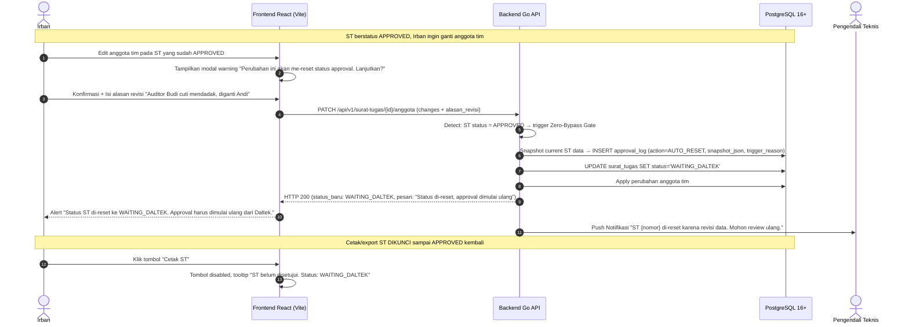

---

## C.4. Single Source of Truth ERD (Locked Skema Global PostgreSQL)

> ERD berikut mencakup **seluruh tabel** yang dibutuhkan untuk mengimplementasikan 43 Functional Requirements di atas.

```mermaid
erDiagram
    REF_AUDIT_ENTITIES {
        uuid id PK
        varchar tipe_entitas "ENUM: OPD, UPTD, KECAMATAN, SEKOLAH, BUMD"
        varchar kode_entitas UK
        varchar nama_entitas
        varchar nama_pimpinan
        text alamat
        varchar kontak_pic
        uuid parent_opd_id FK "nullable — untuk UPTD/Sekolah"
        jsonb metadata_program_kerja
        boolean is_active
        timestamptz created_at
        timestamptz updated_at
    }

    RISK_CONFIG_HISTORY {
        uuid id PK
        integer tahun_berlaku
        decimal bobot_pagu
        decimal bobot_tlhp
        decimal bobot_spip
        decimal threshold_x
        decimal threshold_y
        text keterangan_perubahan
        varchar changed_by_nip
        timestamptz created_at
    }

    RISK_SCORING_INPUTS {
        uuid id PK
        uuid entitas_id FK
        integer tahun
        integer semester "1 atau 2"
        decimal pagu_anggaran
        integer jumlah_temuan_tlhp
        decimal nilai_spip "skala 1.00 - 5.00"
        varchar input_by_nip
        timestamptz created_at
        timestamptz updated_at
    }

    RISK_SCORING_RESULTS {
        uuid id PK
        uuid entitas_id FK
        uuid scoring_input_id FK
        integer tahun
        integer semester
        decimal skor_x "Likelihood (0-100)"
        decimal skor_y "Impact (0-100)"
        varchar kuadran_risiko "ENUM: Q1_HIGH, Q2_MEDIUM_HIGH, Q3_LOW, Q4_MEDIUM"
        text rekomendasi_tindakan
        timestamptz calculated_at
    }

    REF_TUJUAN {
        uuid id PK
        varchar kode_tujuan UK
        text narasi_tujuan
        boolean is_active
        timestamptz created_at
    }

    REF_SASARAN {
        uuid id PK
        uuid tujuan_id FK
        varchar kode_sasaran UK
        text narasi_sasaran
        boolean is_active
        timestamptz created_at
    }

    REF_OUTPUT {
        uuid id PK
        uuid sasaran_id FK
        varchar kode_output UK
        text indikator_output
        varchar satuan_target
        boolean is_active
        timestamptz created_at
    }

    REF_JENIS_PENGAWASAN {
        uuid id PK
        varchar kode_jenis UK
        varchar nama_jenis "Audit, Pengawasan, Monitoring TLHP, Reviu"
        varchar tipe_dokumen_penugasan "ENUM: ST_RESMI, NOTA_DINAS"
        integer batas_hp_max "default 16"
        varchar template_laporan "ENUM: LHA, LHP, LAP_MONITORING, LAP_REVIU"
        boolean wajib_temuan_tlhp
        boolean wajib_obrik_spesifik
    }

    REF_AUDITORS {
        uuid id PK
        varchar pegawai_nip UK
        varchar nama_pegawai
        varchar jenjang_auditor "ENUM: MADYA, MUDA, PERTAMA, TERAMPIL, P2UPD"
        varchar unit_irban "ENUM: IRBAN_I, IRBAN_II, IRBAN_III, IRBAN_IV, KHUSUS"
        integer kapasitas_hp_tahun "default 220"
        boolean is_eselon_ivb
        varchar status_ketersediaan "ENUM: TERSEDIA, CUTI, DINAS_LUAR, NON_AKTIF"
        timestamptz synced_from_simpeg_at
    }

    PKPT_GLOBALS {
        uuid id PK
        varchar kode_pkpt UK "auto: PKPT-YYYY-NNNN"
        integer tahun
        integer semester
        varchar kategori_pkpt "ENUM: MANDATORI, NON_MANDATORI"
        uuid jenis_pengawasan_id FK
        uuid entitas_obrik_id FK
        uuid tujuan_id FK
        uuid sasaran_id FK
        uuid output_id FK
        integer estimasi_hp
        date jadwal_mulai
        date jadwal_selesai
        boolean is_tematik
        boolean is_non_pkpt "true jika Fast-Track"
        boolean is_override
        text justifikasi_mandatori
        varchar minio_dasar_perintah_key "file PDF dasar perintah"
        varchar sumber_instruksi "ENUM: PIMPINAN, KPK, APH, ADUAN, LAINNYA"
        varchar status_pkpt "ENUM: DRAFT, ACTIVE, ARCHIVED"
        text catatan
        timestamptz created_at
        timestamptz updated_at
    }

    PKPT_TEMATIK_ENTITAS {
        uuid id PK
        uuid pkpt_global_id FK
        uuid entitas_id FK
        timestamptz created_at
    }

    SURAT_TUGAS {
        uuid id PK
        varchar nomor_st UK "auto: ST/IRB-x/NNN/MM/YYYY"
        uuid pkpt_global_id FK
        uuid irban_id FK "NIP Irban penyusun"
        varchar tipe_dokumen "ENUM: ST_RESMI, NOTA_DINAS"
        date tgl_mulai
        date tgl_selesai
        integer lama_hp
        varchar status_approval "ENUM: DRAFT, WAITING_DALTEK, WAITING_PPJ, WAITING_INSPEKTUR, APPROVED, REJECTED, IN_PROGRESS, TEREALISASI, CANCELLED"
        text catatan_irban
        text alasan_revisi "diisi saat edit ST APPROVED"
        timestamptz approved_at
        timestamptz created_at
        timestamptz updated_at
    }

    ANGGOTA_TIM {
        uuid id PK
        uuid surat_tugas_id FK
        varchar pegawai_nip FK
        varchar nama_pegawai
        varchar peran_tim "ENUM: PENANGGUNG_JAWAB, PEMBANTU_PJ, DALTEK, KETUA_TIM, ANGGOTA"
        varchar jenjang_auditor
        boolean is_eselon_ivb
        integer urutan_cetak "urutan nama di dokumen ST cetak"
        boolean is_approver "true untuk PJ/PPJ/Daltek — otomatis dari peran_tim"
        integer jenjang_approval "nullable: 3=PJ, 2=PPJ, 1=Daltek, null=non-approver"
        timestamptz created_at
    }

    CLASH_OVERRIDES {
        uuid id PK
        uuid surat_tugas_id FK "ST yang di-override"
        uuid surat_tugas_bentrok_id FK "ST yang bentrok"
        varchar pegawai_nip
        text justifikasi_override "min 30 karakter"
        varchar approved_by_irban_nip
        timestamptz created_at
    }

    APPROVAL_LOGS {
        uuid id PK
        uuid surat_tugas_id FK
        integer jenjang "1=Daltek, 2=PPJ, 3=Inspektur"
        varchar approver_nip
        varchar approver_role
        varchar action "ENUM: SUBMITTED, APPROVED, REVISED, REJECTED, AUTO_RESET"
        text catatan
        jsonb snapshot_st_data "state ST saat aksi dilakukan"
        varchar trigger_reason "untuk AUTO_RESET"
        varchar ip_address
        timestamptz created_at
    }

    REALISASI_PENGAWASAN {
        uuid id PK
        uuid surat_tugas_id FK
        date realisasi_tgl_mulai
        date realisasi_tgl_selesai
        integer realisasi_hp
        text catatan_pelaksanaan
        varchar minio_lhp_object_key
        varchar judul_laporan
        date tanggal_laporan
        varchar status_realisasi "ENUM: SEDANG_BERJALAN, MENUNGGU_LAPORAN, MENUNGGU_VERIFIKASI, TEREALISASI, TIDAK_TEREALISASI"
        timestamptz verified_at
        timestamptz created_at
        timestamptz updated_at
    }

    TEMUAN_PENGAWASAN {
        uuid id PK
        uuid surat_tugas_id FK
        integer nomor_urut "auto-increment per ST"
        varchar judul_temuan
        text kondisi
        text kriteria
        text sebab
        text akibat
        text rekomendasi
        decimal nilai_temuan "nullable, jika ada kerugian keuangan"
        varchar status_temuan "ENUM: DRAFT, DITERIMA_OPD, DITOLAK_OPD, FINAL"
        timestamptz created_at
        timestamptz updated_at
    }

    KLARIFIKASI_THREADS {
        uuid id PK
        uuid temuan_id FK
        varchar pengirim_nip
        varchar pengirim_role "ENUM: AUDITOR, AUDITEE"
        text isi_pesan
        varchar lampiran_object_key "nullable, MinIO path"
        varchar status_thread "ENUM: OPEN, CLOSED"
        timestamptz created_at
    }

    ESKALASI_LOGS {
        uuid id PK
        uuid surat_tugas_id FK
        varchar level_eskalasi "ENUM: WARNING, URGENT, CRITICAL"
        integer hari_overdue
        varchar notified_to_nip
        timestamptz notified_at
    }

    INTEGRATION_CONFIGS {
        uuid id PK
        varchar integration_type "ENUM: SIPD, TLHP"
        varchar base_url
        varchar api_key_encrypted
        boolean is_active
        timestamptz last_health_check
        varchar health_status "ENUM: OK, ERROR, TIMEOUT"
        timestamptz created_at
        timestamptz updated_at
    }

    USERS {
        uuid id PK
        varchar jss_id UK
        varchar nama_user
        uuid role_id FK
        varchar email
        varchar no_hp
        boolean is_active
        varchar preferred_theme_id
        timestamptz created_at
        timestamptz updated_at
    }

    ROLES {
        uuid id PK
        varchar kode_role UK
        varchar nama_role
        text deskripsi
        boolean is_system_role "true untuk 4 role bawaan"
        timestamptz created_at
    }

    PERMISSIONS {
        uuid id PK
        uuid role_id FK
        varchar module_code
        boolean can_view
        boolean can_create
        boolean can_update
        boolean can_delete
    }

    SIDEBAR_MENUS {
        uuid id PK
        varchar label
        varchar icon
        varchar route_path
        uuid parent_id FK "nullable untuk nested"
        varchar header_group
        integer sort_order
        boolean is_visible
        varchar required_permission
    }

    USER_ACTIVITY_LOGS {
        uuid id PK
        varchar user_jss_id
        varchar nama_user
        varchar role_code
        varchar http_method
        varchar endpoint_path
        varchar ip_address
        integer status_code
        integer response_time_ms
        jsonb request_body_sanitized "tanpa password/token"
        timestamptz created_at
    }

    %% === RELASI ===
    REF_AUDIT_ENTITIES ||--o{ REF_AUDIT_ENTITIES : "parent (untuk UPTD/Sekolah)"
    REF_AUDIT_ENTITIES ||--o{ RISK_SCORING_INPUTS : "dinilai risikonya"
    RISK_SCORING_INPUTS ||--|| RISK_SCORING_RESULTS : "menghasilkan skor"
    REF_AUDIT_ENTITIES ||--o{ PKPT_GLOBALS : "menjadi obrik audit"
    REF_AUDIT_ENTITIES ||--o{ PKPT_TEMATIK_ENTITAS : "tematik multi-obrik"
    REF_TUJUAN ||--o{ REF_SASARAN : "memuat sasaran"
    REF_SASARAN ||--o{ REF_OUTPUT : "memuat indikator output"
    REF_JENIS_PENGAWASAN ||--o{ PKPT_GLOBALS : "jenis pengawasan"
    REF_TUJUAN ||--o{ PKPT_GLOBALS : "acuan tujuan"
    REF_SASARAN ||--o{ PKPT_GLOBALS : "acuan sasaran"
    REF_OUTPUT ||--o{ PKPT_GLOBALS : "target output"
    PKPT_GLOBALS ||--o{ PKPT_TEMATIK_ENTITAS : "entitas tematik"
    PKPT_GLOBALS ||--o{ SURAT_TUGAS : "diterbitkan menjadi ST"
    SURAT_TUGAS ||--o{ ANGGOTA_TIM : "menugaskan"
    SURAT_TUGAS ||--o{ CLASH_OVERRIDES : "override clash"
    SURAT_TUGAS ||--o{ APPROVAL_LOGS : "riwayat approval"
    SURAT_TUGAS ||--|| REALISASI_PENGAWASAN : "direalisasikan"
    SURAT_TUGAS ||--o{ TEMUAN_PENGAWASAN : "temuan audit"
    TEMUAN_PENGAWASAN ||--o{ KLARIFIKASI_THREADS : "klarifikasi diskusi"
    SURAT_TUGAS ||--o{ ESKALASI_LOGS : "eskalasi overdue"
    REF_AUDITORS ||--o{ ANGGOTA_TIM : "ditugaskan"
    ROLES ||--o{ USERS : "memiliki user"
    ROLES ||--o{ PERMISSIONS : "hak akses per modul"
```

---

## C.5. State Diagrams

### C.5.1. State Diagram Lifecycle Approval Surat Tugas (3-Tier + Zero-Bypass)

```mermaid
stateDiagram-v2
    [*] --> DRAFT : Irban Buat Draf Surat Tugas

    DRAFT --> WAITING_DALTEK : Submit ke Jenjang 1 (Daltek)

    WAITING_DALTEK --> WAITING_PPJ : Daltek Approve ✅
    WAITING_DALTEK --> DRAFT : Daltek Revisi (Kembalikan) 🔄

    WAITING_PPJ --> WAITING_INSPEKTUR : PPJ Approve ✅
    WAITING_PPJ --> DRAFT : PPJ Revisi (Kembalikan ke awal) 🔄

    WAITING_INSPEKTUR --> APPROVED : Inspektur Approve ✅ (Nomor ST Resmi Terbit)
    WAITING_INSPEKTUR --> REJECTED : Inspektur Reject ❌

    REJECTED --> DRAFT : Irban Perbaiki Data 🔄

    APPROVED --> WAITING_DALTEK : Ada Perubahan HP/Tim/Jadwal (Zero-Bypass Gate 🔒)
    APPROVED --> CANCELLED : Dibatalkan oleh Inspektur

    APPROVED --> IN_PROGRESS : Tanggal Tugas Dimulai (Auto/Manual)

    IN_PROGRESS --> WAITING_DALTEK : Ada Revisi Darurat (Zero-Bypass Gate 🔒)

    state IN_PROGRESS {
        [*] --> SEDANG_BERJALAN
        SEDANG_BERJALAN --> MENUNGGU_LAPORAN : Realisasi HP Diinput
        MENUNGGU_LAPORAN --> MENUNGGU_VERIFIKASI : Laporan Final Diupload
        MENUNGGU_VERIFIKASI --> TEREALISASI_INTERNAL : Laporan Terverifikasi
    }

    IN_PROGRESS --> TEREALISASI : LHP Diunggah & Verified ✅
    TEREALISASI --> [*]
    CANCELLED --> [*]
```

### C.5.2. State Diagram Lifecycle Realisasi Pengawasan

```mermaid
stateDiagram-v2
    [*] --> BELUM_DIMULAI : ST APPROVED tapi tanggal belum tiba

    BELUM_DIMULAI --> SEDANG_BERJALAN : Tanggal mulai tiba / Ketua Tim mulai input

    SEDANG_BERJALAN --> MENUNGGU_LAPORAN : Realisasi tanggal & HP aktual sudah diinput

    MENUNGGU_LAPORAN --> MENUNGGU_VERIFIKASI : Laporan final diupload ke MinIO

    MENUNGGU_VERIFIKASI --> TEREALISASI : Laporan diverifikasi oleh Irban/Inspektur

    SEDANG_BERJALAN --> TIDAK_TEREALISASI : Melewati batas waktu tanpa realisasi (Eskalasi H+14)
    MENUNGGU_LAPORAN --> TIDAK_TEREALISASI : Melewati batas waktu tanpa upload laporan

    TIDAK_TEREALISASI --> SEDANG_BERJALAN : Diperpanjang oleh Inspektur (dengan approval ulang)
    TEREALISASI --> [*]
```

---

## C.6. API Contract Catalog (RESTful Endpoints)

> Seluruh endpoint menggunakan prefix `/api/v1/`. Autentikasi via JWT Bearer Token. Content-Type: `application/json` kecuali upload file (`multipart/form-data`).

### C.6.1. Audit Universe & Master Data

| Method | Endpoint | Deskripsi | Request Body / Params | Response Success | Response Error | SRS-F |
|---|---|---|---|---|---|---|
| `GET` | `/audit-universe` | List semua entitas audit (paginated, filterable) | Query: `?tipe=OPD&is_active=true&page=1&limit=25` | `200` — Array of entities | `401` Unauthorized | `SRS-F-01` |
| `POST` | `/audit-universe` | Tambah entitas baru | `{ tipe_entitas, kode_entitas, nama_entitas, ... }` | `201` Created | `409` Duplicate kode, `422` Validation | `SRS-F-01` |
| `PUT` | `/audit-universe/{id}` | Update entitas | `{ nama_entitas, nama_pimpinan, ... }` | `200` Updated | `404` Not Found, `422` Validation | `SRS-F-01` |
| `DELETE` | `/audit-universe/{id}` | Soft-delete entitas | — | `200` Deactivated | `409` Has active PKPT references | `SRS-F-01` |
| `GET` | `/master/tujuan` | List hierarki Tujuan → Sasaran → Output (tree) | Query: `?flat=false` (tree) / `?flat=true` (flat) | `200` — Tree/flat array | `401` | `SRS-F-02` |
| `GET` | `/master/auditor` | List SDM Auditor dengan kapasitas HP | Query: `?jenjang=MUDA&unit=IRBAN_I&status=TERSEDIA` | `200` — Array + HP stats | `401` | `SRS-F-03` |
| `GET` | `/master/jenis-pengawasan` | List 4 jenis pengawasan + konfigurasi | — | `200` — Array of 4 jenis | `401` | `SRS-F-04` |

### C.6.2. Risk Scoring Engine

| Method | Endpoint | Deskripsi | Request Body / Params | Response Success | Response Error | SRS-F |
|---|---|---|---|---|---|---|
| `POST` | `/risk-scoring/calculate` | Input 3 parameter & trigger kalkulasi | `{ entitas_id, tahun, semester, pagu_anggaran, jumlah_temuan_tlhp, nilai_spip }` | `200` — `{ skor_x, skor_y, kuadran, rekomendasi }` | `422` Validation Error | `SRS-F-05`, `SRS-F-06` |
| `GET` | `/risk-scoring/dashboard` | Data scatter plot peta risiko | Query: `?tahun=2026&semester=1&tipe_entitas=OPD` | `200` — Array of `{ entitas, skor_x, skor_y, kuadran }` | `401` | `SRS-F-07` |
| `GET` | `/risk-scoring/config` | Ambil konfigurasi bobot aktif | — | `200` — `{ bobot_pagu, bobot_tlhp, bobot_spip, threshold_x, threshold_y }` | `401` | `SRS-F-08` |
| `PUT` | `/risk-scoring/config` | Update konfigurasi bobot & trigger rekalkulasi | `{ bobot_pagu, bobot_tlhp, bobot_spip, threshold_x, threshold_y, keterangan_perubahan }` | `200` — Config updated + rekalkulasi queued | `422` Total bobot ≠ 100% | `SRS-F-08` |

### C.6.3. PKPT & Penetapan Obrik

| Method | Endpoint | Deskripsi | Request Body / Params | Response Success | Response Error | SRS-F |
|---|---|---|---|---|---|---|
| `GET` | `/pkpt` | List PKPT (paginated, filterable) | Query: `?tahun=2026&kategori=MANDATORI&status=DRAFT&page=1` | `200` — Array PKPT entries | `401` | `SRS-F-13` |
| `POST` | `/pkpt` | Buat draf PKPT baru | `{ tahun, semester, kategori_pkpt, jenis_pengawasan_id, entitas_obrik_id, tujuan_id, sasaran_id, output_id, estimasi_hp, jadwal_mulai, jadwal_selesai }` | `201` — PKPT created (status DRAFT) | `409` Duplicate, `422` Validation | `SRS-F-13` |
| `POST` | `/pkpt/tematik` | Buat PKPT tematik multi-obrik | `{ judul_tematik, deskripsi, entitas_ids[], tujuan_id, sasaran_id, output_id, ... }` | `201` — PKPT tematik created | `422` Min 2 entitas | `SRS-F-11` |
| `POST` | `/pkpt/non-pkpt` | Fast-track penugasan insidental | `{ judul, entitas_ids[], justifikasi, dasar_perintah_file, ... }` | `201` — Non-PKPT entry created (Mandatori) | `422` Validation, `415` Invalid file | `SRS-F-14` |
| `GET` | `/pkpt/kapasitas-hp` | Dashboard kapasitas HP | Query: `?tahun=2026` | `200` — `{ total_terpakai, total_kapasitas, sisa, persen_utilisasi }` | `401` | `SRS-F-12` |

### C.6.4. Surat Tugas & Tim Audit

| Method | Endpoint | Deskripsi | Request Body / Params | Response Success | Response Error | SRS-F |
|---|---|---|---|---|---|---|
| `POST` | `/surat-tugas` | Buat draft Surat Tugas | `{ pkpt_global_id, tgl_mulai, tgl_selesai, lama_hp, catatan_irban }` | `201` — ST created (DRAFT) | `422` HP > max | `SRS-F-15`, `SRS-F-16` |
| `POST` | `/surat-tugas/{id}/anggota` | Tambah anggota tim (+ Clash Detection) | `{ pegawai_nip, peran_tim }` | `201` — Anggota ditambahkan | `409` Clash detected, `422` Validation | `SRS-F-17`, `SRS-F-18` |
| `POST` | `/surat-tugas/{id}/anggota/override` | Override clash (Mandatori only) | `{ pegawai_nip, justifikasi_override }` | `201` — Override berhasil | `403` Non-mandatori, `422` Justifikasi < 30 char | `SRS-F-19` |
| `PATCH` | `/surat-tugas/{id}` | Edit ST (trigger auto-reset jika APPROVED) | `{ field_changes, alasan_revisi }` | `200` — Updated (status may reset) | `422` Validation | `SRS-F-21` |

### C.6.5. Approval Berjenjang

| Method | Endpoint | Deskripsi | Request Body / Params | Response Success | Response Error | SRS-F |
|---|---|---|---|---|---|---|
| `POST` | `/surat-tugas/{id}/submit` | Submit ST ke Daltek (Jenjang 1) | `{ catatan_submit }` | `200` — Status → WAITING_DALTEK | `422` Incomplete team | `SRS-F-22` |
| `GET` | `/approval/{jenjang}/pending` | List ST pending per jenjang (daltek/ppj/inspektur) | Query: `?page=1&limit=25` | `200` — Array pending ST | `401`, `403` | `SRS-F-23`—`SRS-F-25` |
| `POST` | `/surat-tugas/{id}/review` | Submit keputusan review (approve/revise/reject) | `{ action, jenjang, catatan_review }` | `200` — Status updated | `403` Wrong jenjang, `422` Missing catatan | `SRS-F-23`—`SRS-F-25` |
| `GET` | `/surat-tugas/{id}/approval-history` | Timeline riwayat approval ST | — | `200` — Array approval_logs (kronologis) | `404` | `SRS-F-26` |

### C.6.6. Pelaksanaan, Laporan, & Klarifikasi

| Method | Endpoint | Deskripsi | Request Body / Params | Response Success | Response Error | SRS-F |
|---|---|---|---|---|---|---|
| `PATCH` | `/realisasi/{st_id}` | Input data realisasi pelaksanaan | `{ realisasi_tgl_mulai, realisasi_tgl_selesai, realisasi_hp, catatan }` | `200` — Realisasi updated | `422` Validation | `SRS-F-28` |
| `POST` | `/temuan` | Tambah draft temuan pada ST | `{ surat_tugas_id, judul_temuan, kondisi, kriteria, sebab, akibat, rekomendasi, nilai_temuan }` | `201` — Temuan created (DRAFT) | `422` Missing required fields | `SRS-F-29` |
| `GET` | `/temuan/{id}/klarifikasi` | Get thread klarifikasi temuan | — | `200` — Array messages (kronologis) | `404` | `SRS-F-30` |
| `POST` | `/temuan/{id}/klarifikasi` | Kirim pesan klarifikasi (+ lampiran) | `{ isi_pesan, lampiran_file }` (multipart) | `201` — Pesan terkirim | `415` Invalid file type | `SRS-F-30` |
| `PATCH` | `/temuan/{id}/finalize` | Finalisasi temuan (tutup thread) | `{ status: 'FINAL' }` | `200` — Temuan finalized | `409` Thread masih open | `SRS-F-30` |
| `POST` | `/laporan/upload` | Upload laporan final ke MinIO | Multipart: `surat_tugas_id`, `judul_laporan`, `file` (PDF/DOCX) | `201` — File uploaded | `415` Magic Bytes invalid, `413` File too large | `SRS-F-31` |
| `GET` | `/laporan/{id}/download` | Download laporan (RBAC protected) | JWT Token in header | `200` — `{ presigned_url }` (15min expiry) | `403` Access denied | `SRS-F-32` |

### C.6.7. Dashboard & Evaluasi

| Method | Endpoint | Deskripsi | Request Body / Params | Response Success | Response Error | SRS-F |
|---|---|---|---|---|---|---|
| `GET` | `/dashboard/evaluasi` | Matriks realisasi vs perencanaan | Query: `?tahun=2026&triwulan=TW1` | `200` — Matrix data + summary stats | `401` | `SRS-F-33` |
| `GET` | `/dashboard/executive` | Dashboard eksekutif all-in-one | Query: `?tahun=2026&semester=1` | `200` — 6 widget data (risk map, progress, HP, etc.) | `401` | `SRS-F-34` |
| `GET` | `/dashboard/evaluasi/export` | Export matriks ke Excel/PDF | Query: `?tahun=2026&triwulan=TW1&format=xlsx` | `200` — File binary | `401` | `SRS-F-33` |

---

## C.7. Non-Functional Requirements (ISO/IEC 25010 Metrik Terukur)

### C.7.1. Performance Efficiency

| Metrik | Target | Metode Pengukuran |
|---|---|---|
| P95 Response Time API Backend | `< 150ms` (CRUD), `< 500ms` (kalkulasi/report) | Load testing dengan k6/Locust |
| P99 Response Time API Backend | `< 300ms` (CRUD), `< 1000ms` (kalkulasi/report) | Load testing |
| Max Concurrent Users | `500 active sessions` | Stress test |
| Database Query Time | `< 50ms` per query (indexed) | PostgreSQL `EXPLAIN ANALYZE` |
| File Upload Throughput | `> 5 MB/s` (MinIO) | Benchmark upload |
| Dashboard Render Time (FE) | `< 2 detik` First Contentful Paint | Lighthouse audit |
| Cache Hit Ratio (Dashboard) | `> 80%` | Redis monitoring |

### C.7.2. Security & Privacy

| Aspek | Implementasi |
|---|---|
| Autentikasi | SSO Keycloak OIDC, JWT RS256 signing, Refresh Token Rotation |
| Transport | HTTPS TLS 1.3 mandatory, HSTS header |
| Rate Limiting | `100 req/min/IP` (API), `10 download/min/user` (Laporan) |
| File Security | MinIO Presigned URL expiry `15 menit`, Magic Bytes validation (PDF: `%PDF-`, DOCX: `PK`), max `50MB` |
| Data Encryption | Password hash bcrypt (cost 12), API keys AES-256 encrypted at rest |
| RBAC Enforcement | Middleware level (bukan hanya UI), role-based + resource-based access control |
| Audit Trail | Immutable append-only log, sensitive field redaction, retention 365 hari |
| CSRF | Double-submit cookie pattern pada form login |
| Input Sanitization | XSS prevention (HTML escape), SQL injection prevention (parameterized queries) |

### C.7.3. Reliability & Availability

| Metrik | Target |
|---|---|
| Uptime SLA | `99.9%` (max 8.76 jam downtime/tahun) |
| Database Backup | Automated PostgreSQL `pg_dump` daily, retention `30 hari`, tested restore monthly |
| MinIO Redundancy | Erasure coding (min 4 drives), versioning enabled |
| Error Recovery | Graceful degradation: jika Redis down → bypass cache, jika MinIO down → queue upload |
| Health Checks | `/health` endpoint (BE), `/health/db`, `/health/minio`, `/health/keycloak` |

### C.7.4. Usability & Accessibility

| Aspek | Target |
|---|---|
| Design System | Apple HIG compliant, 8pt grid spacing |
| Responsive | Desktop (1440px+), Tablet (768px-1439px) — mobile-aware tapi bukan target utama |
| Onboarding | User baru operasional `< 10 menit` dengan guided tooltip |
| Color Contrast | WCAG AA (4.5:1) pada seluruh 8 tema |
| Loading States | Skeleton screen pada setiap halaman (Apple HIG 4 states) |
| Toast Notifications | `150ms ease-out` animation, auto-dismiss `5 detik` |
| Keyboard Navigation | Tab order logis, Enter/Space untuk aksi, Escape untuk close modal |

### C.7.5. Maintainability & Portability

| Aspek | Target |
|---|---|
| Code Architecture | Go Clean Architecture (Handler → UseCase → Repository) |
| Test Coverage | `> 80%` unit test (business logic), `> 60%` integration test |
| API Versioning | URL-based (`/api/v1/`, `/api/v2/`) |
| Database Migration | Golang-migrate, numbered sequential migrations |
| Container | Docker multi-stage build, Docker Compose untuk local dev |
| CI/CD | GitHub Actions: lint → test → build → deploy |

---

## C.8. Error Handling & Standard JSON Structure

### C.8.1. Standard Success Response

```json
{
  "status": "success",
  "code": 200,
  "message": "Data berhasil diambil",
  "data": { },
  "meta": {
    "page": 1,
    "limit": 25,
    "total_records": 150,
    "total_pages": 6
  },
  "trace_id": "a1b2c3d4-5678-90ab-cdef-1234567890ab"
}
```

### C.8.2. Standard Error Response

```json
{
  "status": "error",
  "code": 422,
  "error_code": "ERR_HP_LIMIT_EXCEEDED",
  "message": "Alokasi Hari Penugasan (HP) melebihi batas maksimal 16 HP yang diizinkan",
  "details": [
    {
      "field": "lama_hp",
      "issue": "Nilai 18 melebihi batas maksimum 16",
      "constraint": "lama_hp <= 16"
    }
  ],
  "trace_id": "c7a8b9d0-1234-5678-9abc-def012345678"
}
```

### C.8.3. Error Code Catalog

| HTTP Code | Error Code | Deskripsi | Trigger SRS-F |
|---|---|---|---|
| `400` | `ERR_BAD_REQUEST` | Request body tidak valid / malformed JSON | Semua endpoint |
| `401` | `ERR_UNAUTHORIZED` | JWT token missing, expired, atau invalid | Semua endpoint |
| `403` | `ERR_ACCESS_DENIED` | User tidak memiliki permission untuk resource ini | `SRS-F-32`, `SRS-F-39` |
| `403` | `ERR_ROLE_INSUFFICIENT` | Role user tidak mencukupi (misal: bukan Inspektur untuk approve) | `SRS-F-25` |
| `404` | `ERR_NOT_FOUND` | Resource tidak ditemukan | Semua GET/PUT/DELETE by ID |
| `409` | `ERR_DUPLICATE_ENTRY` | Data duplikasi (kode_entitas, NIP dalam 1 ST, dll.) | `SRS-F-01`, `SRS-F-17` |
| `409` | `ERR_CLASH_DETECTED` | Bentrok jadwal auditor terdeteksi | `SRS-F-18` |
| `409` | `ERR_HAS_ACTIVE_REFERENCES` | Entitas tidak bisa dihapus karena masih direferensi PKPT aktif | `SRS-F-01`, `SRS-F-02` |
| `409` | `ERR_ROLE_HAS_USERS` | Role tidak bisa dihapus karena masih memiliki user aktif | `SRS-F-38` |
| `413` | `ERR_FILE_TOO_LARGE` | Ukuran file melebihi batas (max 50MB laporan, 10MB klarifikasi) | `SRS-F-31`, `SRS-F-30` |
| `415` | `ERR_INVALID_FILE_TYPE` | Magic Bytes validation gagal (bukan PDF/DOCX murni) | `SRS-F-31`, `SRS-F-30` |
| `422` | `ERR_HP_LIMIT_EXCEEDED` | Alokasi HP melebihi batas maksimal yang dikonfigurasi | `SRS-F-16` |
| `422` | `ERR_VALIDATION_FAILED` | Validasi input gagal (generic) | Semua POST/PUT |
| `422` | `ERR_BOBOT_NOT_100` | Total bobot 3 parameter risiko ≠ 100% | `SRS-F-08` |
| `422` | `ERR_JUSTIFIKASI_TOO_SHORT` | Justifikasi override / mandatori kurang dari batas minimal karakter | `SRS-F-10`, `SRS-F-19` |
| `422` | `ERR_INCOMPLETE_TEAM` | ST tidak bisa di-submit karena belum ada Ketua Tim / Daltek | `SRS-F-22` |
| `422` | `ERR_MISSING_REVISION_REASON` | Edit ST APPROVED tanpa mengisi alasan revisi | `SRS-F-21` |
| `422` | `ERR_SPIP_OUT_OF_RANGE` | Nilai SPIP di luar range 1.00 — 5.00 | `SRS-F-05` |
| `429` | `ERR_RATE_LIMITED` | Terlalu banyak request (rate limit exceeded) | Semua endpoint |
| `500` | `ERR_INTERNAL_SERVER` | Kesalahan internal server (unhandled exception) | Semua endpoint |
| `502` | `ERR_INTEGRATION_FAILED` | API eksternal (SIPD/TLHP) gagal merespons | `SRS-F-43` |
| `503` | `ERR_SERVICE_UNAVAILABLE` | Service sedang dalam maintenance | Semua endpoint |

---

# BAGIAN D — Rencana Implementasi Modular (`MOD-xx`)

```mermaid
flowchart LR
    MOD00["MOD-00: Core Arch, Auth & Design System"] --> MOD01["MOD-01: 5 Modul System Settings & Master Data"]
    MOD01 --> MOD02["MOD-02: Modul Risk Mapping & PKPT Global"]
    MOD02 --> MOD03["MOD-03: Modul Surat Tugas & Approval Inspektur"]
    MOD03 --> MOD04["MOD-04: Modul Realisasi Audit & Restricted Laporan"]
    MOD04 --> MOD05["MOD-05: Dashboard Eksekutif & Matriks Evaluasi Triwulanan"]
```

### D.1. Pemetaan Modul & Traceability Chain

| Kode Modul | Nama Modul | Cakupan Functional Requirement | Target Deliverable |
|---|---|---|---|
| `MOD-00` | Core Arch, Auth SSO & Design System | `SRS-F-36` (Auth SSO & Sandbox Login) | Gin Go Server, Keycloak OIDC, Vite React Base, Design System Apple HIG |
| `MOD-01` | System Settings & Dynamic Master Data | `SRS-F-01` s.d `SRS-F-04` (Audit Universe, Master Hierarki, Auditor, Jenis Pengawasan), `SRS-F-37` s.d `SRS-F-42` (User Mgt, Role, Permissions, Menu, Theme, Audit Trail), `SRS-F-43` (Integrasi API) | CRUD System Settings, Master Data Engine, Auto-log Middleware |
| `MOD-02` | Risk Scoring Engine & PKPT Global | `SRS-F-05` s.d `SRS-F-14` (Risk Scoring, Dashboard Peta Risiko, Konfigurasi Bobot, Penetapan Obrik, PKPT Global/Tematik/Non-PKPT, Kapasitas HP) | Engine Kalkulasi Risiko, Scatter Plot Dashboard, Form PKPT Mandatori/Non-Mandatori/Tematik |
| `MOD-03` | Surat Tugas, Clash Detection & Approval Berjenjang | `SRS-F-15` s.d `SRS-F-26` (Draft ST, Validasi HP, Penugasan Tim, Clash Detection, Override Clash, SIMPEG Validation, Zero-Bypass Gate, Approval 3 Jenjang Daltek→PPJ→Inspektur, Approval Log) | Form ST, 16 HP Validator, Clash Algorithm, 3-Tier Approval Panel, Timeline Audit |
| `MOD-04` | Pelaksanaan, Pelaporan & Klarifikasi Temuan | `SRS-F-27` s.d `SRS-F-32` (Aktivasi Pelaksanaan, Realisasi HP, Draft Temuan, Klarifikasi Interaktif, Upload MinIO, RBAC Download) | MinIO LHP Uploader, Presigned URL Auth Guard, Klarifikasi Thread UI |
| `MOD-05` | Dashboard Eksekutif & Evaluasi Triwulanan | `SRS-F-33` s.d `SRS-F-35` (Matriks Plan vs Actual, Executive Dashboard, Eskalasi Notifikasi Otomatis) | Executive Chart, Plan vs Actual Matrix, Eskalasi Alerting |

---

# BAGIAN E — Spesifikasi Tampilan UI & Desain Visual (`UI-xx`)

## E.1. Daftar Layar Antarmuka

| Kode UI | Nama Halaman UI | Rute Layout | Akses Role |
|---|---|---|---|
| `UI-AUTH-01` | Halaman Login SSO & Sandbox 4 Role | `/login` (Standalone) | Public |
| `UI-SYS-01` | Manajemen Pengguna JSS | `/settings/users` (Sidebar) | Superadmin, Admin |
| `UI-SYS-04` | Manajemen Menu Sidebar (Drag-to-Reorder) | `/settings/menus` (Sidebar) | Superadmin |
| `UI-SYS-06` | User Activity Log (Audit Trail) | `/settings/activity-logs` (Sidebar) | Superadmin, **Pengawas** (Read-Only) |
| `UI-BIS-01` | Dashboard Penilaian Risiko OPD (Sekretariat) | `/risk-mapping` (Sidebar) | Inspektur, Sekretaris |
| `UI-BIS-02` | Perencanaan PKPT Global & Tim | `/pkpt` (Sidebar) | Inspektur, Sekretaris, Irban |
| `UI-BIS-03` | Manajemen Surat Tugas & Enforce 16 HP | `/surat-tugas` (Sidebar) | Sekretaris, Irban |
| `UI-BIS-04` | Panel Approval Pimpinan Inspektur | `/approval-inspektur` (Sidebar) | **Inspektur Only** |
| `UI-BIS-05` | Pelaksanaan & Pelaporan Realisasi LHP | `/realisasi` (Sidebar) | Ketua Tim, Auditor |
| `UI-BIS-06` | Dashboard Evaluasi Matriks Realisasi | `/dashboard-evaluasi` (Sidebar) | All Internal Roles |

## E.2. Spesifikasi 4 State UI Wajib (Apple HIG Compliant)

Setiap layar wajib mengimplementasikan 4 State Tampilan:
1. **Loading State**: Skeleton screen membulat (`rounded-2xl animate-pulse bg-slate-200 dark:bg-slate-800`).
2. **Empty State**: Ilustrasi vektor bersih + Teks deskriptif + Tombol aksi utama (*CTA*).
3. **Error State**: Banner alert (*frosted glass red*) + Detail pesan error + Tombol Retry.
4. **Success State**: Card data bersih Apple HIG + Toast feedback responsif (150ms ease-out).

---

# BAGIAN F — Matriks Keterlacakan Menyeluruh (Master Traceability Matrix)

| Kebutuhan Bisnis (`BR-xx`) | Fitur Produk (`US-xx`) | Requirement Fungsional (`SRS-F-xx`) | Modul Implementasi (`MOD-xx`) | Spesifikasi Layar (`UI-xx`) | Status Verification |
|---|---|---|---|---|---|
| `BR-17` | — | `SRS-F-01` (Audit Universe Multi-Entitas) | `MOD-01` | `UI-BIS-01` | ✅ Verified |
| `BR-07` | `US-05` | `SRS-F-02` (Master Hierarki Tujuan→Sasaran→Output) | `MOD-01` | `UI-SYS-01` (Master Data) | ✅ Verified |
| `BR-05`, `BR-12` | `US-04` | `SRS-F-03` (Master SDM Auditor & Jenjang) | `MOD-01` | `UI-SYS-01` (Master Data) | ✅ Verified |
| `BR-06` | — | `SRS-F-04` (Master 4 Jenis Pengawasan) | `MOD-01` | `UI-SYS-01` (Master Data) | ✅ Verified |
| `BR-01`, `BR-18` | `US-01` | `SRS-F-05`, `SRS-F-06` (Input & Kalkulasi Risk Scoring) | `MOD-02` | `UI-BIS-01` | ✅ Verified |
| `BR-01`, `BR-02` | `US-01` | `SRS-F-07` (Dashboard Scatter Plot Peta Risiko) | `MOD-02` | `UI-BIS-01` | ✅ Verified |
| `BR-18` | — | `SRS-F-08` (Konfigurasi Bobot Parameter Risiko) | `MOD-02` | `UI-BIS-01` | ✅ Verified |
| `BR-01`, `BR-03` | `US-02` | `SRS-F-09` (Penetapan Obrik dari Scoring) | `MOD-02` | `UI-BIS-02` | ✅ Verified |
| `BR-03` | `US-12` | `SRS-F-10` (Manual Override Jalur Mandatori) | `MOD-02` | `UI-BIS-02` | ✅ Verified |
| `BR-17` | `US-11` | `SRS-F-11` (Audit Tematik Multi-Obrik) | `MOD-02` | `UI-BIS-02` | ✅ Verified |
| `BR-04` | `US-10` | `SRS-F-12` (Mini Dashboard Kapasitas HP) | `MOD-02` | `UI-BIS-02` | ✅ Verified |
| `BR-03`, `BR-07` | `US-02`, `US-05` | `SRS-F-13` (Penyusunan PKPT Global & Tim) | `MOD-02` | `UI-BIS-02` | ✅ Verified |
| `BR-03` | `US-12` | `SRS-F-14` (Penugasan Non-PKPT Fast-Track) | `MOD-02` | `UI-BIS-02` | ✅ Verified |
| `BR-04`, `BR-08` | `US-03` | `SRS-F-15`, `SRS-F-16` (Draft ST & Validasi HP) | `MOD-03` | `UI-BIS-03` | ✅ Verified |
| `BR-05`, `BR-12` | `US-04` | `SRS-F-17`, `SRS-F-20` (Penugasan Tim & Validasi SIMPEG) | `MOD-03` | `UI-BIS-03` | ✅ Verified |
| `BR-19` | `US-13` | `SRS-F-18` (Clash Detection Hard Block) | `MOD-03` | `UI-BIS-03` | ✅ Verified |
| `BR-19` | `US-14` | `SRS-F-19` (Override Clash + Justifikasi Mandatori) | `MOD-03` | `UI-BIS-03` | ✅ Verified |
| `BR-09`, `BR-20` | `US-06` | `SRS-F-21` (Auto-Reset Zero-Bypass Gate) | `MOD-03` | `UI-BIS-03`, `UI-BIS-04` | ✅ Verified |
| `BR-20` | `US-06` | `SRS-F-22` s.d `SRS-F-25` (Approval 3 Jenjang: Daltek→PPJ→Inspektur) | `MOD-03` | `UI-BIS-04` | ✅ Verified |
| `BR-09`, `BR-14`, `BR-20` | `US-06` | `SRS-F-26` (Approval Log & Jejak Audit Berjenjang) | `MOD-03` | `UI-BIS-04` | ✅ Verified |
| `BR-08` | `US-07` | `SRS-F-27` (Aktivasi Pelaksanaan Otomatis) | `MOD-04` | `UI-BIS-05` | ✅ Verified |
| `BR-11` | `US-07` | `SRS-F-28`, `SRS-F-29` (Input Realisasi & Draft Temuan) | `MOD-04` | `UI-BIS-05` | ✅ Verified |
| `BR-22` | `US-15` | `SRS-F-30` (Ruang Klarifikasi Interaktif Temuan) | `MOD-04` | `UI-BIS-05` | ✅ Verified |
| `BR-10`, `BR-16` | `US-07`, `US-08` | `SRS-F-31`, `SRS-F-32` (Upload MinIO & RBAC Download) | `MOD-04` | `UI-BIS-05` | ✅ Verified |
| `BR-11` | `US-09` | `SRS-F-33`, `SRS-F-34` (Matriks Evaluasi & Executive Dashboard) | `MOD-05` | `UI-BIS-06` | ✅ Verified |
| `BR-11` | `US-09` | `SRS-F-35` (Eskalasi Notifikasi Otomatis) | `MOD-05` | `UI-BIS-06` | ✅ Verified |
| `BR-15` | — | `SRS-F-36` (Auth SSO & Sandbox Login) | `MOD-00` | `UI-AUTH-01` | ✅ Verified |
| `BR-13` | — | `SRS-F-37` s.d `SRS-F-41` (5 Modul System Settings) | `MOD-01` | `UI-SYS-01` s.d `UI-SYS-05` | ✅ Verified |
| `BR-14` | — | `SRS-F-42` (User Activity Log Audit Trail) | `MOD-01` | `UI-SYS-06` | ✅ Verified |
| `BR-21` | — | `SRS-F-43` (Arsitektur Integrasi API Future-Ready) | `MOD-01` | (Backend only) | ✅ Verified |

---
*Dokumen Blueprint ini diterbitkan secara resmi oleh Bidang Sistem Informasi dan Statistik Diskominfo Kota Yogyakarta sebagai acuan baku tunggal (SSOT) pengembangan aplikasi SIWASIN.*
