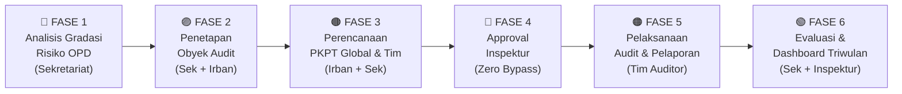
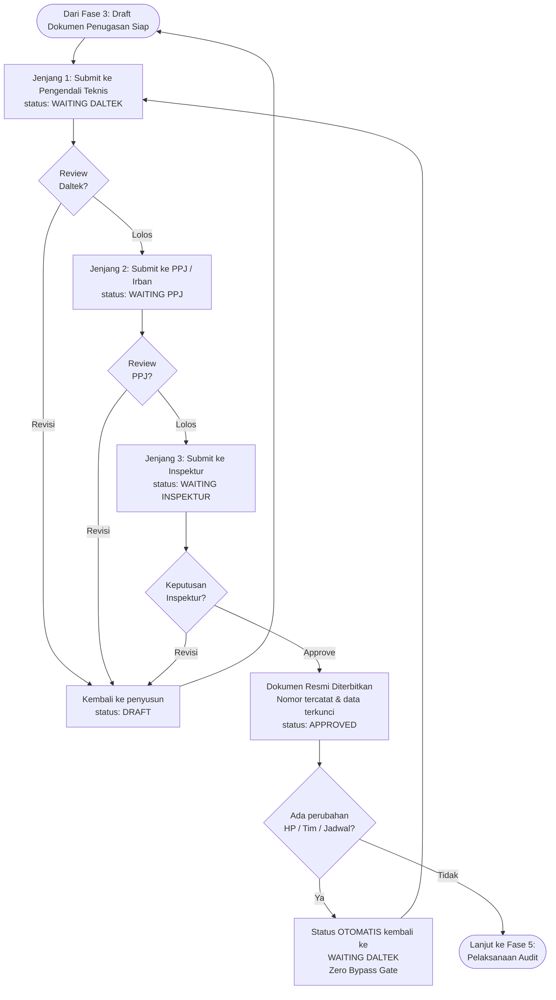
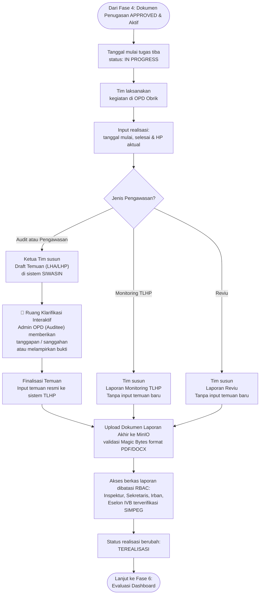
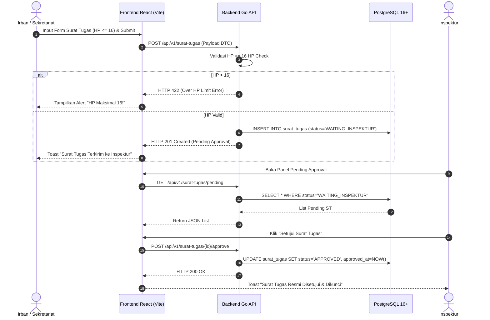
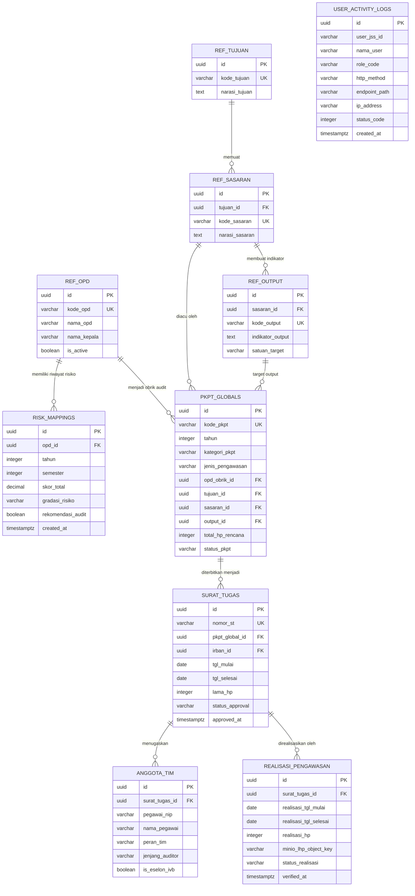
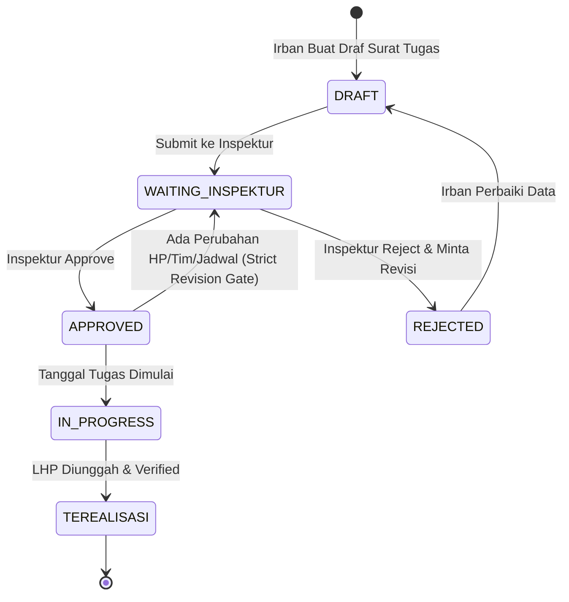
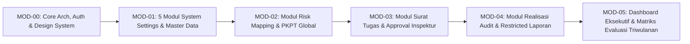

<!-- Dibuat oleh Bidang Sistem Informasi dan Statistik Dinas Komunikasi Informatika dan Persandian Kota Yogyakarta -->
# 🌌 BLUEPRINT — SIWASIN (Sistem Informasi Pengawasan Internal)
> **Single Source of Truth (SSOT)** Kebutuhan Teknis, Bisnis, Spesifikasi Sistem, dan Rencana Masing-Masing Modul untuk Vibe Coding & Agentic Coding di **Google Antigravity 2.0**.

---

## 1. Informasi Dokumen

| Field | Nilai |
|---|---|
| Judul Dokumen | Blueprint & Arsitektur Sistem Informasi Pengawasan Internal (SIWASIN) |
| Kode Dokumen | `BLUEPRINT-SIWASIN-V1.0` |
| Versi | `1.0.0` |
| Tanggal Penerbitan | 2026-09-15 |
| Status Dokumen | `DISETUJUI (APPROVED)` |
| Pemilik Produk | Inspektorat Kota Yogyakarta |
| Tim Pengembang | Dinas Komunikasi Informatika dan Persandian Kota Yogyakarta |
| Framework Acuan | BRD (BABOK v3) · SRS (ISO/IEC/IEEE 29148:2018) · NFR (ISO/IEC 25010) · Prioritas (MoSCoW) · Acceptance (Gherkin) · Visual (Mermaid.js) |
| System Mode | **Full-Stack Production Ready (Go Clean Arch + React/Vue Vite Apple HIG + PostgreSQL 16+ + MinIO + SSO Keycloak JSS)** |

### Riwayat Revisi

| Versi | Tanggal | Deskripsi Perubahan | Penulis | Approver |
|---|---|---|---|---|
| 0.1.0 | 2026-09-15 | Draf awal analisis 16 poin catatan bisnis pengawasan | Tim Developer Diskominfo | Sekretariat Inspektorat |
| 1.0.0 | 2026-09-15 | Finalisasi Blueprint Komprehensif (BRD, PRD, SRS, MOD-00 s.d MOD-05, UI Specs, & Traceability Matrix 0 broken links) | Pembuat Blueprint Profesional | Inspektur Kota Yogyakarta |

---

## 2. Ringkasan Eksekutif

**SIWASIN (Sistem Informasi Pengawasan Internal)** adalah aplikasi backoffice operasional dan executive dashboard utama Pemerintah Kota Yogyakarta yang dirancang khusus untuk mentransformasi seluruh siklus pengawasan internal Inspektorat terhadap Organisasi Perangkat Daerah (OPD). Sistem ini memfasilitasi alur kerja terpadu mulai dari:
- **Audit Universe Engine** — Master data multi-entitas seluruh objek audit: OPD/Dinas, UPTD, Kecamatan, Sekolah, hingga BUMD beserta struktur program kerja masing-masing.
- **Risk Scoring Engine** — Kalkulasi otomatis indeks risiko komposit tiap entitas berdasarkan 3 parameter berbobot: pagu anggaran (arsitektur siap integrasi API SIPD), riwayat temuan TLHP (input manual, siap integrasi API), dan nilai maturitas SPIP — dengan output kuadran risiko (High / Medium / Low).
- **Perencanaan PKPT & Tim** — Penyusunan PKPT Global & Tim, penugasan Auditor per jenjang jabatan (Madya, Muda, Pertama, Terampil), dengan validasi keras 16 HP dan **Clash Detection otomatis** (mencegah auditor ditugaskan di 2 tim pada tanggal yang sama).
- **Approval Berjenjang 3 Jenjang** — Pengendali Teknis (Daltek) → Pembantu Penanggung Jawab / Irban (PPJ) → Inspektur Daerah, dengan **Zero-Bypass Gate** pada setiap revisi.
- **Pelaksanaan & Pelaporan** — Fieldwork realisasi HP, upload LHP ke MinIO dengan akses RBAC ketat.
- **Evaluasi Matriks Realisasi Triwulanan** — Dashboard eksekutif perbandingan Rencana vs Aktual.

Built with Go (Golang 1.22+) Clean Architecture dan React/Vue Vite dengan desain visual Apple Human Interface Guidelines (HIG), SIWASIN menjamin efisiensi tinggi, isolasi role RBAC ketat (termasuk verifikasi SIMPEG Eselon IVB), serta perlindungan kerahasiaan berkas Laporan Pengawasan.

---

# BAGIAN A — BRD (Business Requirements Document)

## A.1. Latar Belakang & Konteks Bisnis

- **A.1.1. Kondisi Bisnis Saat Ini (As-Is)**:
  Proses pengawasan internal di Inspektorat Kota Yogyakarta masih menghadapi kendala fragmentasi data. Penilaian risiko OPD dilakukan secara manual via spreadsheet, pengusulan Hari Penugasan (HP) dan pembentukan tim audit sering tidak terpantau secara riil, serta revisi penugasan/surat tugas di tengah jalan berisiko luput dari verifikasi Inspektur. Matriks realisasi vs perencanaan PKPT baru dievaluasi secara reaktif di akhir tahun.
- **A.1.2. Pemicu Perubahan**:
  Kebutuhan tata kelola pemerintahan yang akuntabel (SPBE & MCP KPK), kewajiban transparansi audit berbasis risiko (Risk-Based Auditing), serta arahan Inspektur untuk memberlakukan kontrol persetujuan terpusat (*strict inspection approval gate*) terhadap setiap perubahan penugasan dan pelaporan pengawasan.
- **A.1.3. Kaitan dengan Strategi Organisasi**:
  Mendukung Peningkatan Kualitas Pengawasan Internal APIP (Aparat Pengawasan Intern Pemerintah) Kota Yogyakarta, Percepatan Reformasi Birokrasi (RB), dan Penguatan Sistem Pengendalian Intern Pemerintah (SPIP).

## A.2. Pernyataan Masalah & Peluang

- **A.2.1. Problem Statement**:
  *"Saat ini Sekretariat, Irban, dan Tim Auditor Inspektorat tidak dapat memantau realisasi penugasan PKPT secara presisi dan realtime karena proses pemetaan risiko OPD, pengusulan Surat Tugas, dan evaluasi realisasi HP masih terpisah-pisah, berdampak pada risiko ketidaksesuaian alokasi audit (melebihi batas 16 HP), keterlambatan laporan triwulanan, dan potensi perubahan jadwal penugasan tanpa persetujuan Inspektur."*
- **A.2.2. Peluang / Value Proposition**:
  Membangun sistem pengawasan internal terintegrasi berbasis web yang memetakan gradasi risiko OPD secara otomatis, membatasi alokasi maksimal 16 HP per kegiatan, mengunci alur approval revisi ke Inspektur, serta menyajikan matriks perbandingan realisasi vs perencanaan PKPT secara transparan dan akurat.
- **A.2.3. Dampak Bila Tidak Ditangani**:
  Risiko temuan berulang, alokasi Hari Penugasan auditor yang tumpang tindih/inefisien, serta melemahnya fungsi kontrol pimpinan terhadap pelaksanaan audit di lingkup Pemkot Yogyakarta.

## A.3. Tujuan Bisnis & KPI (SMART)

| ID | Tujuan Bisnis | Metrik (KPI) | Baseline | Target | Periode Ukur |
|---|---|---|---|---|---|
| `TUJ-01` | Meningkatkan akurasi pemetaan Obrik audit berbasis gradasi risiko OPD | Persentase OPD berisiko tinggi yang ter-cover PKPT | 65% | 100% | Semesteran |
| `TUJ-02` | Menjamin kontrol penuh Inspektur terhadap seluruh revisi penugasan | Persentase revisi Surat Tugas & Laporan yang terverifikasi Inspektur | 80% | 100% (Zero Bypass) | Realtime |
| `TUJ-03` | Mengoptimalkan alokasi Hari Penugasan (HP) Auditor | Kepatuhan alokasi HP (Maksimal 16 HP per penugasan) | 70% | 100% Validated | Triwulanan |
| `TUJ-04` | Meningkatkan akurasi evaluasi realisasi pengawasan | Ketepatan waktu penerbitan Matriks Realisasi Perencanaan vs Actual | H+14 Triwulan | H+2 Triwulan | 3 Bulanan |

## A.4. Ruang Lingkup Bisnis

- **A.4.1. In-Scope**:
  1. **Audit Universe Engine** — Master data multi-entitas objek audit: OPD/Dinas, UPTD, Kecamatan, Sekolah, dan BUMD, beserta struktur program kerja dan hierarki organisasi masing-masing entitas.
  2. **Risk Scoring Engine** — Kalkulasi otomatis indeks risiko komposit per entitas dengan 3 parameter berbobot: (a) Pagu anggaran — input manual Sekretariat, arsitektur siap integrasi API read-only SIPD/e-Keuangan Pemda; (b) Riwayat jumlah temuan TLHP — input manual, arsitektur siap integrasi API TLHP; (c) Nilai maturitas SPIP — input manual Sekretariat. Output: kuadran risiko **High / Medium / Low** dan daftar prioritas Obrik.
  3. Modul Penilaian Gradasi Risiko OPD (Sekretariat) untuk Audit Kinerja & Pengawasan (Semesteran & Tahunan).
  4. Modul Perencanaan PKPT (Perencanaan Global & Perencanaan Tim) dengan kategori Mandatori & Non-Mandatori.
  5. **Resource Allocation & Scheduling** — Master data SDM Auditor/P2UPD (kompetensi, jenjang jabatan, ketersediaan Hari Pengawasan), validasi keras maksimal 16 HP, dan **Clash Detection otomatis** (sistem mendeteksi & menolak jika satu auditor dijadwalkan di 2 tim pada tanggal yang sama).
  6. Modul Manajemen Surat Tugas & Pembentukan Tim Audit (Penerbitan ST Besar per Irban, penugasan Ketua Tim spesifik: Auditor Madya, Muda, Pertama, Terampil).
  7. Dynamic Hierarchical Master Data: Relasi `Master_Tujuan` $\rightarrow$ `Master_Sasaran` $\rightarrow$ `Master_Output` (Bukan sekadar text string mentah).
  8. **Approval Berjenjang 3 Jenjang** — Pengendali Teknis (Daltek) $\rightarrow$ Pembantu Penanggung Jawab / Irban (PPJ) $\rightarrow$ Inspektur Daerah. Setiap revisi sekecil apapun wajib melewati seluruh jenjang (Zero-Bypass Gate). Export otomatis ke format laporan resmi PDF/Word.
  9. Modul Pelaksanaan & Pelaporan Pengawasan (Parent Utama: Audit, Pengawasan, Monitoring, Reviu).
  10. Proteksi Hak Akses Laporan Pengawasan (Terbatas hanya untuk Inspektur, Sekretaris, Irban, dan Eselon IVB SIMPEG).
  11. Modul Matriks Pemantauan Realisasi vs Perencanaan (Status: Terealisasi, Belum Terealisasi, Tidak Terealisasi) & Evaluasi 3 Bulanan.
  12. 5 Modul Pengaturan Sistem Wajib (User Management JSS, Role Management, Permission Matrix, Drag-to-Reorder Sidebar Menu, Theme Manager 8 Themes, & User Activity Log Audit Trail).
  13. **Audit Trail ketat** — Log aktivitas setiap perubahan bobot parameter risiko, pergeseran jadwal penugasan, dan akses berkas LHP (hanya dapat diakses Superadmin & Pengawas).
- **A.4.2. Out-of-Scope**:
  1. Modul penganggaran belanja langsung OPD (di luar alokasi anggaran penugasan APIP).
  2. Integrasi penggajian / TPP pegawai SIMPEG (hanya membaca data master pegawai, jabatan, dan status Eselon IVB).
  3. Integrasi langsung (live sync) API SIPD & TLHP pada versi awal — disediakan sebagai **arsitektur integrasi future-ready** (endpoint siap, implementasi setelah koordinasi tim SIPD Pemda).
- **A.4.3. Batasan Lingkup**:
  Disesuaikan dengan Perwal Pengawasan Kota Yogyakarta, regulasi Jabatan Fungsional Auditor/P2UPD KemenPAN-RB, serta kebijakan SPBE Diskominfo Kota Yogyakarta.

## A.5. Stakeholder & RACI Matrix

| Stakeholder | Peran Organisasi | Kepentingan Utama | R | A | C | I |
|---|---|---|---|---|---|---|
| **Inspektur** | Pimpinan Inspektorat | Approval final ST, PKPT, LHP, & Monitoring Dashboard. Jenjang approval ke-3 (tertinggi) | | **A** | **C** | |
| **Pengendali Teknis (Daltek)** | Auditor Senior / Koordinator | Verifikasi teknis draft ST & PKPT sebelum naik ke PPJ. **Jenjang approval ke-1** | **R** | | **C** | |
| **Sekretaris / PPJ (Irban)** | Sekretariat / Pembantu Penanggung Jawab | Input parameter risiko OPD, PKPT Global, evaluasi triwulanan. **Jenjang approval ke-2** | **R** | | **C** | |
| **Irban (I s.d IV / Khusus)**| Inspektur Pembantu Wilayah | Perencanaan Tim, usulan Surat Tugas Besar, review NHP/LHP | **R** | | **C** | |
| **Auditor / P2UPD** | Ketua & Anggota Tim | Pelaksanaan fieldwork, input realisasi HP & dokumen pengawasan | **R** | | | **I** |
| **Eselon IVB (SIMPEG)** | Pejabat Terverifikasi | Verifikasi data struktural & akses laporan pengawasan terpilih | | | **C** | **I** |
| **Admin OPD (Obrik)** | Auditee Perangkat Daerah | Terima penugasan, upload bukti tanggapan & konfirmasi | **R** | | | **I** |
| **Superadmin Diskominfo** | Pengelola IT | Maintenance infrastruktur, RBAC, & Audit Log | **R** | **A** | | |

*Keterangan RACI: R = Responsible, A = Accountable, C = Consulted, I = Informed.*

## A.6. Kebutuhan Bisnis (Business Requirements)

| ID | Kebutuhan Bisnis | Prioritas | Sumber |
|---|---|---|---|
| `BR-01` | Sistem wajib menyediakan modul penilaian gradasi risiko OPD oleh Sekretariat sebagai dasar penentuan Obrik audit | **Must Have** | `[Jawaban: Catatan #1, #15]` |
| `BR-02` | Perencanaan risiko wajib mendukung periode analisis Semesteran dan Evaluasi Berkala per 3 Bulan (Triwulanan) | **Must Have** | `[Jawaban: Catatan #2, #12]` |
| `BR-03` | Sistem wajib mengelola Perencanaan PKPT (Global & Tim) dengan kategori Mandatori dan Non-Mandatori | **Must Have** | `[Jawaban: Catatan #2, #13]` |
| `BR-04` | Sistem wajib memberikan proteksi validasi maksimal 16 Hari Penugasan (HP) per kegiatan audit/pengawasan | **Must Have** | `[Jawaban: Catatan #16]` |
| `BR-05` | Sistem wajib mengintegrasikan pembentukan tim dengan kualifikasi Ketua Tim spesifik Jabatan Fungsional Auditor (Madya, Muda, Pertama, Terampil) | **Must Have** | `[Jawaban: Catatan #2]` |
| `BR-06` | Sistem wajib menyediakan 4 Parent Utama Pengawasan baku: Audit, Pengawasan, Monitoring, dan Reviu | **Must Have** | `[Jawaban: Catatan #4, #7]` |
| `BR-07` | Sistem wajib mengaitkan Tujuan dan Sasaran Pengawasan dengan struktur relasional parent Output (bukan teks mentah) | **Must Have** | `[Jawaban: Catatan #8]` |
| `BR-08` | Pembentukan Surat Tugas Besar wajib diprakarsai oleh Irban / Sekretariat sebelum penugasan tim berjalan | **Must Have** | `[Jawaban: Catatan #5]` |
| `BR-09` | Sistem wajib menerapkan **Strict Inspektur Approval**: revisi sekecil apa pun pada perencanaan/ST wajib diketahui & disetujui Inspektur | **Must Have** | `[Jawaban: Catatan #6]` |
| `BR-10` | Akses membaca Laporan Pengawasan wajib dibatasi eksklusif hanya untuk Inspektur, Sekretaris, Irban, dan Eselon IVB | **Must Have** | `[Jawaban: Catatan #9]` |
| `BR-11` | Sistem wajib menyajikan Matriks Pemantauan perbandingan Realisasi vs Perencanaan (Status: Terealisasi, Belum, Tidak Terealisasi) | **Must Have** | `[Jawaban: Catatan #10, #11]` |
| `BR-12` | Sistem wajib terintegrasi dengan SIMPEG Pemda untuk validasi NIP, Jabatan Pegawai, dan Eselon IVB | **Must Have** | `[Jawaban: Catatan #9]` |
| `BR-13` | Sistem wajib menyediakan 5 Modul Pengaturan Sistem (User Management, Role, Permission Matrix, Drag-to-Reorder Sidebar Menu, Theme Manager) | **Must Have** | `[Standar Diskominfo]` |
| `BR-14` | Sistem wajib mencatat Log Aktivitas Pengguna (Audit Trail) yang hanya dapat diakses oleh Superadmin dan Pengawas | **Must Have** | `[Standar Diskominfo]` |
| `BR-15` | Sistem wajib menyediakan Sandbox 4 Role Dummy User dengan 1-click quick login pada halaman login terpisah (`/login`) | **Must Have** | `[Standar Diskominfo]` |
| `BR-16` | Penyimpanan berkas laporan & dokumen pendukung wajib menggunakan MinIO Object Storage dengan Presigned URL | **Must Have** | `[Standar Diskominfo]` |
| `BR-17` | Sistem wajib menyediakan **Audit Universe** multi-entitas: OPD/Dinas, UPTD, Kecamatan, Sekolah, dan BUMD sebagai master data objek audit yang dapat dikelola & diperbarui oleh Sekretariat | **Must Have** | `[Diskusi Arsitektur 2026-09-15]` |
| `BR-18` | Sistem wajib menyediakan **Risk Scoring Engine** dengan 3 parameter berbobot: (a) Pagu Anggaran, (b) Jumlah Temuan TLHP, (c) Nilai Maturitas SPIP — menghasilkan indeks risiko komposit dan pengelompokan kuadran High/Medium/Low per entitas | **Must Have** | `[Diskusi Arsitektur 2026-09-15]` |
| `BR-19` | Sistem wajib menyediakan **Clash Detection otomatis**: menolak & menampilkan alert jika satu auditor dijadwalkan di 2 tim penugasan pada rentang tanggal yang sama | **Must Have** | `[Diskusi Arsitektur 2026-09-15]` |
| `BR-20` | Sistem wajib menerapkan **Approval Berjenjang 3 Jenjang**: Pengendali Teknis (Daltek) → Pembantu Penanggung Jawab / Irban (PPJ) → Inspektur Daerah, setiap revisi wajib ulang dari awal (Zero-Bypass) | **Must Have** | `[Diskusi Arsitektur 2026-09-15]` |
| `BR-21` | Sistem wajib menyiapkan **Arsitektur Integrasi Future-Ready**: endpoint API read-only siap terhubung ke SIPD/e-Keuangan Pemda (pagu anggaran) dan sistem TLHP (riwayat temuan) — implementasi setelah koordinasi tim SIPD Pemda | **Should Have** | `[Diskusi Arsitektur 2026-09-15]` |
| `BR-22` | Sistem wajib menyediakan **Ruang Klarifikasi Interaktif Temuan**: fitur diskusi layaknya chat/thread antara Auditor dan OPD (Auditee) untuk memberikan tanggapan/sanggahan sebelum laporan difinalisasi | **Must Have** | `[Diskusi Arsitektur 2026-09-15]` |

## A.7. Proses Bisnis As-Is (Kondisi Nyata Sebelum SIWASIN)

> **Kondisi Nyata**: Sistem yang ada hanya berfungsi sebagai **alat pencatatan** sederhana. Hasil analisis risiko OPD **tidak masuk** ke sistem, data tersebar & tidak terintegrasi (spreadsheet terpisah, catatan fisik, email), dan monitoring hanya bisa dilakukan oleh tim internal secara manual. Tidak ada alur audit dari hulu ke hilir yang terpadu.


**❌ Gap Kritis Kondisi As-Is:**
- Data risiko OPD tidak dianalisis secara sistematis ke dalam sistem.
- Hasil analisis tidak terintegrasi — hanya catatan manual terpisah.
- Monitoring tim audit tidak bisa dilakukan secara realtime.
- Revisi penugasan tidak diketahui oleh Inspektur.
- Tidak ada kontrol akses berkas laporan pengawasan.

## A.8. Proses Bisnis To-Be SIWASIN (Hulu ke Hilir — End-to-End)

### 📍 Overview Alur 6 Fase (Hulu ke Hilir)



---

### 📖 Glosarium & Daftar Singkatan
*Berikut adalah istilah-istilah yang sering digunakan dalam alur SIWASIN di bawah ini:*

| Singkatan | Kepanjangan | Penjelasan Singkat |
|---|---|---|
| **APIP** | Aparat Pengawasan Intern Pemerintah | Instansi pengawas internal pemerintah (dalam hal ini Inspektorat Kota). |
| **OPD** | Organisasi Perangkat Daerah | Dinas/Badan/Kecamatan di pemerintah daerah (sebagai pihak yang diaudit). |
| **Obrik** | Obyek Pemeriksaan | Entitas/OPD spesifik yang menjadi target pengawasan. |
| **PKPT** | Program Kerja Pengawasan Tahunan | Dokumen perencanaan global kegiatan pengawasan selama satu tahun. |
| **ST** | Surat Tugas | Dokumen resmi penugasan tim untuk turun ke lapangan. |
| **HP** | Hari Pengawasan / Penugasan | Satuan ukur durasi & beban kerja (man-days) tim auditor di lapangan. |
| **Daltek** | Pengendali Teknis | Auditor senior yang memimpin dan mereviu teknis kerja beberapa tim. |
| **PPJ** | Pembantu Penanggung Jawab | Peran strategis (biasanya dijabat Irban/Sekretaris) di bawah Inspektur. |
| **LHA / LHP** | Laporan Hasil Audit/Pengawasan | Dokumen output resmi (final) yang berisi temuan dan rekomendasi. |
| **TLHP** | Tindak Lanjut Hasil Pemeriksaan | Proses OPD merespons dan memperbaiki temuan setelah LHA/LHP terbit. |
| **SPIP** | Sistem Pengendalian Intern Pemerintah | Skor kematangan manajemen risiko internal dari sebuah OPD. |

---

### 🔵 FASE 1 — Analisis Gradasi Risiko OPD *(Aktor: Sekretariat)*

> **Fase ini terdiri dari 2 sub-sistem:** `1A — Audit Universe` (daftarkan siapa yang dinilai) → `1B — Risk Scoring Engine` (hitung seberapa berisiko).

#### 🗂️ Fase 1A — Audit Universe Engine *(Registrasi Multi-Entitas Objek Audit)*


#### 🧮 Fase 1B — Risk Scoring Engine *(Kalkulasi Indeks Risiko Komposit per Entitas)*

| Parameter | Sumber Data | Status Integrasi |
|---|---|---|
| **P1 — Pagu Anggaran** | Input manual Sekretariat | ⚙️ Arsitektur siap integrasi API SIPD / e-Keuangan Pemda |
| **P2 — Riwayat Temuan TLHP** | Input manual Irban | ⚙️ Arsitektur siap integrasi API sistem TLHP |
| **P3 — Nilai Maturitas SPIP** | Input manual Sekretariat (skala 1—5) | Manual permanen |


> **Skenario Perhitungan Lanjutan (Matriks X dan Y):**
> Untuk visualisasi *Scatter Plot* pada Dashboard Eksekutif, 3 parameter di atas dipetakan ke dalam 2 Sumbu (Matriks 2x2 atau 3x3) berdasarkan standar ISO 31000:
>
> 1. **Sumbu X (Kemungkinan Terjadi / Likelihood)**
>    Menilai seberapa besar kemungkinan OPD melakukan pelanggaran. Dihitung dari 2 parameter:
>    - **Riwayat Temuan TLHP** (makin banyak temuan masa lalu, makin berisiko mengulang)
>    - **Maturitas SPIP** (makin rendah nilainya, makin berisiko sistem internal bocor)
>
> 2. **Sumbu Y (Dampak / Signifikansi / Impact)**
>    Menilai seberapa besar kerugian/dampaknya jika terjadi penyelewengan. Dihitung dari:
>    - **Pagu Anggaran** (makin besar uang yang dikelola, makin destruktif dampaknya)
>
> **Pemetaan Status Kuadran Risiko (Scatter Plot):**
> | Sumbu Y (Dampak) | Sumbu X (Kemungkinan) | Posisi Kuadran | Status & Rekomendasi Tindakan |
> | :---: | :---: | :--- | :--- |
> | **TINGGI** | **TINGGI** | **Kanan Atas (Q1)** | 🔴 **HIGH RISK (Prioritas 1)** - Wajib masuk PKPT (Audit Kinerja). |
> | **TINGGI** | **RENDAH** | **Kiri Atas (Q2)** | 🟠 **MEDIUM-HIGH RISK (Prioritas 2)** - Wajib diaudit bila SDM mencukupi. |
> | **RENDAH** | **TINGGI** | **Kanan Bawah (Q4)**| 🟡 **MEDIUM RISK (Prioritas 3)** - Anggaran kecil tapi sering salah. Cocok untuk *Pengawasan/Monitoring*. |
> | **RENDAH** | **RENDAH** | **Kiri Bawah (Q3)** | 🟢 **LOW RISK** - Cukup pantauan jarak jauh. Bisa ditunda tahun berikutnya. |


---

### 🟣 FASE 2 — Penetapan Obyek Audit *(Aktor: Sekretariat + Irban)*


> **Fitur Dinamis Penetapan Obyek Audit:**
> Untuk mencegah proses yang kaku, Fase 2 dilengkapi 4 kapabilitas dinamis:
> 1. **Manual Override (Jalur Mandatori)**: Memungkinkan Sekretariat memasukkan OPD yang berisiko rendah (Kuadran Hijau) ke dalam PKPT jika ada instruksi mendadak dari Pimpinan/KPK/Aduan Masyarakat, dengan kewajiban mengisi kolom justifikasi.
> 2. **Audit Tematik (Multi-Obrik)**: Satu entri PKPT (1 set Tujuan & Sasaran) dapat memayungi lebih dari 1 OPD sekaligus, berguna untuk pengawasan isu lintas sektoral (contoh: *Audit Stunting*, *Pengentasan Kemiskinan*).
> 3. **Mini Dashboard Kapasitas HP**: Mencegah *overbooking*. Sistem akan otomatis menjumlahkan estimasi Hari Pengawasan (HP) yang dibutuhkan dari seluruh Obrik yang dipilih, lalu membandingkannya dengan ketersediaan SDM Auditor.
> 4. **Master Data Management Terpusat**: Hirarki `Tujuan → Sasaran → Output` dan `Jenis Kegiatan` bersifat dinamis (*tree-based*) yang dapat dikonfigurasi oleh Superadmin tanpa mengubah *source code*, untuk mengantisipasi perubahan RPJMD/Regulasi di masa depan.


---

### 🟤 FASE 3 — Perencanaan PKPT Global & Tim *(Aktor: Irban + Sekretariat)*

> **Setiap entri PKPT harus diklasifikasikan ke salah satu dari 4 Jenis Pengawasan.** Masing-masing jenis punya karakteristik tim, dokumen, dan batas HP yang berbeda.

#### Perbedaan 4 Jenis Pengawasan dalam PKPT

| Aspek | 🔍 Audit | 👁️ Pengawasan | 📊 Monitoring TLHP | 📋 Reviu |
|---|---|---|---|---|
| **Dokumen Penugasan** | ST Resmi (ST Besar) | ST Resmi (ST Besar) | Dapat digabung dalam ST Audit terkait | Nota Dinas |
| **Tim** | Ketua Tim + Anggota Wajib | Ketua Tim + Anggota | Minimal 1-2 orang | Sesuai kompetensi dokumen |
| **Batas HP** | Dikonfigurasi Admin | Dikonfigurasi Admin | Dikonfigurasi Admin | Dikonfigurasi Admin |
| **Output Laporan** | LHA (Laporan Hasil Audit) | LHP (Laporan Hasil Pengawasan) | Laporan Monitoring TLHP | Laporan Reviu |
| **Temuan → TLHP** | ✅ Ya | ✅ Ya | ❌ Tidak | ❌ Tidak |
| **Obrik Spesifik** | Wajib 1 entitas | Wajib 1 entitas | Bisa multi-OPD | Bisa multi-dokumen |

#### Diagram Perencanaan PKPT Global & Tim


> **Penanganan Penugasan Insidental & Bentrok Jadwal (Clash Detection):**
> 1. **Penugasan Non-PKPT**: Jika ada permintaan audit mendadak (Aduan, APH, KPK), Irban dapat melewati Fase 1 & 2 dengan menekan tombol **Buat Penugasan Insidental**. Penugasan ini otomatis mendapat *flag* **Mandatori**.
> 2. **Clash Detection**: Sistem SIWASIN memiliki algoritma deteksi bentrok (`BR-19`). Jika Auditor X didaftarkan di ST baru namun jadwalnya bertabrakan dengan ST lain yang sedang *In Progress* atau *Approved*, sistem otomatis menolak (*Hard Block*).
> 3. **Override Clash (Perangkapan Tugas)**: Pengecualian diberikan khusus untuk penugasan berlabel **Mandatori**. Sistem akan memunculkan opsi *Override*, mengizinkan auditor merangkap tugas dengan syarat Irban wajib mengisi justifikasi (misal: "Hanya diperbantukan sementara untuk tim KPK"). Ke depan, ini juga membantu pelacakan *Audit Trail*.

---

### ⚡ JALUR KHUSUS — Audit Non-PKPT (Penugasan Insidental)

> **Konteks:** Digunakan saat ada permintaan audit di tengah periode berjalan (injeksi jadwal) di luar kalender PKPT resmi (misal: Atensi Walikota, KPK, atau Aduan Masyarakat viral).


---

### 🔴 FASE 4 — Approval Berjenjang *(Aktor: Daltek, PPJ, Inspektur — Zero Bypass)*



---

### 🟠 FASE 5 — Pelaksanaan Audit & Pelaporan *(Aktor: Ketua Tim + Auditor + Admin OPD)*



---

### 🟢 FASE 6 — Evaluasi & Monitoring Dashboard *(Aktor: Sekretariat + Inspektur)*


## A.9. Analisis Kesenjangan (Gap Analysis)

| Area Proses | Kondisi As-Is | Kondisi To-Be SIWASIN | Gap & Aksi Perbaikan |
|---|---|---|---|
| **Penilaian Risiko** | Manual spreadsheet, parameter kualitatif tidak seragam | Gradasi risiko otomatis terhitung per semester/tahun berdasarkan parameter audit kinerja | Membangun Engine Perhitungan Risk Mapping di MOD-02 |
| **Validasi HP** | Sering melebihi 16 HP karena alokasi manual | System-enforced validation (Hard Cap 16 HP) saat submit PKPT & Surat Tugas | Menambahkan constraint backend & UI validator HP di MOD-02/03 |
| **Approval Inspektur** | Revisi penugasan di lapangan sering tidak tercatat | Zero-bypass workflow approval: setiap perubahan data memicu status `WAITING_INSPEKTUR` | Membangun State Machine Lifecycle Approval di MOD-03 |
| **Relasi Target Output** | Tujuan & Sasaran hanya string mentah terpisah | Relasi hirarki `Tujuan` $\rightarrow$ `Sasaran` $\rightarrow$ `Output` terstruktur dengan ID | Membangun Master Data Relasional Hierarki di MOD-01 |
| **Akses Laporan** | Berkas fisik/file server rentan diakses pihak tak berwenang | RBAC strict enforcement: hanya Inspektur, Sekretaris, Irban, & Eselon IVB SIMPEG | Mengaktifkan Middleware Authorization Guard di MOD-04 |

## A.10. Manajemen Risiko & Mitigasi Bisnis

| ID | Risiko Bisnis | Probabilitas | Dampak | Strategi Mitigasi | Pemilik |
|---|---|---|---|---|---|
| `R-01` | Keterlambatan respon approval Surat Tugas oleh Inspektur saat dinas luar | Sedang | Tinggi | Menyediakan Mobile-responsive Quick Approval Panel & Notifikasi SSO | Inspektur |
| `R-02` | Ketidaksesuaian data NIP/Eselon pegawai dengan SIMPEG | Rendah | Sedang | Mengimplementasikan Caching Data SIMPEG dengan mekanisme fallback sync | Diskominfo |
| `R-03` | Pengunggahan dokumen laporan ilegal / mengandung malware | Rendah | Tinggi | Validasi Magic Bytes biner pada MinIO storage & pembatasan format PDF/DOCX | Diskominfo |

---

# BAGIAN B — PRD (Product Requirements Document)

## B.1. Visi Produk

Menjadi platform digital pengawasan internal Aparat Pengawasan Intern Pemerintah (APIP) terdepan yang mengintegrasikan seluruh siklus perencanaan berbasis risiko, penugasan audit, approval pimpinan, dan evaluasi realisasi secara akuntabel, efisien, dan aman.

## B.2. Persona Pengguna

| ID | Nama Persona | Peran / Jabatan | Tujuan Utama | Pain Points | Jobs-to-be-Done (JTBD) | Success Metrics | Konteks Pakai |
|---|---|---|---|---|---|---|---|
| `P-01` | **Drs. Bambang (Inspektur)** | Inspektur / Pimpinan | Kontrol 100% terhadap seluruh penugasan & laporan pengawasan | Kesulitan memantau revisi penugasan di lapangan secara realtime | *"Ketika ada revisi penugasan audit, saya ingin memverifikasi langsung di sistem, sehingga tidak ada surat tugas berjalan tanpa approval."* | Zero bypass revision, 100% ST approved | Desktop / Tablet, 2-5x sehari |
| `P-02` | **Siti Nurhaliza, M.Si (Sekretaris)** | Sekretaris Inspektorat | Kelancaran pemetaan risiko OPD & evaluasi realisasi triwulanan | Data risiko OPD berceceran & rekap realisasi memakan waktu minggu | *"Ketika awal periode tiba, saya ingin memetakan gradasi risiko OPD secara otomatis, sehingga PKPT berbasis risiko siap disusun."* | Rekap risiko instan, laporan evaluasi H+2 | Desktop, Harian |
| `P-03` | **Ahmad Hidayat, M.A (Irban I)** | Inspektur Pembantu Wilayah | Penyusunan PKPT Tim & Surat Tugas Besar wilayah pengawasan | Alokasi HP auditor sering bentrok atau melebihi 16 HP | *"Ketika menyusun tim pengawasan, saya ingin alokasi HP tervalidasi otomatis max 16, sehingga penugasan patuh regulasi."* | 100% ST patuh 16 HP | Desktop, Harian |
| `P-04` | **Eko Prasetyo, S.STP (Ketua Tim Audit)** | Auditor Muda / Ketua Tim | Pelaksanaan fieldwork audit & input realisasi laporan | Proses administrasi pelaporan rumit dan membutuhkan banyak cetak kertas | *"Ketika audit selesai, saya ingin mengunggah LHP dan mengisi realisasi HP, sehingga status penugasan berubah Terealisasi."* | Upload LHP < 2 menit, status real-time | Laptop/Tab Lapangan, Harian |
| `P-05` | **Rina Handayani (Admin OPD)** | Operator Auditee OPD | Mengetahui jadwal penugasan audit & menyampaikan tanggapan NHP | Informasi penugasan audit sering mendadak dan kurang transparan | *"Ketika ada penugasan audit ke OPD saya, saya ingin menerima notifikasi resmi, sehingga dokumen pendukung siap disajikan."* | Notifikasi ST realtime | Laptop OPD, Berkala |

## B.3. User Stories & Matriks Prioritas (MoSCoW)

| ID | User Story | Persona | Prioritas | Tautan BR |
|---|---|---|---|---|
| `US-01` | Sebagai Sekretaris, saya ingin menginput data penilaian risiko OPD agar sistem menghitung gradasi risiko otomatis | `P-02` | **Must Have** | `BR-01`, `BR-02` |
| `US-02` | Sebagai Irban, saya ingin menyusun PKPT Global & Tim (Mandatori/Non-Mandatori) dengan memilih Obrik berisiko tinggi | `P-03` | **Must Have** | `BR-03` |
| `US-03` | Sebagai Irban, saya ingin sistem memvalidasi maksimal 16 HP saat pembentukan Surat Tugas agar patuh aturan | `P-03` | **Must Have** | `BR-04` |
| `US-04` | Sebagai Irban, saya ingin menugaskan Ketua Tim dengan filter spesifik jenjang Auditor (Madya, Muda, Pertama, Terampil) | `P-03` | **Must Have** | `BR-05` |
| `US-05` | Sebagai Irban, saya ingin menghubungkan kegiatan PKPT dengan relasi hirarki Tujuan $\rightarrow$ Sasaran $\rightarrow$ Output | `P-03` | **Must Have** | `BR-07` |
| `US-06` | Sebagai Inspektur, saya ingin menerima notifikasi persetujuan & memverifikasi setiap revisi Surat Tugas/Laporan | `P-01` | **Must Have** | `BR-09` |
| `US-07` | Sebagai Ketua Tim, saya ingin menginput realisasi tanggal, HP, dan mengunggah LHP setelah audit selesai | `P-04` | **Must Have** | `BR-11` |
| `US-08` | Sebagai Inspektur/Sekretaris/Irban/Eselon IVB, saya ingin mengunduh & membaca berkas Laporan Pengawasan secara aman | `P-01`, `P-02`, `P-03` | **Must Have** | `BR-10`, `BR-12` |
| `US-09` | Sebagai Sekretaris, saya ingin melihat Matriks Realisasi vs Perencanaan PKPT dengan indikator status triwulanan | `P-02` | **Must Have** | `BR-11` |

## B.4. Standar UI Apple HIG & Pola Navigasi

Aplikasi SIWASIN mengusung antarmuka **Apple Human Interface Guidelines (HIG)** dengan ketentuan visual:
1. **Typography**: Font utama `-apple-system, BlinkMacSystemFont, "SF Pro Display", "SF Pro Text", "Helvetica Neue", Inter, sans-serif` dengan kerning `tracking-tight` pada heading.
2. **Whitespace**: Grid Spacing 8pt (padding card `p-6` / `p-8`, gap `gap-6` / `gap-8`) untuk tampilan lega dan tidak padat.
3. **Squircle & Frosted Glass**: Border Radius membulat halus (`rounded-2xl` / 16px) dipadukan efek backdrop blur (`backdrop-filter: blur(20px) saturate(180%)`) pada Topbar & Sidebar Navigation.
4. **Branding Pemkot Yogyakarta**:
   - Pojok Kiri Atas Sidebar: Logo Vektor Pemkot Yogyakarta (`assets/logo-jogja.svg`, tinggi 40px) + Teks **SIWASIN Inspektorat**.
   - Footer Resmi: `© 2026 Pemerintah Kota Yogyakarta`.
5. **Pola Navigasi**: **Left Panel Menu (Sidebar Navigation)** collapsible untuk backoffice operasional.

## B.5. 5 Modul Wajib Pengaturan Sistem & Autentikasi

SIWASIN wajib menyediakan 5 Modul System Settings dan Autentikasi Sandbox:
0. **Autentikasi Terpisah (`UI-AUTH-01` / `/login`)**: Halaman login terpisah dari layout utama dengan panel **1-Click Quick Login Sandbox 4 Role Dummy User** (`Superadmin`, `Pengawas`, `Admin`, `Operator`).
1. **Manajemen Pengguna (`UI-SYS-01`)**: Form input JSS ID (auto-sync nama), Role selection, Edit status.
2. **Manajemen Role (`UI-SYS-02`)**: Proteksi hapus role aktif (*Protected Role Deletion*).
3. **Manajemen Hak Akses (`UI-SYS-03`)**: Permission Matrix 4 aksi (View, Create, Update, Delete) per modul.
4. **Manajemen Menu Sidebar (`UI-SYS-04`)**: Pengelompokan header & **pengurutan posisi menu WAJIB Drag-and-Drop (Drag-to-Reorder)**.
5. **Manajemen Tema UI (`UI-SYS-05`)**: 8 Tema Terstandarisasi (4 Light + 4 Dark Themes, WCAG AA/AAA Ratio ≥ 4.5:1).
6. **User Activity Log (`UI-SYS-06`) [Fitur Wajib Audit Trail]**: Log pencatatan aktivitas pengguna (Waktu, NIP/JSS, Role, Method, Endpoint, IP Address). **Akses Eksklusif hanya untuk Role `Superadmin` dan `Pengawas`** (Read-Only).

## B.6. Acceptance Criteria (Gherkin Scenarios)

### Feature 1: Validasi Maksimal 16 Hari Penugasan (HP)
```gherkin
Scenario: Irban menginput alokasi HP valid (<= 16 HP)
  Given Irban berada di form penyusunan Surat Tugas
  When Irban mengisi lama Hari Penugasan sejumlah 14 HP
  Then Sistem menerima input tersebut dan menampilkan indikator kuota HP "14 / 16 HP (Valid)"

Scenario: Irban menginput alokasi HP melebihi batas (> 16 HP)
  Given Irban berada di form penyusunan Surat Tugas
  When Irban mengisi lama Hari Penugasan sejumlah 18 HP
  Then Sistem menolak form submit dan menampilkan pesan error "Alokasi Hari Penugasan melebihi batas maksimal 16 HP!"
```

### Feature 2: Strict Workflow Approval Revisi oleh Inspektur
```gherkin
Scenario: Inspektur menyetujui usulan Surat Tugas / Revisi Penugasan
  Given Inspektur membuka daftar pengajuan di Pending Approval Panel
  When Inspektur memeriksa detail penugasan dan mengklik "Setujui Surat Tugas"
  Then Status Surat Tugas berubah menjadi "APPROVED", nomor ST resmi diterbitkan, dan notifikasi terkirim ke Tim Audit

Scenario: Perubahan data penugasan tanpa approval Inspektur
  Given Perencanaan penugasan berstatus "APPROVED"
  When Irban melakukan pengubahan anggota tim atau jadwal pelaksanaan
  Then Status Surat Tugas otomatis berbalik menjadi "WAITING_INSPEKTUR" dan mengunci cetak dokumen resmi hingga disetujui ulang
```

---

# BAGIAN C — SRS (Software Requirements Specification)

## C.1. Functional Requirements (`SRS-F-xx`)

| ID | Nama Requirement | Trigger / Precondition | Input Data | Output / Behavior | Tautan PRD |
|---|---|---|---|---|---|
| `SRS-F-01` | Input & Perhitungan Risk Mapping OPD | Sekretariat membuka modul Penilaian Risiko | `opd_id`, `tahun`, `semester`, skor parameter audit | Sistem mengkalkulasi total skor & menetapkan `kategori_gradasi` ('TINGGI', 'SEDANG', 'RENDAH') | `US-01` |
| `SRS-F-02` | Penyusunan PKPT Global & Tim | Sekretariat/Irban membuat draf PKPT | `jenis_pengawasan_id`, `kategori_pkpt`, `opd_obrik_id`, `tujuan_id`, `sasaran_id`, `output_id` | Draf PKPT tersimpan dengan status `DRAFT` | `US-02`, `US-05` |
| `SRS-F-03` | Validasi Enforce 16 HP | Form Surat Tugas di-submit | `lama_hp` (Integer) | Jika `lama_hp > 16`, return HTTP 422 Unprocessable Entity | `US-03` |
| `SRS-F-04` | Penugasan Tim Audit & Jenjang Fungsional | Irban menambahkan tim pada ST | `pegawai_nip`, `peran_tim`, `jenjang_auditor` | Data anggota terhubung dengan SIMPEG validation check | `US-04` |
| `SRS-F-05` | Submission & Approval Inspektur | Irban submit ST / Revisi data ST | `surat_tugas_id`, `catatan_revisi` | Status ST berubah `WAITING_INSPEKTUR`, membuat entry approval log | `US-06` |
| `SRS-F-06` | Verification & Sign Off Inspektur | Inspektur klik Approve/Reject | `surat_tugas_id`, `action` ('APPROVE'/'REJECT') | Jika APPROVED, status menjadi `ACTIVE`, kunci data penugasan | `US-06` |
| `SRS-F-07` | Input Realisasi & Pelaporan Audit | Ketua Tim menyelesaikan audit | `realisasi_tgl_mulai`, `realisasi_tgl_selesai`, `realisasi_hp`, file LHP | File tersimpan di MinIO, status realisasi berubah `TEREALISASI` | `US-07` |
| `SRS-F-08` | Restricted File Download Laporan | User meminta download LHP | `laporan_id`, JWT Token | Auth middleware mengecek role (Superadmin, Inspektur, Sekretaris, Irban, Eselon IVB). Jika lolos, return Presigned URL MinIO (15m) | `US-08` |
| `SRS-F-09` | Matriks Pemantauan Plan vs Actual | User membuka Dashboard Evaluasi | `tahun_periode`, `triwulan` | Mengembalikan matriks statistik komparasi HP, Jadwal, & Obrik | `US-09` |
| `SRS-F-10` | User Activity Log Audit Trail | User melakukan request API mutasi/akses laporan | HTTP Request Context | Async log entry tersimpan di `user_activity_logs` | `BR-14` |

## C.2. Sequence Diagrams (Mermaid)

### Sequence 1: Alur Workflow Approval Surat Tugas & Strict Revision Gate



## C.3. Single Source of Truth ERD (Locked Skema Global PostgreSQL)



## C.4. State Diagram Lifecycle Approval Surat Tugas



## C.5. Non-Functional Requirements (ISO/IEC 25010 Metrik Terukur)

1. **Performance Efficiency**: P95 Response time API backend `< 150ms`, max concurrent users `500 active sessions`.
2. **Security & Privacy**: Enkripsi password/token JWT RS256, HTTPS TLS 1.3, Rate limit `100 req/min/IP`, MinIO Presigned URL expiration `15 menit`, Magic Bytes validation untuk PDF/DOCX.
3. **Reliability & Availability**: Target Uptime `99.9%`, Automated PostgreSQL daily backup dengan retention 30 hari.
4. **Usability**: Desain Apple HIG responsive 8pt grid, waktu onboarding user baru `< 10 menit`.

## C.6. Error Handling & Standard JSON Structure

Semua respons error API backend Go mengikuti format JSON standar:
```json
{
  "code": "ERR_HP_LIMIT_EXCEEDED",
  "message": "Alokasi Hari Penugasan (HP) melebihi batas maksimal 16 HP yang diizinkan",
  "details": [
    {
      "field": "lama_hp",
      "issue": "Nilai 18 melebihi batas maksimum 16"
    }
  ],
  "trace_id": "c7a8b9d0-1234-5678-9abc-def012345678"
}
```

---

# BAGIAN D — Rencana Implementasi Modular (`MOD-xx`)



### D.1. Pemetaan Modul & Traceability Chain

| Kode Modul | Nama Modul | Cakupan Functional Requirement | Target Deliverable |
|---|---|---|---|
| `MOD-00` | Core Arch, Auth SSO & Design System | Auth `/login` Sandbox 4 Role, Base Layout Apple HIG | Gin Go Server, Keycloak OIDC, Vite React Base |
| `MOD-01` | System Settings & Dynamic Master Data | User Mgt, Role, Permissions, Drag Menu, Theme, Activity Log, Master Tujuan/Sasaran/Output | CRUD System Settings, Auto-log Middleware |
| `MOD-02` | Risk Mapping OPD & PKPT Global | `SRS-F-01`, `SRS-F-02` | Engine Gradasi Risiko, Form PKPT Mandatori/Non-Mandatori |
| `MOD-03` | Surat Tugas & Strict Inspektur Approval | `SRS-F-03`, `SRS-F-04`, `SRS-F-05`, `SRS-F-06` | Form ST, 16 HP Validator, Pending Approval Panel |
| `MOD-04` | Realisasi Audit & Restricted Laporan | `SRS-F-07`, `SRS-F-08` | MinIO LHP Uploader, Presigned URL Auth Guard |
| `MOD-05` | Dashboard Eksekutif & Evaluasi Triwulanan | `SRS-F-09` | Executive Chart, Plan vs Actual Matrix |

---

# BAGIAN E — Spesifikasi Tampilan UI & Desain Visual (`UI-xx`)

## E.1. Daftar Layar Antarmuka

| Kode UI | Nama Halaman UI | Rute Layout | Akses Role |
|---|---|---|---|
| `UI-AUTH-01` | Halaman Login SSO & Sandbox 4 Role | `/login` (Standalone) | Public |
| `UI-SYS-01` | Manajemen Pengguna JSS | `/settings/users` (Sidebar) | Superadmin, Admin |
| `UI-SYS-04` | Manajemen Menu Sidebar (Drag-to-Reorder) | `/settings/menus` (Sidebar) | Superadmin |
| `UI-SYS-06` | User Activity Log (Audit Trail) | `/settings/activity-logs` (Sidebar) | Superadmin, **Pengawas** (Read-Only) |
| `UI-BIS-01` | Dashboard Penilaian Risiko OPD (Sekretariat) | `/risk-mapping` (Sidebar) | Inspektur, Sekretaris |
| `UI-BIS-02` | Perencanaan PKPT Global & Tim | `/pkpt` (Sidebar) | Inspektur, Sekretaris, Irban |
| `UI-BIS-03` | Manajemen Surat Tugas & Enforce 16 HP | `/surat-tugas` (Sidebar) | Sekretaris, Irban |
| `UI-BIS-04` | Panel Approval Pimpinan Inspektur | `/approval-inspektur` (Sidebar) | **Inspektur Only** |
| `UI-BIS-05` | Pelaksanaan & Pelaporan Realisasi LHP | `/realisasi` (Sidebar) | Ketua Tim, Auditor |
| `UI-BIS-06` | Dashboard Evaluasi Matriks Realisasi | `/dashboard-evaluasi` (Sidebar) | All Internal Roles |

## E.2. Spesifikasi 4 State UI Wajib (Apple HIG Compliant)

Setiap layar wajib mengimplementasikan 4 State Tampilan:
1. **Loading State**: Skeleton screen membulat (`rounded-2xl animate-pulse bg-slate-200 dark:bg-slate-800`).
2. **Empty State**: Ilustrasi vektor bersih + Teks deskriptif + Tombol aksi utama (*CTA*).
3. **Error State**: Banner alert (*frosted glass red*) + Detail pesan error + Tombol Retry.
4. **Success State**: Card data bersih Apple HIG + Toast feedback responsif (150ms ease-out).

---

# BAGIAN F — Matriks Keterlacakan Menyeluruh (Master Traceability Matrix)

| Kebutuhan Bisnis (`BR-xx`) | Fitur Produk (`PRD-xx`) | Requirement Fungsional (`SRS-F-xx`) | Modul Implementasi (`MOD-xx`) | Spesifikasi Layar (`UI-xx`) | Status Verification |
|---|---|---|---|---|---|
| `BR-01`, `BR-02` | `US-01` | `SRS-F-01` | `MOD-02` | `UI-BIS-01` | ✅ Verified (0 Broken Links) |
| `BR-03`, `BR-07` | `US-02`, `US-05` | `SRS-F-02` | `MOD-02` | `UI-BIS-02` | ✅ Verified (0 Broken Links) |
| `BR-04`, `BR-05` | `US-03`, `US-04` | `SRS-F-03`, `SRS-F-04` | `MOD-03` | `UI-BIS-03` | ✅ Verified (0 Broken Links) |
| `BR-06`, `BR-09` | `US-06` | `SRS-F-05`, `SRS-F-06` | `MOD-03` | `UI-BIS-04` | ✅ Verified (0 Broken Links) |
| `BR-10`, `BR-11` | `US-07`, `US-08` | `SRS-F-07`, `SRS-F-08` | `MOD-04` | `UI-BIS-05` | ✅ Verified (0 Broken Links) |
| `BR-11`, `BR-12` | `US-09` | `SRS-F-09` | `MOD-05` | `UI-BIS-06` | ✅ Verified (0 Broken Links) |
| `BR-13`, `BR-14` | System Settings | `SRS-F-10` | `MOD-01` | `UI-SYS-01` s.d `06` | ✅ Verified (0 Broken Links) |

---
*Dokumen Blueprint ini diterbitkan secara resmi oleh Bidang Sistem Informasi dan Statistik Diskominfo Kota Yogyakarta sebagai acuan baku tunggal (SSOT) pengembangan aplikasi SIWASIN.*
