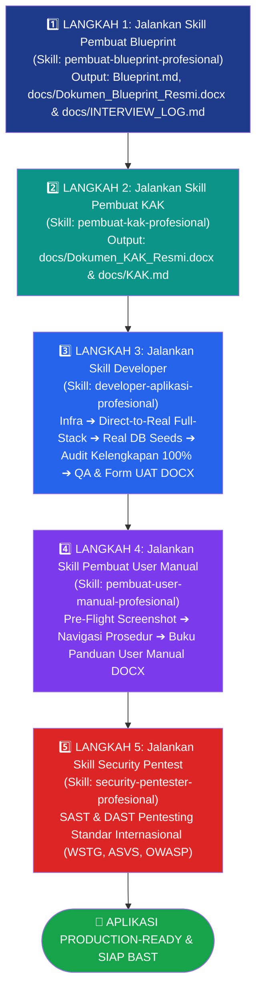

# 🌌 TEMPLATE PENGEMBANGAN APLIKASI DISKOMINFO KOTA YOGYAKARTA
### Powered by Google Antigravity 2.0 (Agentic Coding OS)

Template resmi standar arsitektur perangkat lunak Pemerintah Kota Yogyakarta untuk pembuatan aplikasi baru menggunakan AI Pair Programming & Vibe Coding di **Google Antigravity 2.0**.

---

## 🏗️ Tech Stack & Arsitektur Standar

- **Backend**: Go (Golang 1.22+) — *Clean Architecture* (Domain, Usecase, Repository, Delivery)
- **Frontend & UI Design**: React / Vue 3 (Vite) + Tailwind CSS berstandar **Apple Human Interface Guidelines (HIG)** (San Francisco / SF Pro typography, generous whitespace 8pt grid, frosted glass blur backdrop-filter, squircle corners, dan 8 tema anti-color clash)
- **Database**: PostgreSQL 16+ (Connection Pooling via `pgxpool`)
- **Cache & Rate Limiting**: Redis 7+ *(opsional jika dibutuhkan traffic tinggi/job queue)*
- **Object Storage**: MinIO Object Storage (Validasi *Magic Bytes* + *Presigned URL* 5–15 menit)
- **Otentikasi Terpusat**: SSO JSS Keycloak OIDC (`sso.jogjakota.go.id`) dengan 4 Role RBAC (`Superadmin`, `Pengawas`, `Admin`, `Operator`)
- **Dokumentasi Output**: Format ganda Markdown (`.md`) dan Dokumen Word Resmi (`.docx`) siap cetak/distribusi via `.agents/scripts/generate_docx.py`
- **Environment**: **Docker & Docker Compose**

---

## 🔄 5 TAHAPAN KERJA PENGEMBANGAN APLIKASI SECARA BERURUTAN

Setiap pengembangan aplikasi baru di lingkungan Diskominfo Kota Yogyakarta **WAJIB** mengikuti 5 tahapan kerja berurutan berikut. Seluruh progres dan status pekerjaan dapat dipantau langsung pada [docs/Tasklist_monitor.md](file:///Users/kominfo/Nextcloud/AntiGravity/DEVTOOLS/docs/Tasklist_monitor.md).



---

### 1️⃣ Langkah 1: Jalankan Skill Pembuat Blueprint (`pembuat-blueprint-profesional`)
Panggil skill ini untuk memandu wawancara terstruktur penentuan arsitektur dan spesifikasi kebutuhan software (BRD + PRD + SRS).

```text
Prompt: "Tolong gunakan skill pembuat-blueprint-profesional untuk menyusun Blueprint sistem [Nama Aplikasi]"
```

- **Fokus Utama**:
  - Pre-flight check otomatis: Memastikan Caveman mode aktif dan Mermaid CLI terpasang.
  - Menggali kebutuhan bisnis (`BR-xx`), fitur produk (`PRD-xx`), dan kebutuhan teknis fungsional (`SRS-F-xx`) & non-fungsional (`SRS-NF-xx`).
  - **Pola Navigasi Utama UI**: Menetapkan **Left Panel Menu (Sidebar)** untuk aplikasi web operasional/dashboard backoffice, atau **Top Navigation** untuk website publik/landing page.
  - **Autentikasi Terpisah & 4 Dummy User Pengujian (Sandbox)**:
    - Halaman login dibuat tersendiri dan terpisah dari layout aplikasi utama (`UI-AUTH-01` / `/login`).
    - Disediakan minimal 4 user dummy testing sandbox (1 per role: `Superadmin`, `Pengawas`, `Admin`, `Operator`) lengkap dengan 1-click quick login.
  - **5 Modul Pengaturan Sistem Wajib**:
    1. *Manajemen Pengguna (Form ID JSS + Nama Lengkap Terisi Otomatis + Role)*
    2. *Manajemen Role (Proteksi role aktif tidak boleh dihapus)*
    3. *Manajemen Hak Akses (Matriks izin per role: Lihat, Tambah, Ubah, Hapus)*
    4. *Manajemen Menu Sidebar (Pengelompokan header, pengurutan posisi menu WAJIB menggunakan metode interaktif menggeser / drag-and-drop / drag-to-reorder, bukan input angka manual)*
    5. *Manajemen Tema & Warna UI (8 Tema Terstandarisasi Anti-Color Clash)*
  - **Log Aktivitas Pengguna (Audit Trail)**: Akses eksklusif hanya untuk `Superadmin` dan `Pengawas` (Read-Only).
  - **Offline-First & Auto-Wiring Policy**: Larangan URL gambar/dummy eksternal internet, kewajiban auto-wiring seluruh layanan pendukung & health check `/api/v1/health`.
- **Deliverable Output**:
  - `Blueprint.md` (Single Source of Truth di root proyek untuk agentic coding — memuat Bagian A s.d E)
  - `docs/Dokumen_Blueprint_Resmi.docx` (Dokumen formal kesepakatan client–developer)
  - `docs/INTERVIEW_LOG.md` (Catatan transkrip tanya-jawab dan evaluasi traceability)
  - `docs/MODULE_PROGRESS.md` (Pelacak status dan pengunci urutan eksekusi per-modul)

---

### 2️⃣ Langkah 2: Jalankan Skill Pembuat KAK (`pembuat-kak-profesional`)
Panggil skill ini untuk menyusun Dokumen Kerangka Acuan Kerja (KAK) pengadaan dan pengembangan sistem informasi formal standar LKPP & Diskominfo Kota Yogyakarta.

```text
Prompt: "Tolong gunakan skill pembuat-kak-profesional untuk menyusun Dokumen KAK resmi berdasarkan Blueprint dan data pengadaan"
```

- **Fokus Utama**:
  - Mengekstrak informasi dari rekaman audio, dokumen pendukung (DPA/Renstra), dan `Blueprint.md`.
  - Melengkapi bab administratif formal: Landasan Hukum SPBE, Sumber Dana & Pagu/HPS, Susunan 7 Tenaga Ahli, Jadwal Milestone, SLA & Garansi, serta Lembar Pengesahan PPK.
- **Deliverable Output**:
  - `docs/Dokumen_KAK_Resmi.docx` (Dokumen formal bertanda tangan PPK / Pengguna Anggaran)
  - `docs/KAK.md` (Dokumen KAK versi Markdown)

---

### 3️⃣ Langkah 3: Jalankan Skill Developer (`developer-aplikasi-profesional`)
Panggil skill ini untuk menyiapkan environment, membangun sistem produksi nyata (Go Clean Architecture + React/Vue Vite) dengan data dummy yang di-seed langsung ke database PostgreSQL, meneliti kelengkapan seluruh fungsi (Quality Gate Anti-Tertinggal), menjalankan pengujian E2E menyeluruh, auto-fix bug secara mandiri, serta menerbitkan Laporan Pengujian QA resmi dan Formulir UAT Calon Pengguna.

```text
Prompt: "Tolong gunakan skill developer-aplikasi-profesional untuk menyiapkan environment, membangun real aplikasi modul per-modul berdasarkan Blueprint.md, mengaudit kelengkapan seluruh fungsi, dan menjalankan pengujian QA menyeluruh"
```

- **Fokus Utama Developer**:
  1. **Kesiapan Environment**: Memastikan Docker/Lokal, Nginx, PostgreSQL 16+, Redis 7+, MinIO, dan Portainer CE aktif.
  2. **Core Foundation & Real Database Seeding**:
     - Inisiasi pelacak kelengkapan `docs/MODULE_PROGRESS.md` memetakan seluruh `SRS-F-xx` dari `Blueprint.md`.
     - Skema dasar SQL & **Seed 4 Dummy Users langsung ke PostgreSQL** (`db/migrations/`, `db/seeds/`).
     - **Halaman Login Terpisah (`/login`)** terhubung ke API otentikasi nyata dan panel quick-login 4 Dummy User Sandbox.
     - **Pengurutan Menu Sidebar Geser (Drag-and-Drop Reorder)** terhubung langsung ke API backend.
  3. **Pembangunan Real Full-Stack Modular (100% Real API Auto-Wiring)**:
     - Membangun Backend Go Clean Architecture dan Frontend React/Vue (Vite) Apple HIG secara modular (`docs/MODULE_PROGRESS.md`).
     - **Real Database Seeding**: Data dummy realistis disuntikkan **langsung ke PostgreSQL** (`db/migrations/`, `db/seeds/`), **tanpa ada data dummy hardcode di frontend atau in-memory**.
     - Setiap tombol, form, filter, dan tabel di frontend **WAJIB memanggil HTTP API backend Go secara nyata** via Axios/Fetch.
  4. **Quality Gate: Audit Kelengkapan Fitur 100% (Anti-Tertinggal)**:
     - Meneliti ulang seluruh kebutuhan fungsional `SRS-F-xx` dan modul `MOD-xx` dari `Blueprint.md` terhadap tabel database, endpoint backend, dan komponen frontend.
     - Dilarang beralih ke QA jika ada fungsi yang tertinggal, kode stub kosong (`// TODO`), atau tombol UI yang belum memanggil API backend.
  5. **Pengujian Menyeluruh (QA), Auto-Fix Mandiri (Maks. 3x) & Laporan QA / Form UAT**:
     - **Wajib Skenario Pengujian Sebelum Testing**: Menyusun skenario pengujian tertulis mencakup Positive Testing (Happy Path) dan Negative Testing (9 matriks cacat/error) sebelum eksekusi dimulai.
     - **Kepatuhan Eksekusi 100%**: Eksekusi konektivitas penuh (Frontend $\leftrightarrow$ API Backend $\leftrightarrow$ PostgreSQL Database & MinIO) dan automated negative suite Go wajib patuh mutlak pada parameter input dan kriteria assertion skenario.
     - **Auto-Fix Mandiri**: Jika ada bug/kegagalan, langsung perbaiki kode sumber secara otomatis maksimal 3 kali percobaan.
     - **Eskalasi Prompter**: Jika setelah 3x perbaikan masih gagal, konfirmasi ke prompter (Lanjutkan / Skip dan catat sebagai defect di Laporan QA).
     - Pengambilan screenshot bukti pengujian ke `docs/screenshots/qa-*`.
     - **Penuangan Hasil ke Dokumen QA & Form UAT**: Seluruh hasil pengujian dan bukti screenshot dituangkan ke `docs/TEST_REPORT.md`, diterbitkan menjadi dokumen resmi `docs/Laporan_Pengujian_QA.docx`, serta diterbitkan `docs/Form_UAT_Resmi.docx` untuk uji terima calon pengguna OPD.
- **Deliverable Output**:
  - `docs/MODULE_PROGRESS.md` (Tercentang `Completed` 100% untuk seluruh modul `SRS-F-xx`)
  - Source code di folder `backend/` dan `frontend/` (100% real API connected)
  - `docker-compose.yml` (Orkestrasi App + DB + MinIO + Redis + Portainer + Nginx)
  - `docs/Dokumen_Spesifikasi_API.docx` (Buku pegangan developer eksternal)
  - `docs/swagger.json` & `docs/swagger.yaml` (Spesifikasi OpenAPI interaktif di `/swagger/index.html`)
  - **`docs/Laporan_Pengujian_QA.docx`** & **`docs/TEST_REPORT.md`** (Laporan resmi pengujian QA lengkap dengan screenshot)
  - **`docs/Form_UAT_Resmi.docx`** & **`docs/Form_UAT_Resmi.md`** (Formulir UAT resmi siap isi calon pengguna)
  - `docs/screenshots/` (Aset screenshot bukti pengujian QA)

---

### 4️⃣ Langkah 4: Jalankan Skill Pembuat User Manual (`pembuat-user-manual-profesional`)
Setelah aplikasi aktif berjalan dan lulus uji QA, panggil skill ini untuk menyusun Buku Panduan Penggunaan Aplikasi (User Manual) resmi berstandar ISO/IEC/IEEE 26514 lengkap dengan screenshot visual antarmuka per prosedur langkah kerja.

```text
Prompt: "Tolong gunakan skill pembuat-user-manual-profesional untuk menyusun Buku Panduan Penggunaan Aplikasi resmi lengkap dengan screenshot antarmuka"
```

- **Fokus Utama**:
  - **Pre-Flight Check Kesiapan Screenshot**: Menjalankan `python3 .agents/scripts/capture_screenshots.py --check` untuk memverifikasi engine penangkap layar.
  - **Navigasi & Dokumentasi Prosedur Pengguna**: Menelusuri seluruh fitur aplikasi di browser, mengambil screenshot antarmuka nyata ke `docs/screenshots/um-*`, dan menuliskan instruksi langkah bernomor yang ramah pembaca.
  - **Dokumentasi Halaman Login & 4 Role Dummy**: Mendokumentasikan alur login SSO resmi serta akses sandbox role `Superadmin`, `Pengawas`, `Admin`, dan `Operator`.
  - **Auto-Embed Gambar ke DOCX**: Mengompilasi buku panduan pengguna formal Word siap cetak via `.agents/scripts/generate_docx.py`.
- **Deliverable Output**:
  - **`docs/Panduan_Penggunaan_Aplikasi.docx`** (Buku Panduan Penggunaan resmi Word siap cetak)
  - **`docs/USER_MANUAL.md`** (Panduan pengguna versi Markdown)
  - `docs/screenshots/` (Folder aset tangkapan layar prosedur antarmuka)

---

### 5️⃣ Langkah 5: Jalankan Skill Security Pentest (`security-pentester-profesional`)
Setelah dokumentasi pengguna lengkap, panggil skill ini sebagai **Security Gatekeeper** akhir untuk menguji ketahanan dan keamanan aplikasi secara komprehensif.

```text
Prompt: "Tolong gunakan skill security-pentester-profesional untuk melakukan audit keamanan SAST pada kode dan DAST Pentest pada container yang berjalan"
```

- **Fokus Utama**:
  - Menjalankan audit SAST (`gosec`, `semgrep`), SCA (`govulncheck`, `npm audit`), dan DAST Pentest menyerang endpoint live aplikasi mengacu standar internasional (OWASP Top 10, OWASP API Top 10, ASVS v4.0, WSTG v4.2, NIST SP 800-115, PTES, CVSS v3.1/v4.0).
  - Menguji penegakan batas wewenang 4 Role RBAC (memastikan role `Pengawas` 100% read-only), IDOR, SQL Injection, XSS, rate limiting, dan validasi *Magic Bytes* MinIO.
  - **Bukti Visual**: Setiap temuan PoC dan kontrol positif wajib menyertakan tangkapan layar respon/terminal di `docs/screenshots/sec-*`.
  - **Security Gatekeeper**: Wajib **0 temuan** berstatus *Medium/High/Critical* untuk rilis lolos uji.
- **Deliverable Output**:
  - `docs/Dokumen_Laporan_Pentest_Resmi.docx` (Laporan resmi audit keamanan pimpinan ber-screenshot)
  - `docs/SECURITY_REPORT.md` (Laporan teknis pentest ber-screenshot)
  - `docs/WSTG_AUDIT_CHECKLIST.md` (Lembar kerja checklist pengujian WSTG/ASVS)

---

## 📂 Struktur Direktori Proyek Standar

```text
├── AGENTS.md                       # Master Context OS Antigravity 2.0 (SSOT)
├── Blueprint.md                    # Single Source of Truth Kebutuhan Teknis
├── docker-compose.yml              # Standard Orchestration Lokal (App + DB + MinIO + Redis + Portainer + Nginx)
├── .env.example                    # Template Environment Variables Docker
├── .gitignore                      # Git Ignore File
├── .agents/
│   ├── rules/                      # Aturan Modular Standar Diskominfo
│   │   ├── 01_architecture_clean.md# Arsitektur Go, PostgreSQL, Concurrency, & Auto-Wiring
│   │   ├── 02_sso_keycloak_rbac.md # SSO Keycloak, 4 Role RBAC & 4 Dummy Users
│   │   ├── 03_minio_storage.md     # MinIO Storage, Presigned URL, & Offline-First Policy
│   │   ├── 04_security_owasp.md    # OWASP Top 10 & Security Gatekeeper
│   │   ├── 05_testing_qa.md        # QA Policy, Positive & Negative Testing Matrix
│   │   └── 06_attribution_marker.md# Attribution Comment Marker Standar
│   ├── scripts/
│   │   ├── generate_docx.py        # Generator DOCX Resmi Pemkot Yogyakarta (Auto-Embed Gambar)
│   │   └── capture_screenshots.py  # Utility Pre-Flight & Screenshot Visual Capture CLI
│   ├── design-system/              # Design System (8 Tema UI & Anti-Color Clash)
│   │   ├── assets/logo-jogja.svg   # Master Vektor SVG Logo Pemkot Yogyakarta
│   │   ├── tokens/colors.css       # Color Tokens 4 Light + 4 Dark Themes
│   │   └── README.md
│   └── skills/
│       ├── pembuat-blueprint-profesional/   # [Langkah 1] Skill Wawancara BRD+PRD+SRS
│       ├── pembuat-kak-profesional/         # [Langkah 2] Skill Penyusunan KAK Formal
│       ├── developer-aplikasi-profesional/  # [Langkah 3] Skill Developer (Infra, Real DB Seed, Full App Modular, Audit, QA)
│       ├── pembuat-user-manual-profesional/ # [Langkah 4] Skill Penyusunan Buku Panduan Pengguna DOCX
│       └── security-pentester-profesional/  # [Langkah 5] Skill Audit Keamanan & Pentest
├── backend/                        # [Langkah 3] Go Backend Service (Clean Architecture)
│   ├── db/migrations/              # Migrasi Skema Database SQL
│   ├── db/seeds/                   # Real PostgreSQL Dummy Data Seeds
│   └── tests/                      # Unit & Negative Testing Suite
├── frontend/                       # [Langkah 3] React / Vue Frontend Service (Vite + Tailwind + Apple HIG)
├── nginx/                          # [Langkah 3] Nginx Reverse Proxy Gateway Config
└── docs/                           # Folder Seluruh Deliverable Resmi (DOCX & MD)
    ├── Tasklist_monitor.md         # Master Checklist Monitoring Progres 5 Tahapan
    ├── Dokumen_Blueprint_Resmi.docx# [DOCX 1] Dokumen Kesepakatan Scope & Arsitektur
    ├── INTERVIEW_LOG.md            # Catatan Transkrip Wawancara (Tanya-Jawab) & Evaluasi
    ├── MODULE_PROGRESS.md          # Pelacak Status & Progres Pembangunan Per-Modul
    ├── Dokumen_KAK_Resmi.docx      # [DOCX 2] Dokumen Kerangka Acuan Kerja (KAK) Resmi
    ├── KAK.md                      # Dokumen KAK versi Markdown
    ├── Laporan_Pengujian_QA.docx   # [DOCX 3] Laporan QA (Fungsional & Negative Testing + Screenshot)
    ├── TEST_REPORT.md              # Laporan Pengujian Fungsional & Teknis Markdown
    ├── Form_UAT_Resmi.docx         # [DOCX 4] Formulir Uji Terima Pengguna (UAT) Resmi
    ├── Form_UAT_Resmi.md           # Formulir UAT versi Markdown
    ├── Dokumen_Laporan_Pentest_Resmi.docx # [DOCX 5] Laporan Resmi Audit Keamanan Pentest (Lengkap Screenshot)
    ├── SECURITY_REPORT.md          # Laporan Teknis Pentest OWASP Markdown
    ├── WSTG_AUDIT_CHECKLIST.md     # Lembar Kerja Checklist Audit Keamanan WSTG
    ├── Dokumen_Spesifikasi_API.docx# [DOCX 6] Spesifikasi API Developer Eksternal / Mitra
    ├── swagger.json                # Spesifikasi OpenAPI / Swagger JSON
    ├── swagger.yaml                # Spesifikasi OpenAPI / Swagger YAML
    ├── Panduan_Penggunaan_Aplikasi.docx # [DOCX 7] Panduan Penggunaan / User Manual Resmi (Lengkap Screenshot)
    ├── USER_MANUAL.md              # Panduan Pengguna versi Markdown
    ├── CHANGELOG.md                # Log Perubahan Aplikasi
    └── screenshots/                # Aset Screenshot Tampilan Antarmuka Aplikasi & Bukti Pengujian
```

